# Architecture

This section explains the **implemented architecture** of vLab2D: the responsibilities that exist in source today, how those responsibilities collaborate, and which boundaries the project deliberately protects.

vLab2D is an exploratory learning project, so the architecture is expected to evolve as new capabilities create concrete pressure. The documentation therefore distinguishes between:

- **implemented architecture** — relationships visible in the current code;
- **established principles** — rules that guide new work;
- **future directions** — plausible abstractions that have not yet earned implementation.

The goal is not to predict a final framework. It is to make the current system understandable.

---

## 1. Architecture at a glance

vLab2D currently has four conceptual layers:

1. **Engine / Domain** — reusable physical definitions, world-owned authoritative state, mathematical values, and numerical integration policy;
2. **Simulation / Orchestration** — deterministic coordination of one or more Worlds;
3. **Runtime** — host execution and wall-clock scheduling;
4. **Visualization** — rendering and visual interaction against detached observations.

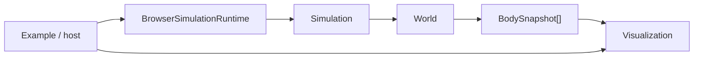

The most important dependency rule remains:

```text
engine/domain does not depend on visualization or browser runtime
```

Visualization may observe engine output, but rendering and interaction concerns do not enter the engine.

---

## 2. Repository-level boundaries

The current source tree communicates the implemented responsibilities directly:

```text
src/
├── mod.ts
├── engine/
│   ├── geometry/
│   ├── kinematics/
│   ├── math/
│   ├── world/
│   └── mod.ts
├── simulation/
│   └── simulation.ts
├── runtime/
│   └── browser/
│       └── simulation-runtime.ts
└── visualization/
    ├── inspection/
    │   ├── canvas-inspection-renderer.ts
    │   └── inspection-options.ts
    ├── interaction/
    │   └── body-picker.ts
    ├── rendering/
    │   ├── canvas-kinematic-renderer.ts
    │   └── svg-kinematic-renderer.ts
    ├── viewport/
    │   └── viewport-transform.ts
    └── README.md

examples/
└── kinematic-world-canvas/
    ├── canvas-example-host.ts
    └── main.ts
```

The responsibilities are:

| Area                     | Responsibility                                                        |
| ------------------------ | --------------------------------------------------------------------- |
| `src/mod.ts`             | package-facing composition facade                                     |
| `src/engine/`            | authoritative simulation/domain state and physical definitions        |
| `src/engine/mod.ts`      | public engine-layer boundary                                          |
| `src/engine/math/`       | small mathematical values and validation helpers used by the engine   |
| `src/engine/kinematics/` | current linear numerical integration behavior                         |
| `src/engine/world/`      | body runtime ownership and World behavior                             |
| `src/simulation/`        | deterministic multi-World orchestration                               |
| `src/runtime/browser/`   | browser wall-clock execution and fixed-step scheduling                |
| `src/visualization/`     | viewport, rendering, interaction, and inspection responsibilities     |
| `examples/`              | concrete composition plus example-specific browser/application policy |

These directories are not intended as permanent framework layers simply because they exist. They reflect responsibilities demonstrated by the current implementation.

---

## 3. Dependency direction

Dependencies point toward simulation/domain concepts rather than allowing presentation concerns to leak inward.

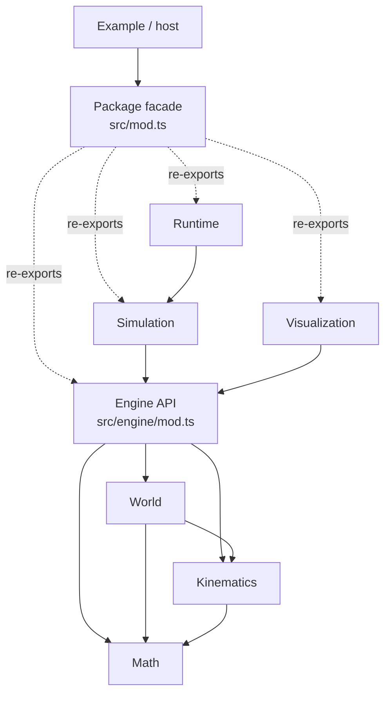

There is deliberately no reverse dependency from engine/domain code to Canvas, SVG, DOM APIs, browser scheduling, hover state, selection state, or picking policy.

A simulation can run without a renderer.

A renderer can consume detached observations without advancing physics.

---

## 4. Domain lifecycle: definition, initial conditions, runtime state

One of the strongest current architecture rules is that reusable intrinsic data is different from runtime state.

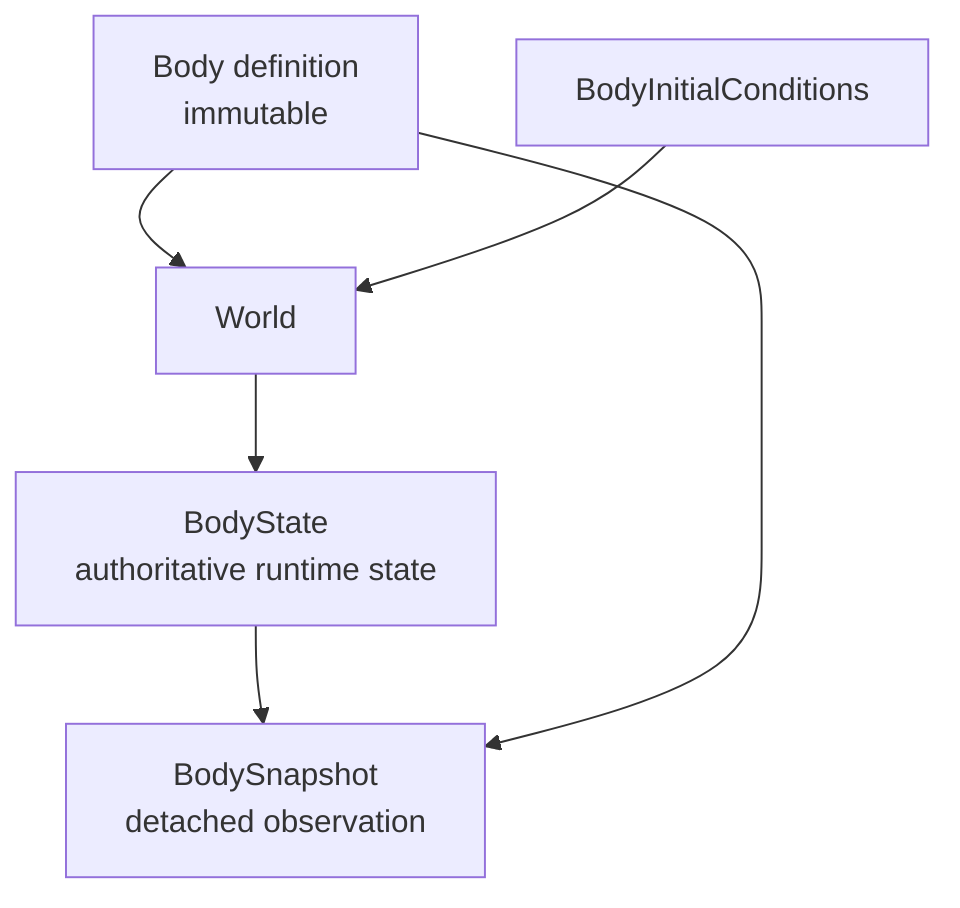

The lifecycle is:

```text
immutable reusable definition
        +
initial conditions
        ↓
World.addBody(...)
        ↓
independent world-local runtime instance
```

The same `Body` definition can be added multiple times to one World or reused across Worlds. Every addition creates independent runtime state and a world-local `BodyId`.

### Body definition

`Body` represents reusable intrinsic definition data.

The current definition can be shapeless or carry one concrete geometry value:

```ts
new Body();
new Body({ shape: new Circle(0.5) });
new Body({ shape: new Rectangle(2, 1) });
new Body({ shape: new RegularPolygon(5, 1) });
```

The current type is a concrete union rather than a class hierarchy:

```text
BodyShape = Circle | Rectangle | RegularPolygon
```

No generic `Shape` interface or abstract base class is required yet.

### Geometry

`Circle` owns one positive finite radius expressed in world units.

`Rectangle` owns positive finite width and height expressed in world units. Its intrinsic local geometry is centered around `(0, 0)`:

```text
x ∈ [-width / 2, +width / 2]
y ∈ [-height / 2, +height / 2]
```

`RegularPolygon` owns an integer vertex count of at least `3` and a positive finite circumradius. It precomputes immutable local-space vertices around `(0, 0)`:

```text
vertex 0
    lies on local +X

remaining vertices
    equally spaced
    counter-clockwise in mathematical local coordinates
```

The circumradius is the distance from the local origin to every vertex.

None of these geometry objects owns world position, orientation, or angular velocity.

A shapeless Body remains valid and has no domain spatial extent. Visualization may still give it a fixed presentation marker so it can be seen and interacted with.

### Initial conditions

`BodyInitialConditions` describes how one Body definition enters a World:

```text
position
velocity
orientation
angularVelocity
```

Current defaults are:

```text
position         (0, 0)
velocity         (0, 0)
orientation      0 radians
angularVelocity  0 radians / second
```

Initial conditions do not become intrinsic Body properties.

### Runtime state

`BodyState` is readonly structural data owned authoritatively by the World:

```text
position
velocity
orientation
angularVelocity
```

It is not a constructible behavior-owning domain object.

Position and velocity are vectors. Orientation is a finite scalar in radians. Angular velocity is a finite scalar in radians per second.

---

## 5. Orientation and angular velocity

The engine uses mathematical world coordinates:

```text
+X → right
+Y → up
```

Positive orientation is counter-clockwise and measured in radians.

```text
0          local +X points world +X
π / 2      local +X points world +Y
π          local +X points world -X
```

Angular velocity is measured in radians per second:

```text
positive angular velocity  → counter-clockwise
negative angular velocity  → clockwise
zero angular velocity      → orientation remains unchanged
```

Both orientation and angular velocity belong to World-owned runtime state rather than to the reusable `Body` or shape definition. They describe the rotational state of one instantiated Body in one World.

This remains true for shapeless Bodies and Circles even when their present visual representation does not reveal orientation directly.

Any finite orientation is valid. Orientation is intentionally not normalized to a canonical interval yet. Normalization should be introduced only when a real consumer requires canonical angles, shortest angular deltas, or bounded long-running rotational state.

### Current rotational integration

The current kinematic integrators now advance rotational state as well as translational state.

Because angular acceleration has not yet been introduced, angular velocity is constant across a timestep:

```text
nextOrientation     = orientation + angularVelocity × dt
nextAngularVelocity = angularVelocity
```

The complete current state-evolution picture is therefore:

```text
position         integrated from linear velocity
velocity         integrated from linear acceleration
orientation      integrated from angular velocity
angularVelocity  preserved
```

Both Explicit Euler and Semi-Implicit Euler use the same rotational equation at this stage. Their existing distinction still concerns accelerated linear motion:

```text
Explicit Euler
    advances position from the velocity at the beginning of the step

Semi-Implicit Euler
    advances velocity first, then position from the updated velocity
```

If angular acceleration is introduced later, the two methods may also acquire meaningfully different rotational update orderings. That future pressure should determine whether the current `KinematicIntegrator` contract remains appropriate or whether rotational integration deserves a separate abstraction.

No separate `RotationalIntegrator` is introduced now. The current `KinematicIntegrator` already maps a complete `BodyState` to its next kinematic state, and one constant-angular-velocity equation does not justify another strategy hierarchy.

Angular acceleration, torque, moment of inertia, rotational damping, and collision-driven rotation do not exist yet.

---

## 6. World owns authoritative body state

`World` is the state-owning engine container.

Internally it associates each world-local `BodyId` with:

```text
reusable immutable Body definition
+
authoritative BodyState
```

Externally, callers do not receive writable World storage.

The World exposes validated command-like methods for mutation and detached values for observation.

### Atomic World stepping

A World step is transactional at World scope.

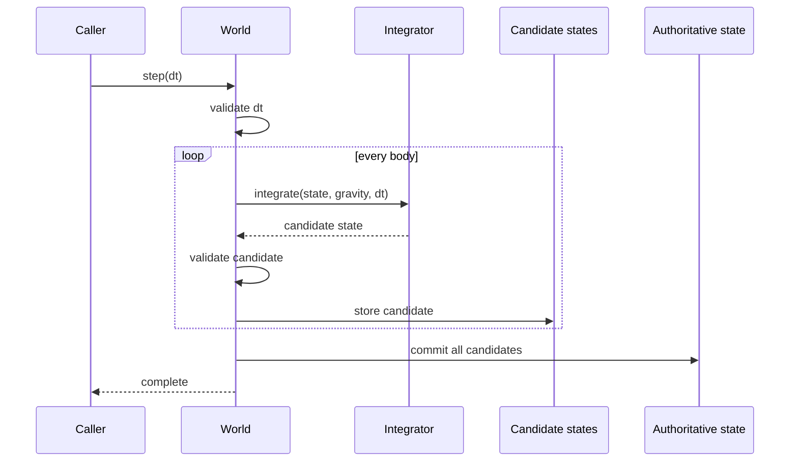

The invariant is:

> Either every body advances successfully, or no authoritative body state is replaced.

This prevents a failed numerical step from leaving a World partially advanced.

---

## 7. Observation model

World observation deliberately separates immutable reusable definition data from mutable authoritative state.

`BodySnapshot` is:

```text
BodySnapshot
├── id
├── definition
└── state
```

### Shared definition

`definition` is the exact immutable `Body` reference used when the runtime instance was created.

It is shared because immutable definition data is safe to reuse and copying it into every snapshot would add duplication without protecting World state.

### Detached state

`state` is detached from World storage.

External code can inspect a snapshot without receiving the World's writable state object.

The snapshot is therefore an observation, not a state-owning entity.

```text
shared by reference
    immutable Body definition

copied for observation
    World-owned mutable runtime state
```

Visualization uses this contract to discover Circle/Rectangle geometry without adding shape-specific World queries or maintaining a parallel BodyId-to-definition registry.

---

## 8. Numerical integration as injected behavior

`World` owns **when** body states are advanced and provides the environment acceleration currently represented by gravity.

`KinematicIntegrator` owns **how** a state is numerically advanced.

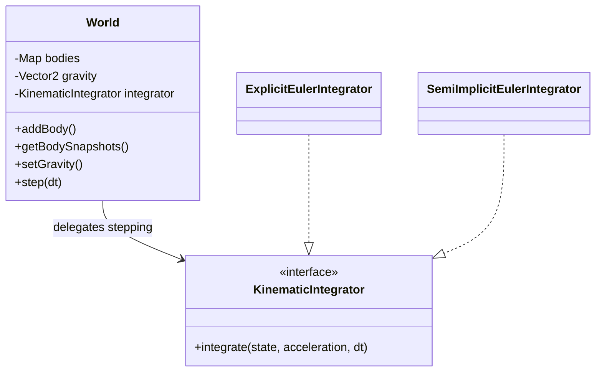

The contract is deliberately narrow. It is not a generic numerical-method framework.

At the current stage, the acceleration passed to the integrator is exactly the World's gravity vector.

---

## 9. Simulation coordinates Worlds

`Simulation` is the deterministic orchestration layer above World.

It contains a fixed set of `1..N` unique World references and owns per-World execution status.

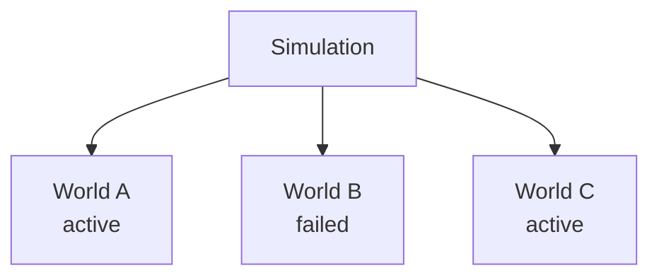

For each valid `Simulation.step(dt)`:

1. the timestep is validated before any World is touched;
2. active Worlds are visited in deterministic constructor order;
3. each active World receives the same `dt` once;
4. a thrown World becomes terminally failed;
5. later active Worlds are still stepped;
6. failed Worlds are skipped on future steps.

Simulation owns orchestration state, not physical body state.

It does not own:

- World gravity;
- integrators;
- BodyState;
- rendering;
- browser time;
- viewport state.

---

## 10. Browser Runtime owns wall-clock scheduling

`BrowserSimulationRuntime` separates variable browser frame timing from deterministic simulation stepping.

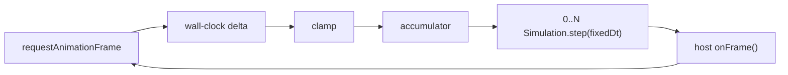

The Runtime owns:

```text
requestAnimationFrame
wall-clock frame deltas
maximum frame-delta clamp
fixed-timestep accumulator
repeated Simulation.step(...)
host frame callback cadence
```

It does not own:

```text
Canvas / SVG
World snapshots
Body picking
hover / selection
DOM input
renderer state
```

The host callback decides what should be presented after the latest completed simulation steps.

---

## 11. Visualization boundary

Visualization lives under:

```text
src/visualization/
```

The current concrete components are:

```text
ViewportTransform
CanvasKinematicRenderer
SvgKinematicRenderer
BodyPicker
CanvasInspectionRenderer
InspectionOptions / InspectionStyle
```

They consume engine observations but do not advance physics or mutate World state.

Canvas is the primary interactive target. SVG remains a useful secondary static renderer where maintaining support remains natural and inexpensive.

There is no generic renderer hierarchy because the two output technologies still have meaningfully different interaction needs.

---

## 12. ViewportTransform

`ViewportTransform` owns viewport geometry rather than drawing technology.

Its state is:

```text
width             immutable
height            immutable
centerWorldX      mutable
centerWorldY      mutable
pixelsPerUnit     mutable
```

It derives continuous visible-world bounds and provides forward/inverse scalar coordinate conversion.

Forward mapping:

```text
displayX = width / 2
         + (worldX - centerWorldX) × pixelsPerUnit

displayY = height / 2
         - (worldY - centerWorldY) × pixelsPerUnit
```

Inverse mapping:

```text
worldX = centerWorldX
       + (displayX - width / 2) / pixelsPerUnit

worldY = centerWorldY
       - (displayY - height / 2) / pixelsPerUnit
```

The Y sign changes because mathematical world Y points up while Canvas/SVG display Y points down.

The transform also owns the geometry needed for:

- panning by display-space deltas;
- programmatic scale changes;
- scale changes around a display-space anchor while preserving the world point under that anchor.

It does **not** own browser wheel policy, zoom limits, input events, rendering primitives, or body hit testing.

---

## 13. Canvas: one shared viewport, focused collaborators

The live Canvas path now composes one explicit `ViewportTransform` instance in `main.ts`.

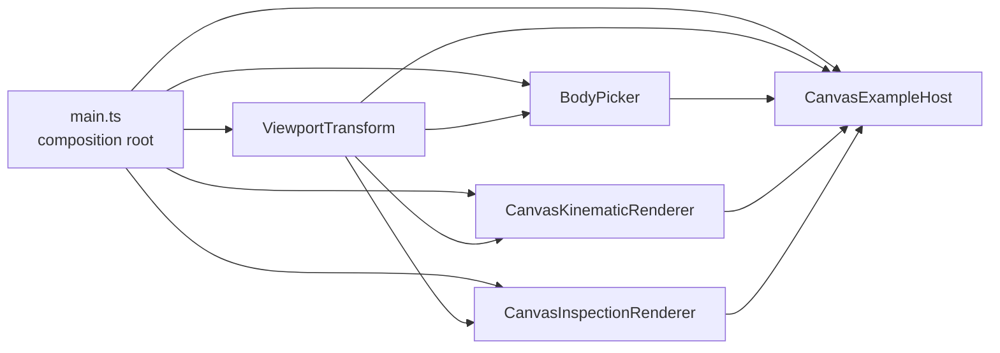

The same mutable viewport state is observed by all Canvas collaborators that need it.

### CanvasKinematicRenderer

Owns drawing:

```text
grid
axes
origin marker
body geometry
hover feedback
selection feedback
```

It receives the transform but does not own browser interaction or hit testing.

### BodyPicker

Owns visual hit testing against detached observations.

It receives the same transform as the renderer so the geometry used for picking cannot drift from the current pan/zoom state.

### CanvasInspectionRenderer

Owns optional diagnostic drawing:

```text
geometry contour
body origin
orientation
velocity
```

It receives the shared `ViewportTransform` and renderer-neutral `InspectionOptions`. It does not clear the surface or own normal body appearance.

### CanvasExampleHost

Owns concrete browser/application policy:

```text
Pointer / Wheel events
CSS → Canvas coordinate conversion
pointer capture
click-versus-drag policy
zoom sensitivity + limits
hover identity
selection identity
DOM inspection formatting
frame presentation orchestration
```

It directly mutates/queries `ViewportTransform`, delegates hit testing to `BodyPicker`, delegates normal drawing to `CanvasKinematicRenderer`, and composes `CanvasInspectionRenderer` afterward as an optional diagnostic overlay.

This keeps normal rendering, inspection, and interaction policy from collapsing into one façade.

---

## 14. Why Canvas viewport ownership changed

Earlier, both renderers constructed and owned their `ViewportTransform` internally. That was a reasonable design when the renderer was the only concrete consumer of viewport state.

Later, Canvas body picking became sufficiently substantial to deserve its own responsibility. `BodyPicker` then became a second real consumer of exactly the same mutable viewport state used by rendering.

Keeping transform ownership inside the renderer would have forced one of three weaker designs:

```text
1. duplicate transform state
   → drawing and picking can drift

2. make BodyPicker call through renderer façade methods
   → picking remains unnecessarily coupled to drawing

3. expose/inject the shared transform
   → both collaborators observe one source of viewport truth
```

The implementation chose the third option for Canvas.

This is a useful example of the project rule:

> An earlier architecture decision can be correct for its original pressure and still be superseded when new concrete consumers appear.

The change does **not** mean every dependency should always be injected.

SVG still owns its transform internally because no second SVG collaborator currently needs to share that state.

---

## 15. Rendering body geometry

Normal rendering derives visual geometry from the immutable Body definition plus World-owned runtime pose.

```text
BodySnapshot.definition
    shape

BodySnapshot.state
    position
    orientation
    angularVelocity

ViewportTransform
    world ↔ display placement and scale
```

### Shapeless Body

A shapeless Body has no domain spatial extent.

Canvas/SVG may render a fixed display-space marker so it remains visible.

```text
zoom in/out
    domain geometry: none
    marker radius: visually fixed
```

### Circle

Circle radius is expressed in world units:

```text
display radius = world radius × pixelsPerUnit
```

Orientation remains part of runtime pose but a plain Circle outline is rotationally symmetric.

### Rectangle

Rectangle width/height are expressed in world units and centered around the local origin.

Canvas conceptually renders:

```ts
context.save();
context.translate(displayX, displayY);
context.rotate(-orientation);
context.fillRect(-width / 2, -height / 2, width, height);
context.restore();
```

SVG uses the equivalent transform attribute.

The geometry remains simple because the renderer transforms the coordinate frame rather than manually rotating each corner.

---

## 16. Hover and selection ownership

Hover and selection are interaction/application state, not physical World state.

```text
CanvasExampleHost
    owns hovered BodyId
    owns selected BodyId

CanvasKinematicRenderer
    receives IDs for one frame
    decides how to draw feedback
```

Hover is transient and recomputed against the latest observations, including when the pointer does not move, because bodies may move under a stationary pointer.

Selection persists by identity until a click changes it.

The host stores a `BodyId`, not a persistent selected snapshot. Each frame it resolves the identity against fresh detached observations for current read-only inspection data.

For Rectangle bodies, hover and selection outlines are drawn in the same body-local transformed frame as the normal Rectangle, so the feedback follows orientation correctly.

---

## 17. BodyPicker, local-coordinate hit testing, and pick tolerance

`BodyPicker` answers a visualization-interaction question:

> Which observed body is close enough to this display-space point to be the user's intended target?

It deliberately does not answer a physics/collision question.

Current picking geometry is:

| Body kind | Picking geometry                                            |
| --------- | ----------------------------------------------------------- |
| shapeless | fixed circular display marker                               |
| Circle    | world radius scaled by current viewport                     |
| Rectangle | world width/height scaled by viewport + current orientation |
| RegularPolygon | exact polygon boundary scaled by viewport + current orientation |

The picker adds a non-negative `pickTolerance` measured in display units. This is interaction policy rather than domain geometry: a thin Rectangle or small Circle can remain easy to acquire when zoomed out without changing its physical/world dimensions.

The common candidate rule is:

```text
distance(pointer, pick geometry) <= pickTolerance
```

A point already inside the pick geometry has distance zero.

### Rotated Rectangle

The easiest distance calculation exists in the Rectangle's own local coordinates.

Rendering transforms local geometry outward into display space. Picking performs the inverse conceptual operation: it moves the pointer back into local coordinates, then measures distance to the simple centered Rectangle.

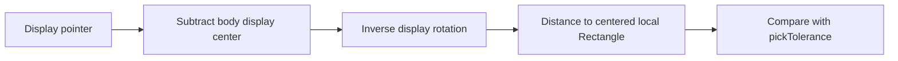

Current display-space inverse rotation:

```ts
const cos = Math.cos(orientation);
const sin = Math.sin(orientation);

const localX = deltaX * cos - deltaY * sin;
const localY = deltaX * sin + deltaY * cos;
```

The shortest local distance to the Rectangle is obtained from the amount by which the point lies outside each half-extent:

```ts
const outsideX = Math.max(Math.abs(localX) - halfWidth, 0);
const outsideY = Math.max(Math.abs(localY) - halfHeight, 0);

const geometryDistanceSquared = outsideX * outsideX + outsideY * outsideY;
```

This produces a true Euclidean/rounded tolerance around corners. Simply increasing both Rectangle half-extents by the tolerance would create excessive diagonal reach at the corners.

### Ranking overlapping candidates

Once candidate acceptance is expressed as distance to geometry, the same quantity gives a stronger ranking policy:

```text
1. nearest pick geometry wins
2. equal geometry distance → nearest displayed center wins
```

The center rule therefore remains useful as a tie-breaker. The common tie case is overlapping geometry: when the pointer is inside several bodies, each has geometry distance zero.

Snapshot order is never used as a hit-priority contract.

This local-coordinate/distance approach is an important geometry technique that will likely reappear in later diagnostic or collision work, but the current repetition still does not earn a generic transform or picking framework.

---

## 18. SVG composition remains simpler

`SvgKinematicRenderer` still constructs its own `ViewportTransform` internally.

It exposes programmatic viewport center and scale changes because those have concrete static-rendering uses.

It does not expose Canvas-specific pointer interaction APIs, and there is no SVG `BodyPicker` merely for API symmetry.

```text
Canvas
    main.ts owns shared transform
    renderer + picker + host collaborate around it

SVG
    renderer owns transform internally
```

Shared concepts should be common because responsibilities genuinely match, not because two implementations must look identical.

---

## 19. Normal rendering, appearance, interaction feedback, and diagnostics are distinct

The current architecture keeps four visual ideas separate:

```text
1. Physical/domain representation
   Body / Shape / BodyState

2. Normal appearance
   current basic body rendering
   future material / fill / texture / sprite decisions

3. Interaction feedback
   hover / selection / picking tolerance

4. Diagnostic / inspection visualization
   geometry contour / body origin / orientation / velocity
   future bounds / contacts / labels
```

`CanvasInspectionRenderer` is now a concrete diagnostic layer rather than a future possibility. It observes detached state and draws after normal Canvas rendering without changing Body geometry or appearance semantics.

`InspectionOptions` is renderer-neutral plain configuration data. It provides a default inspection style plus optional partial per-indicator overrides, together with the implemented visibility and sizing/projection parameters.

The velocity diagnostic has deliberately mixed units: its shaft represents projected world displacement and therefore scales with the viewport, while its arrowhead and minimum useful visibility threshold are display-space presentation values.

A future sprite/material system would describe how a body normally looks, not how physics behaves. No generic appearance framework or diagnostic plug-in framework exists yet.

---

## 20. Abstractions deliberately deferred

The project intentionally has **not** introduced the following merely because they are plausible:

```text
Shape interface / abstract base hierarchy
Transform2D
Vector2.rotate() solely for Canvas/SVG native transforms
Renderer interface / base class
Picker interface / generic picking framework
Camera abstraction separate from ViewportTransform
Scene graph
Collision system
Force framework beyond current World gravity
Material / texture / sprite framework
Diagnostic overlay framework
General browser interaction framework
Dependency-injection container
```

### Why no Transform2D yet?

Normal Canvas and SVG rendering already provide native translate/rotate capabilities. Creating a project-owned `Transform2D` only to feed values into those native transforms would be ceremonial.

Pressure becomes stronger when project-owned code repeatedly needs operations such as:

```text
body-local point → world point
world point → body-local point
local direction → world direction
world direction → local direction
```

Rectangle and RegularPolygon picking now both require explicit conversion into a body-local display frame. This is real repeated pressure, but narrow-phase collision detection is about to become another geometry consumer and will provide better evidence about the right reusable abstraction.

The project therefore still defers `Transform2D`, `Vector2.rotate()`, or another local/world helper until collision requirements show which operations genuinely repeat across physics and visualization.

---

## 21. Architecture evolution rule

vLab2D follows this rule:

> Concrete requirements create pressure; repeated pressure earns abstractions.

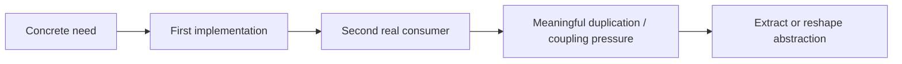

Examples already visible in the project:

- Canvas and SVG independently demonstrated the same viewport geometry before `ViewportTransform` was extracted;
- `ViewportTransform` was initially renderer-owned because no other consumer needed it;
- `BodyPicker` later became a second Canvas viewport consumer, so the Canvas path evolved to explicit shared composition;
- Circle alone did not justify a generic Shape abstraction;
- Rectangle became the second concrete geometry, and RegularPolygon is now the third; the concrete `BodyShape` union plus exhaustive dispatch still expresses current behavior without requiring inheritance;
- Visualization dispatch sites use explicit concrete cases plus `satisfies never`, so adding a future `BodyShape` produces compile-time pressure to update every exhaustive consumer;
- native Canvas/SVG transforms currently handle normal body orientation, so `Transform2D` remains deferred.

Architecture is therefore allowed to change when evidence changes. The aim is disciplined evolution, not early prediction.

---

## 22. Current flow through the browser example

The current Canvas example composes the system as follows:

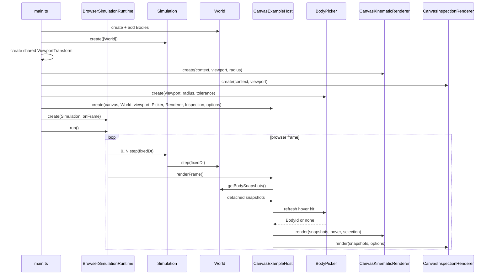

The composition root decides which concrete collaborators exist. Each collaborator keeps a focused responsibility.

---

## 23. What is not yet architecture

The following are future possibilities rather than implemented structure:

- collision detection and collision response;
- force accumulation;
- rotational dynamics beyond constant angular velocity;
- compound geometry;
- body materials/mass/inertia;
- editable body controls;
- multiple synchronized visual views;
- comparison overlays;
- runtime-editable or persisted diagnostic configuration;
- richer logger/console observers;
- pinch/multi-pointer gesture handling.

When these become real passes, they should be designed from their concrete requirements rather than retrofitted into speculative frameworks described here in advance.

---

## 24. Current review checkpoint

The current Phase 2 sequence has established:

```text
Body geometry
    Circle + Rectangle + RegularPolygon

World-owned motion state
    position + velocity + orientation + angularVelocity

Normal rendering
    orientation-aware Canvas + SVG

Interaction feedback
    geometry/orientation-aware hover + selection

Picking
    geometry/orientation-aware BodyPicker
    display-space pick tolerance
    nearest-geometry ranking + center tie-breaker

Inspection
    geometry contour
    body origin
    orientation
    velocity
    renderer-neutral configuration
    default + per-indicator styles

Responsibility refinement
    shared Canvas ViewportTransform
    renderer ≠ inspection ≠ picker ≠ host policy
```

The first rotational-kinematics pass is now implemented.

`BodyState` carries angular velocity, `BodyInitialConditions` can supply it, and both current kinematic integrators advance orientation from constant angular velocity. World validation, atomic stepping, and detached observation semantics extend to the new runtime value.

The Canvas example now gives Rectangle and RegularPolygon instances visible rotational motion, making World-owned orientation and angular velocity directly observable.

RegularPolygon also establishes a second project-owned local-coordinate geometry consumer through exact polygon picking. The next planned architecture discussion is narrow-phase collision detection. That work should determine whether Rectangle and RegularPolygon now earn shared convex-polygon operations, local/world transform helpers, or another smaller abstraction.

Collision response, angular acceleration, torque, moment of inertia, mass distribution, damping, and collision-driven rotation remain future capabilities.
