# Architecture

This section explains how vLab2D is structured, how its current components collaborate, and which boundaries the project deliberately protects.

vLab2D is an exploratory learning project rather than a production physics engine, so its architecture is intentionally allowed to grow with the implementation.

The architecture documentation therefore distinguishes between:

- **implemented architecture** — structures and boundaries visible in the current code;
- **architectural principles** — deliberate rules that guide new work;
- **future directions** — plausible extensions that have not yet earned an implementation.

The goal is not to predict the final system. It is to make the current system understandable.

---

## 1. Architecture at a glance

At the current checkpoint, vLab2D has three important runtime areas:

1. an independent simulation engine;
2. visualization outside that engine;
3. host/example code that composes the two.

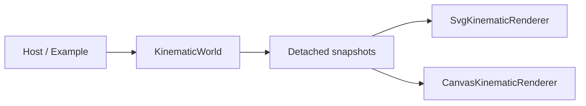

The most important dependency rule is:

```text
simulation engine does not depend on visualization
```

Visualization may observe information exposed by the engine, but rendering concerns do not enter the simulation core.

---

## 2. Repository-level boundaries

The current source tree exposes the architecture directly:

```text
src/
├── engine/
│   ├── kinematics/
│   ├── math/
│   ├── simulation/
│   ├── world/
│   └── mod.ts
│
└── visualization/
    ├── canvas-kinematic-renderer.ts
    ├── svg-kinematic-renderer.ts
    └── viewport-transform.ts

examples/
├── kinematic-world-canvas/
└── kinematic-world-svg.ts
```

These areas have different responsibilities.

| Area                     | Responsibility                                                                  |
| ------------------------ | ------------------------------------------------------------------------------- |
| `src/engine/`            | Own and advance simulation state                                                |
| `src/engine/mod.ts`      | Define the public consumer-facing engine boundary                               |
| `src/engine/math/`       | Small mathematical values and operations used by the engine                     |
| `src/engine/kinematics/` | Kinematic state and numerical integration behavior                              |
| `src/engine/world/`      | Own collections of simulated bodies and their authoritative state               |
| `src/engine/simulation/` | Earlier single-state simulation runtime retained while the architecture evolves |
| `src/visualization/`     | Convert observed simulation information into visual representations             |
| `examples/`              | Compose components into runnable scenarios                                      |

The folders are not intended as permanent framework layers. They exist because concrete implementation responsibilities have appeared.

---

## 3. Dependency direction

vLab2D deliberately keeps dependencies pointing toward simulation concepts rather than allowing presentation concerns to leak inward.

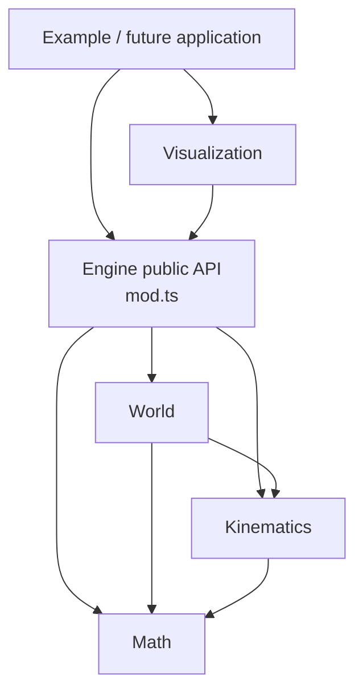

There is deliberately no dependency in the opposite direction:

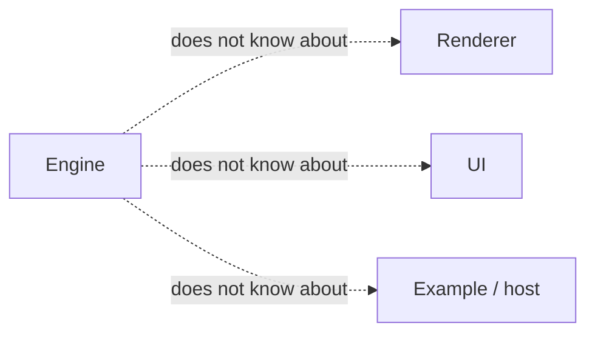

This gives the engine a useful property:

> A simulation can run without any renderer at all.

Likewise, a renderer does not advance physics. It consumes observations produced by the engine.

---

## 4. The engine boundary

External consumers are expected to enter the simulation engine through:

```text
src/engine/mod.ts
```

`mod.ts` exports the engine's supported public concepts while internal modules remain implementation details.

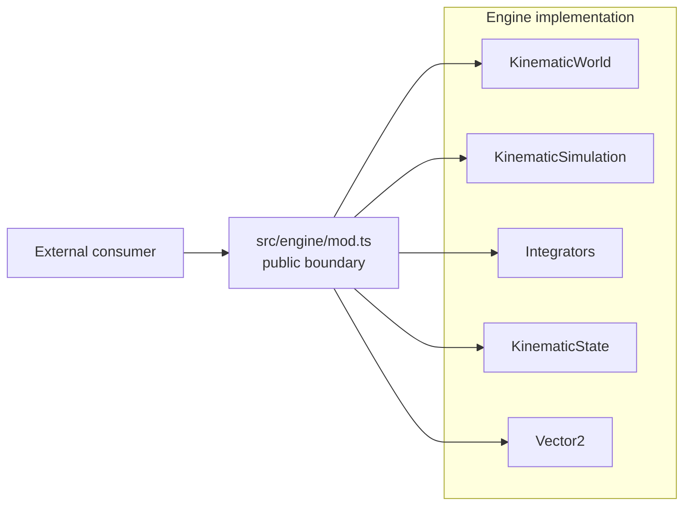

TypeScript does not physically prevent a consumer from importing an internal file directly.

The boundary is therefore both:

- a source-code convention;
- a documented API contract.

Project code outside the engine should prefer `mod.ts`.

The SVG renderer already follows this rule:

```ts
import type { KinematicBodySnapshot } from "../engine/mod.ts";
```

That is significant because visualization depends on the **engine contract**, not on the engine's storage implementation.

---

## 5. State ownership

One of the strongest current architectural rules is:

> The simulation engine owns authoritative mutable simulation state.

For the multi-body runtime, that authority belongs to `KinematicWorld`.

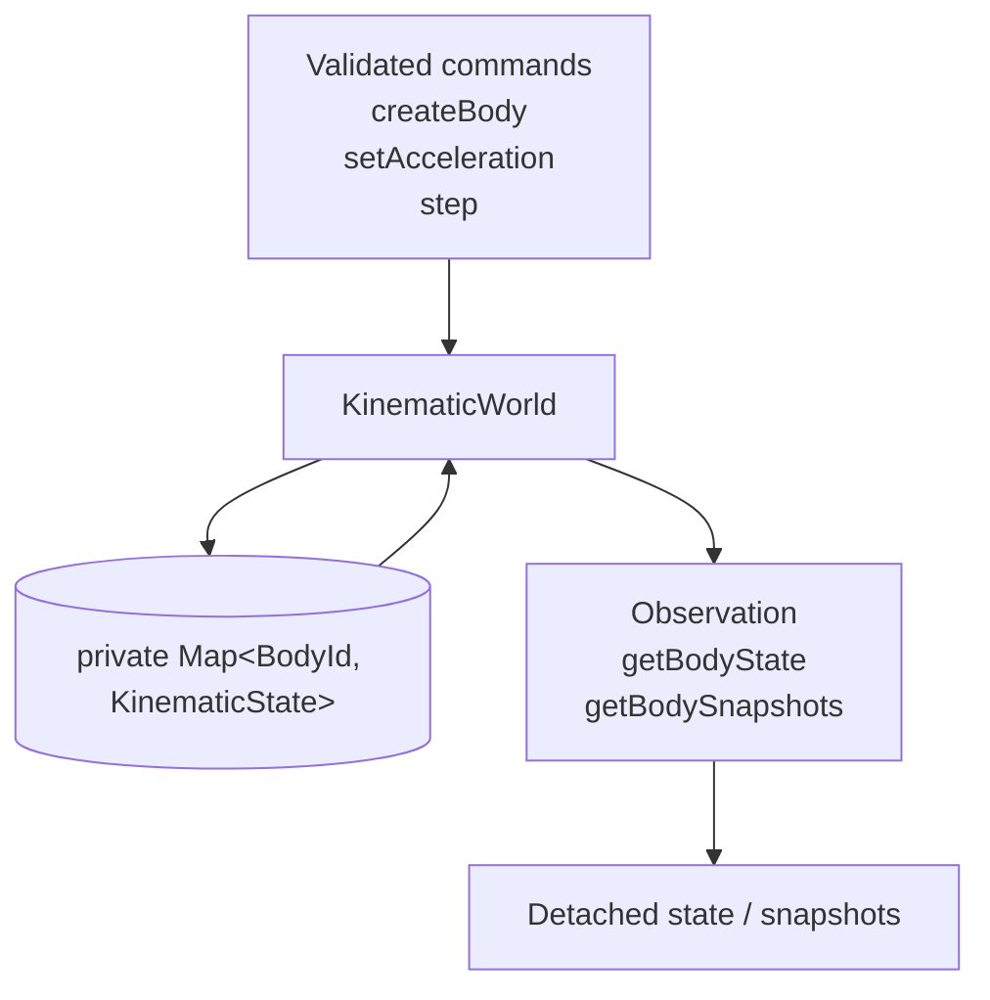

Consumers do not receive the world's internal `Map`, and observation APIs do not expose writable references into world storage.

This gives us a clear ownership boundary:

```text
outside world                     inside world

BodyId  ───────────────────────►  authoritative body state
                                  private Map

snapshot ◄──────────────────────  copied observation
```

A renderer can inspect a body snapshot, but changing that snapshot cannot change the world.

---

## 6. Observation and control are separate

The engine API currently contains two conceptually different kinds of interaction.

### Observation

Observation asks:

> What is the simulation state?

Examples:

```text
world.acceleration
world.getBodyState(...)
world.getBodySnapshots()
```

### Control

Control asks:

> Please change or advance the simulation.

Examples:

```text
world.createBody(...)
world.setAcceleration(...)
world.step(...)
```

The distinction can be visualized as:

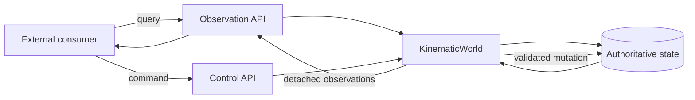

This separation is currently expressed through ordinary methods rather than through separate framework objects or interfaces.

That is intentional.

The project has not demonstrated a need for a command bus, repository abstraction, event system, or similar infrastructure.

---

## 7. World-owned bodies

Bodies currently do not exist as independently mutable runtime objects.

Instead:

```text
KinematicWorld
    owns
      ↓
BodyId → KinematicState
```

`BodyId` is an opaque, world-local identifier used by consumers to refer to body state owned by a world.

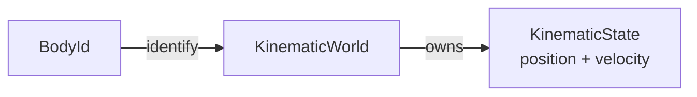

This avoids handing consumers a mutable `Body` object whose state could bypass world invariants.

It also gives the world one clear place to coordinate future operations that affect multiple bodies.

---

## 8. State and behavior are separate

`KinematicWorld` owns state, but it does not contain a hard-coded numerical integration algorithm.

Instead it receives a `KinematicIntegrator`.

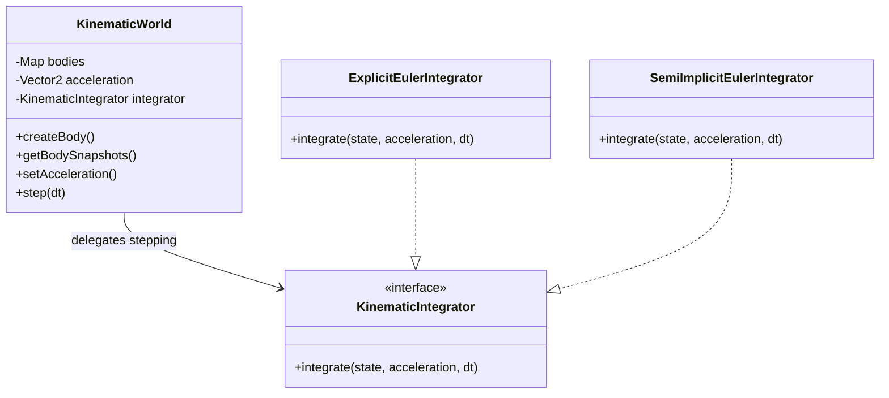

This is a small application of the **Strategy pattern**:

- `KinematicWorld` decides **when** bodies are advanced;
- an integrator decides **how** one kinematic state is numerically advanced.

The world depends on the narrow abstraction:

```ts
interface KinematicIntegrator {
  integrate(state: KinematicState, acceleration: Vector2, dt: number): KinematicState;
}
```

rather than constructing a particular algorithm internally.

This allows the same world model to use:

```text
Explicit Euler
       or
Semi-Implicit Euler
```

without changing world ownership semantics.

The interface is deliberately specific to kinematics rather than being a generalized numerical-integration framework.

---

## 9. Stepping a world

A world step is deliberately transactional.

The world does not update each body immediately after integrating it.

Instead it first calculates every candidate state.

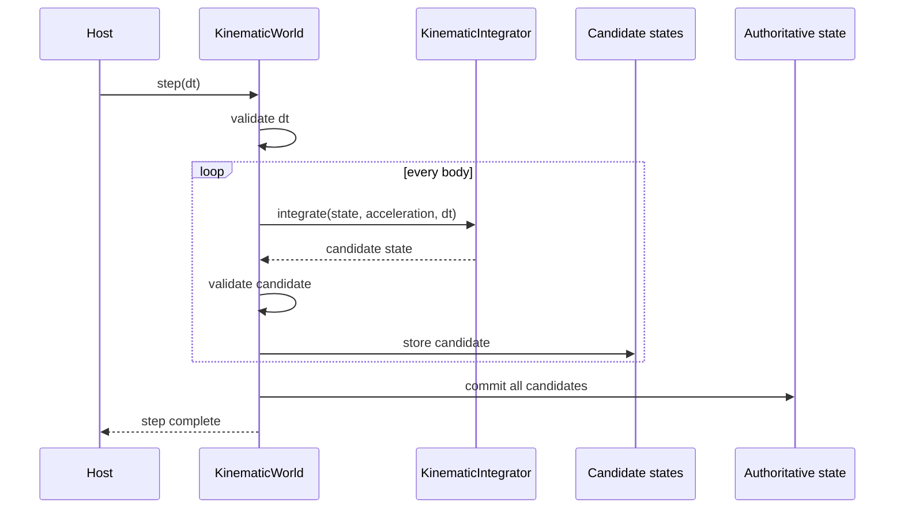

The important invariant is:

> Either every body advances successfully, or no authoritative body state is replaced.

Conceptually:

```text
calculate
    ↓
validate all
    ↓
commit all
```

rather than:

```text
calculate body A
    ↓
commit A
    ↓
calculate body B
    ↓
failure
    ↓
partially updated world
```

This becomes increasingly valuable as world behavior grows more complex.

---

## 10. Kinematic state model

The current physics state is intentionally small.

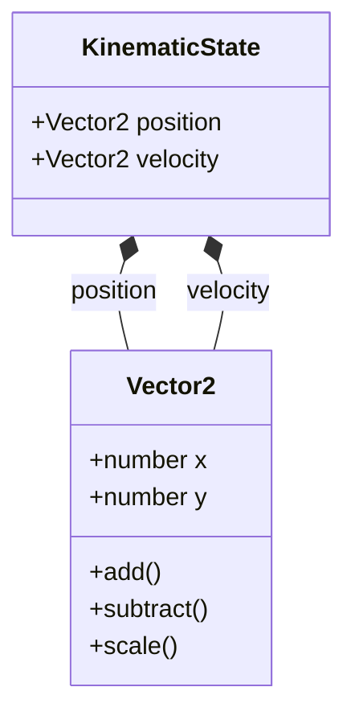

A `KinematicState` contains:

```text
position
velocity
```

It deliberately does not yet contain concepts such as:

```text
mass
force
shape
orientation
angular velocity
collision state
```

Those should appear only when simulation features create a real requirement for them.

---

## 11. The role of `KinematicSimulation`

The project currently contains two state-owning runtime concepts:

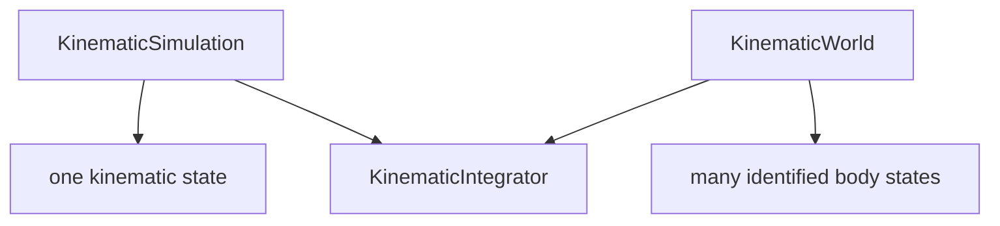

`KinematicSimulation` came first and established several architectural ideas:

- authoritative state ownership;
- validated state changes;
- injected integration behavior;
- candidate-before-commit stepping.

`KinematicWorld` later applies those ideas to multiple identified bodies.

`KinematicSimulation` is currently still part of the public engine API, but it should not be interpreted as evidence that the final architecture requires both concepts permanently.

It is part of the project's evolutionary design history.

A future review may find that:

- both concepts remain useful;
- `KinematicWorld` subsumes the single-state runtime;
- or a different runtime boundary emerges from later requirements.

No change is necessary until the implementation provides evidence.

---

## 12. Visualization boundary

Visualization lives outside the engine:

```text
src/visualization/
```

The current concrete renderers are:

```text
SvgKinematicRenderer
CanvasKinematicRenderer
```

Both consume detached engine observations.

Their output mechanisms differ:

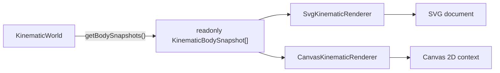

Neither renderer:

- advances simulation time;
- calculates acceleration;
- integrates velocity or position;
- modifies world state;
- inspects the world's private storage.

Their responsibility starts after simulation state has already been produced.

The two renderers intentionally retain different output models. Their existence does not currently justify a generic renderer interface.

---

## 13. World coordinates versus display coordinates

The engine uses mathematical world coordinates:

```text
+x → right
+y → up
```

The current display technologies use coordinates where positive Y points downward.

World-to-display conversion is therefore owned by the shared `ViewportTransform`.


The current mapping is:

```text
displayX = width / 2 + worldX × pixelsPerUnit

displayY = height / 2 - worldY × pixelsPerUnit
```

The world origin therefore appears at the center of the viewport.

The minus sign in the Y mapping performs the coordinate-system inversion.

`ViewportTransform` owns only viewport geometry, scale, validation, and numeric coordinate conversion.

It deliberately does not know about:

```text
SVG
Canvas
KinematicWorld
KinematicBodySnapshot
Vector2
rendering primitives
```

Both renderers construct their transform internally from their existing viewport constructor arguments.

The transform was extracted only after SVG and Canvas independently demonstrated the same coordinate-mapping responsibility.

---

## 14. Host/application responsibility

The example program currently acts as the composition root.

`examples/kinematic-world-svg.ts` decides:

- which integrator to use;
- which acceleration the world has;
- which bodies to create;
- how many simulation steps to perform;
- which renderer to create;
- where generated output is written.

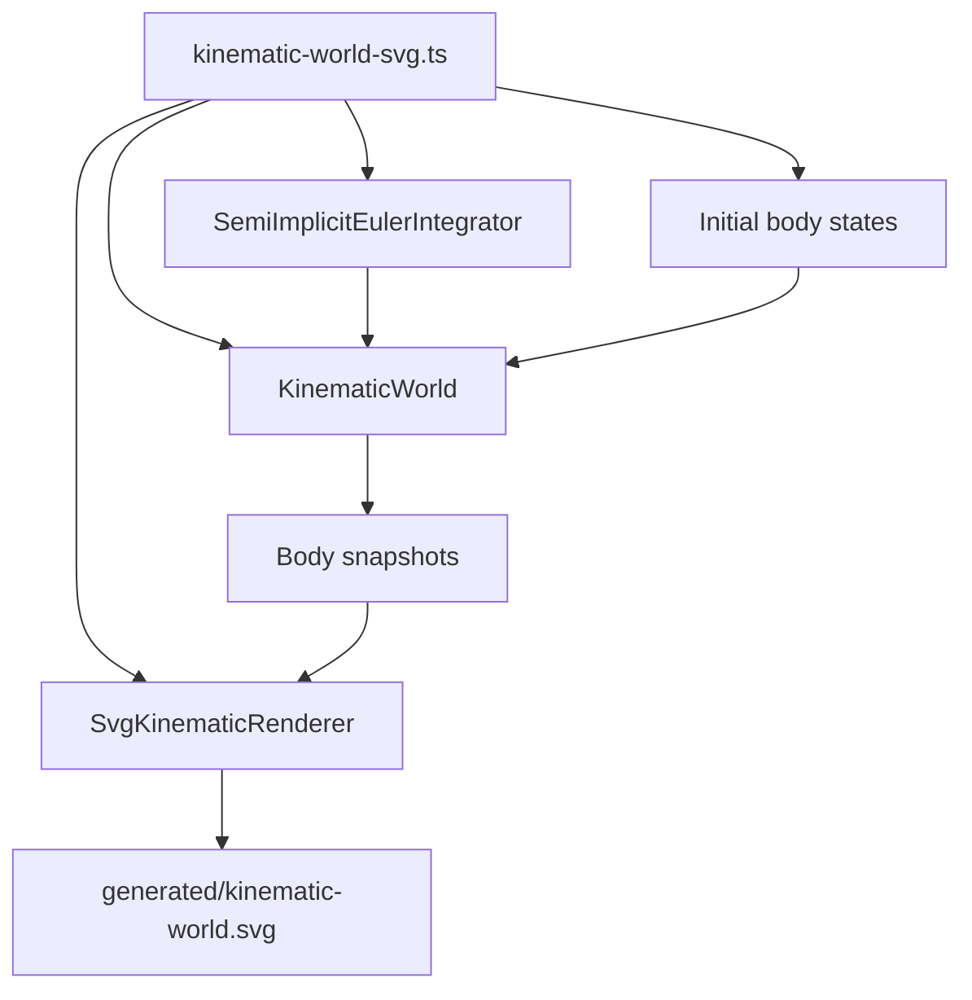

This is a useful architectural role even though there is not yet an `application/` subsystem.

The host composes otherwise independent pieces.

The engine does not decide which renderer exists, and the renderer does not decide which world or integrator exists.

---

## 15. Current runtime flow

Putting the pieces together:

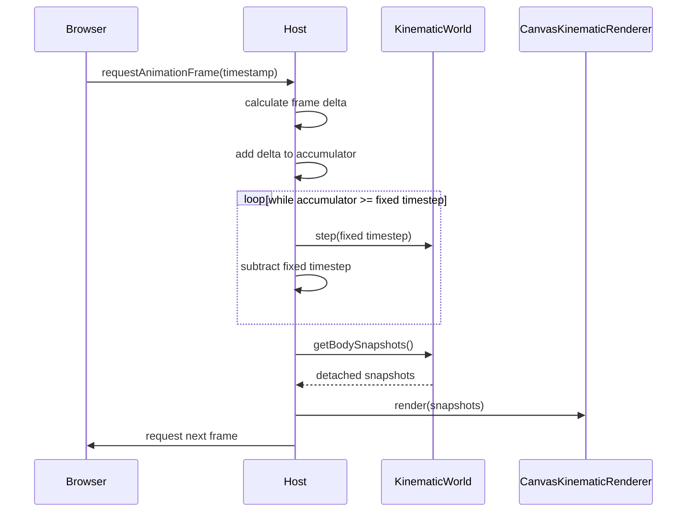

This represents the first complete vertical slice through vLab2D:

```text
configuration
     ↓
simulation
     ↓
observation
     ↓
visualization
     ↓
visible output
```

---

## 16. Architectural principles demonstrated today

Several project principles are no longer merely intentions; the current implementation demonstrates them.

### Simulation and visualization are independent

The engine contains no rendering dependency.

### State ownership is explicit

`KinematicWorld` owns authoritative body state.

### Observation does not expose world storage

Consumers receive detached observations.

### Behavior can be injected

The numerical integration algorithm is supplied to the world through `KinematicIntegrator`.

### Composition is preferred over inheritance

Integrators implement a small behavior contract rather than participating in a deep class hierarchy.

### Public boundaries are deliberate

External engine consumers are expected to import from `src/engine/mod.ts`.

### Abstractions are introduced from concrete needs

`ViewportTransform` was introduced only after SVG and Canvas independently demonstrated the same viewport geometry and coordinate-conversion responsibility.

There is still no generalized renderer hierarchy, camera framework, event bus, entity-component system, or dependency-injection container.

Those abstractions have not been justified by the implementation.

---

## 17. What architecture this is — and is not

Some current ideas resemble well-known architectural patterns, but vLab2D is not attempting to implement a formal architecture methodology.

For example:

- injected integrators resemble the **Strategy pattern**;
- `mod.ts` acts as a **module facade/public boundary**;
- world-owned state and detached observations reinforce **encapsulation**;
- external composition follows **dependency inversion** where replaceable behavior is involved.

However, vLab2D is not currently claiming to be:

- Clean Architecture;
- Hexagonal Architecture;
- an Entity Component System;
- Domain-Driven Design;
- an event-driven architecture;
- a plugin framework.

Those labels would imply structures and constraints the project has not needed.

The project uses architectural ideas selectively when they solve real problems.

---

## 18. Implemented, intended, and future architecture

It is useful to keep these categories separate.

### Implemented

```text
✓ public engine boundary through mod.ts
✓ mathematical Vector2 values
✓ kinematic state
✓ replaceable kinematic integrators
✓ single-state KinematicSimulation
✓ multi-body KinematicWorld
✓ world-local BodyId
✓ world-owned authoritative body state
✓ detached body observations
✓ atomic world stepping
✓ independent SVG visualization
✓ independent Canvas 2D visualization
✓ shared ViewportTransform
✓ shared world-to-display coordinate mapping
✓ external host/example composition
✓ browser requestAnimationFrame host
✓ fixed-timestep accumulator loop
✓ simulation/render cadence separation
```

### Established architectural principles

```text
→ simulation remains independent from presentation
→ authoritative state remains engine-owned
→ external mutation uses validated APIs
→ observation should not leak writable engine state
→ genuinely variable behavior may use injected strategies
→ composition is preferred over unnecessary inheritance
→ abstractions should be earned by concrete use cases
```

### Future directions, not current architecture

Possible future capabilities include:

```text
? Canvas grid, axes and origin reference rendering
? pan and zoom
? inverse display-to-world mapping
? experiment orchestration
? synchronized multiple worlds
? UI controls
? collision detection and response
? forces
? richer body models
? logging / inspection
? diagnostic overlays
```

These are directions, not promises about concrete class or folder structure.

---

## 19. Shared viewport transformation

SVG and Canvas previously implemented the same world-to-display transformation independently.

That duplication produced the evidence needed to extract `ViewportTransform`.


The shared transform owns:

- viewport width and height;
- pixels per world unit;
- placement of the world origin at the viewport center;
- inversion between mathematical positive Y and display positive Y;
- conversion from world coordinates into display coordinates.

The renderers retain responsibility for rendering-specific behavior.

For example:

```text
ViewportTransform
    coordinate geometry

SvgKinematicRenderer
    SVG document generation
    grid / axes / origin SVG elements
    body SVG elements

CanvasKinematicRenderer
    Canvas frame clearing
    body drawing
```

The transform is intentionally immutable and is created internally by each renderer.

It is not currently an injected strategy because the project has not demonstrated a need to substitute transformation behavior independently from renderer construction.

The abstraction also remains independent from engine-domain values such as `Vector2`; its coordinate operations accept and return numbers.

No renderer hierarchy, camera model, transformation matrix framework, pan/zoom system, or inverse coordinate mapping has been introduced.

Those capabilities remain available for later evolution when concrete requirements make their shape clear.

---

## 20. Architecture evolution rule

vLab2D follows a simple architectural rule:

> Concrete requirements create pressure; repeated pressure earns abstractions.

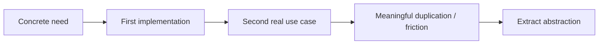

This keeps the code understandable while still allowing the architecture to mature.

The architecture documentation should evolve in the same way.

When this overview becomes too large, focused documents can be extracted from it, for example:

```text
docs/architecture/
├── README.md
├── engine.md
├── visualization.md
├── runtime.md
└── coordinate-systems.md
```

Those files should be created only when the amount of real architecture makes the split useful.

For now, this README is the architecture entry point and overview.
