# Architecture

This section explains how vLab2D is structured, how its current components collaborate, and which boundaries the project deliberately protects.

vLab2D is an exploratory learning project rather than a production physics engine, so its architecture is intentionally allowed to grow with the implementation.

The architecture documentation therefore distinguishes between:

- **implemented architecture** — structures and boundaries visible in the current code;
- **architectural principles** — deliberate rules that guide new work;
- **future directions** — plausible extensions that have not yet earned an implementation.

The goal is not to predict the final system. It is to make the current system understandable.

---

## 1. Architecture at a glance

At the current checkpoint, vLab2D has three important runtime areas:

1. an independent simulation engine;
2. visualization outside that engine;
3. host/example code that composes the two.

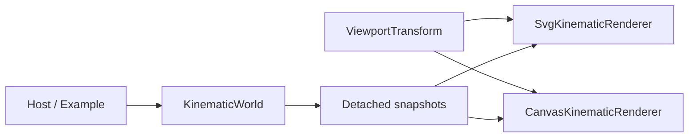

The most important dependency rule is:

```text
simulation engine does not depend on visualization
```

Visualization may observe information exposed by the engine, but rendering concerns do not enter the simulation core.

---

## 2. Repository-level boundaries

The current source tree exposes the architecture directly:

```text
src/
├── engine/
│   ├── kinematics/
│   ├── math/
│   ├── simulation/
│   ├── world/
│   └── mod.ts
│
└── visualization/
    ├── canvas-kinematic-renderer.ts
    ├── svg-kinematic-renderer.ts
    └── viewport-transform.ts

examples/
├── kinematic-world-canvas/
└── kinematic-world-svg.ts
```

These areas have different responsibilities.

| Area                     | Responsibility                                                                  |
| ------------------------ | ------------------------------------------------------------------------------- |
| `src/engine/`            | Own and advance simulation state                                                |
| `src/engine/mod.ts`      | Define the public consumer-facing engine boundary                               |
| `src/engine/math/`       | Small mathematical values and operations used by the engine                     |
| `src/engine/kinematics/` | Kinematic state and numerical integration behavior                              |
| `src/engine/world/`      | Own collections of simulated bodies and their authoritative state               |
| `src/engine/simulation/` | Earlier single-state simulation runtime retained while the architecture evolves |
| `src/visualization/`     | Convert observed simulation information into visual representations             |
| `examples/`              | Compose components into runnable scenarios                                      |

The folders are not intended as permanent framework layers. They exist because concrete implementation responsibilities have appeared.

---

## 3. Dependency direction

vLab2D deliberately keeps dependencies pointing toward simulation concepts rather than allowing presentation concerns to leak inward.

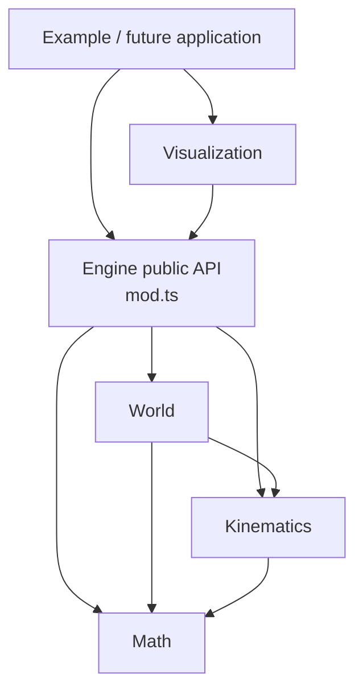

There is deliberately no dependency in the opposite direction:

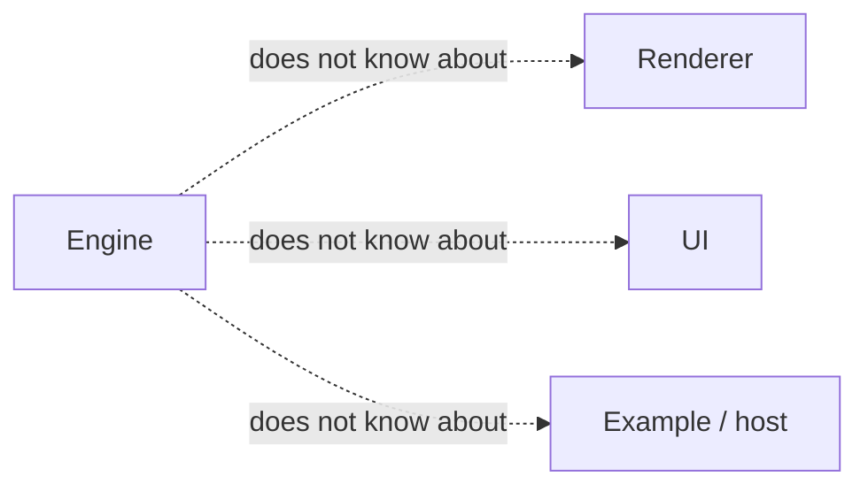

This gives the engine a useful property:

> A simulation can run without any renderer at all.

Likewise, a renderer does not advance physics. It consumes observations produced by the engine.

---

## 4. The engine boundary

External consumers are expected to enter the simulation engine through:

```text
src/engine/mod.ts
```

`mod.ts` exports the engine's supported public concepts while internal modules remain implementation details.

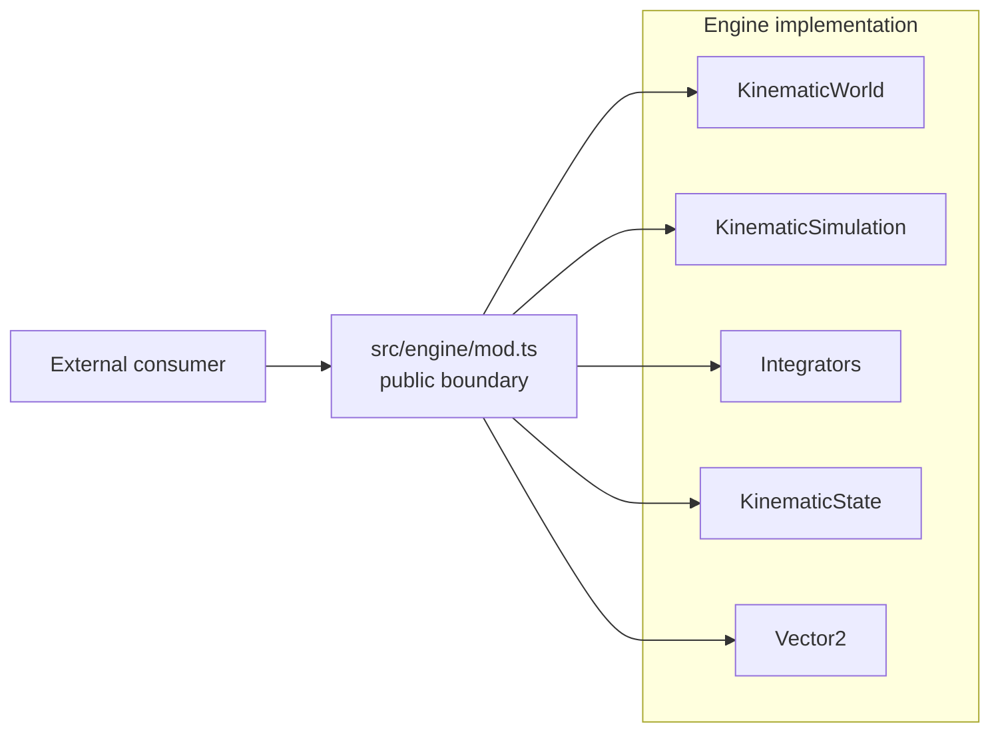

TypeScript does not physically prevent a consumer from importing an internal file directly.

The boundary is therefore both:

- a source-code convention;
- a documented API contract.

Project code outside the engine should prefer `mod.ts`.

Both visualization renderers follow this rule by consuming public snapshot types from the engine boundary rather than depending on world storage internals.

---

## 5. State ownership

One of the strongest current architectural rules is:

> The simulation engine owns authoritative mutable simulation state.

For the multi-body runtime, that authority belongs to `KinematicWorld`.

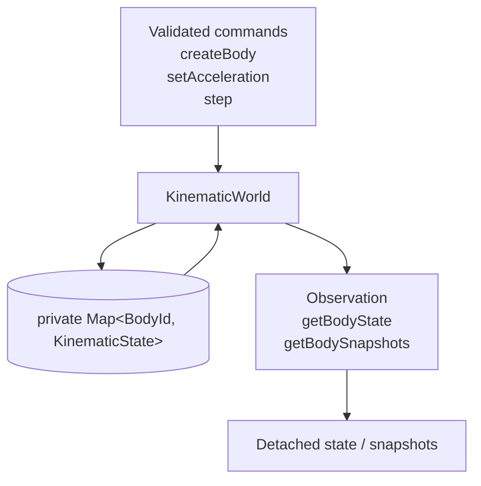

Consumers do not receive the world's internal `Map`, and observation APIs do not expose writable references into world storage.

A renderer can inspect a body snapshot, but changing that snapshot cannot change the world.

---

## 6. Observation and control are separate

The engine API currently contains two conceptually different kinds of interaction.

### Observation

Observation asks:

> What is the simulation state?

Examples:

```text
world.acceleration
world.getBodyState(...)
world.getBodySnapshots()
```

### Control

Control asks:

> Please change or advance the simulation.

Examples:

```text
world.createBody(...)
world.setAcceleration(...)
world.step(...)
```

The distinction is expressed through ordinary methods rather than separate command/query framework objects.

That is intentional. The project has not demonstrated a need for a command bus, repository abstraction, event system, or similar infrastructure.

---

## 7. World-owned bodies

Bodies currently do not exist as independently mutable runtime objects.

Instead:

```text
KinematicWorld
    owns
      ↓
BodyId → KinematicState
```

`BodyId` is an opaque, world-local identifier used by consumers to refer to body state owned by a world.

This avoids handing consumers a mutable `Body` object whose state could bypass world invariants.

It also gives the world one clear place to coordinate future operations that affect multiple bodies.

---

## 8. State and integration behavior are separate

`KinematicWorld` owns state, but it does not contain a hard-coded numerical integration algorithm.

Instead it receives a `KinematicIntegrator`.

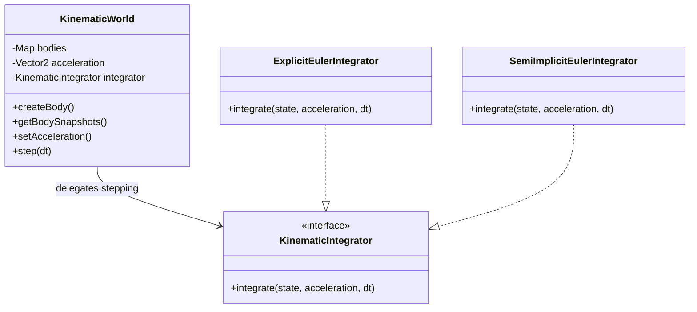

This is a small application of the Strategy pattern:

- `KinematicWorld` decides **when** bodies are advanced;
- an integrator decides **how** one kinematic state is numerically advanced.

The interface remains deliberately specific to kinematics rather than becoming a generalized numerical-integration framework.

---

## 9. Stepping a world

A world step is deliberately transactional.

The world first calculates and validates every candidate state before committing any authoritative replacement.

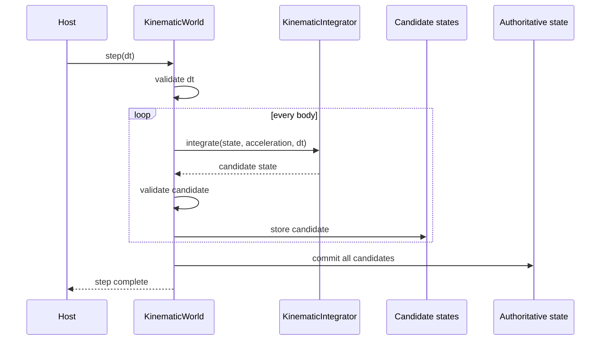

The invariant is:

> Either every body advances successfully, or no authoritative body state is replaced.

---

## 10. Kinematic state model

The current physics state is intentionally small.

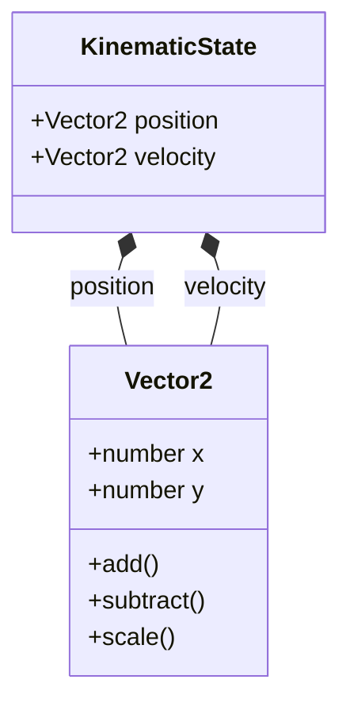

A `KinematicState` contains only:

```text
position
velocity
```

It deliberately does not yet contain concepts such as mass, force, shape, orientation, angular velocity, or collision state.

Those should appear only when simulation features create a real requirement for them.

---

## 11. The role of `KinematicSimulation`

The project currently contains two state-owning runtime concepts:

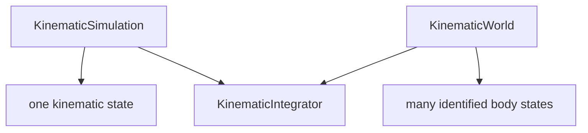

`KinematicSimulation` came first and established authoritative state ownership, validated state changes, injected integration behavior, and candidate-before-commit stepping.

`KinematicWorld` later applied those ideas to multiple identified bodies.

`KinematicSimulation` remains part of the public engine API, but its presence should not be interpreted as a commitment that both runtime concepts must exist permanently.

---

## 12. Visualization boundary

Visualization lives outside the engine:

```text
src/visualization/
```

The current concrete renderers are:

```text
SvgKinematicRenderer
CanvasKinematicRenderer
```

Both consume detached engine observations, but their output mechanisms differ.

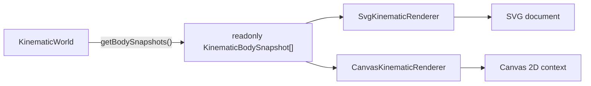

Neither renderer advances simulation time, calculates physics, modifies world state, or inspects private world storage.

Their rendering responsibilities are currently:

```text
SvgKinematicRenderer
    SVG document generation
    integer grid
    world axes
    origin marker
    body markers

CanvasKinematicRenderer
    Canvas frame clearing
    integer grid
    world axes
    origin marker
    body drawing
    display-space body-marker hit testing
    per-frame highlighted-body presentation
```

Both renderers use `ViewportTransform` for coordinate placement while retaining rendering-technology-specific drawing behavior. Both expose programmatic viewport centering and scale changes. Canvas additionally accepts display-space pan deltas, exposes inverse display-to-world scalar queries, supports anchor-preserving scale changes, and can hit-test its rendered body markers, while browser pointer/wheel-event orchestration remains outside the renderer in host/example code.

Canvas and canvas-like interactive rendering are the primary visualization target. SVG remains a secondary static companion where maintaining support is natural and reasonably inexpensive. Shared abstractions should represent genuinely common concepts; SVG compatibility must not force Canvas into a weaker or less useful design.

The two renderers intentionally retain different output models. Their existence does not currently justify a generic renderer interface.

---

## 13. World coordinates versus display coordinates

The engine uses mathematical world coordinates:

```text
+x → right
+y → up
```

The current display technologies use coordinates where positive Y points downward.

Bidirectional conversion between world and display coordinates is owned by the shared `ViewportTransform`.

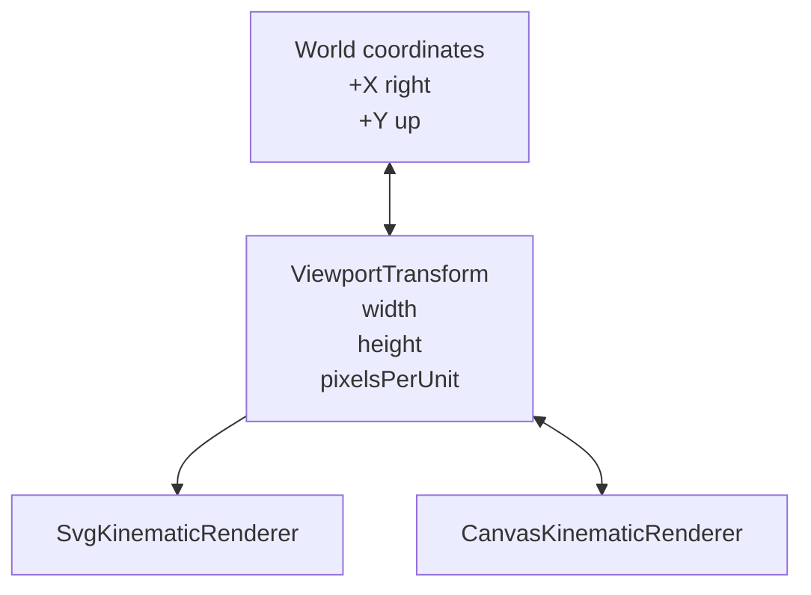

The forward mapping is:

```text
displayX = width / 2 + (worldX - centerWorldX) × pixelsPerUnit

displayY = height / 2 - (worldY - centerWorldY) × pixelsPerUnit
```

The inverse mapping is:

```text
worldX = centerWorldX + (displayX - width / 2) / pixelsPerUnit

worldY = centerWorldY - (displayY - height / 2) / pixelsPerUnit
```

The configured world-space center therefore appears at the center of the viewport; `(0, 0)` remains the default center.

`ViewportTransform` owns viewport dimensions, scale, mutable world-space center, validation, scalar forward/inverse coordinate conversion, and the continuous world-space extent visible through the viewport.

The visible extent is exposed through scalar values equivalent to:

```text
minWorldX
maxWorldX
minWorldY
maxWorldY
```

It deliberately does not know about integer-grid selection, SVG, Canvas, `KinematicWorld`, snapshots, `Vector2`, or rendering primitives.

Both renderers construct and retain their transform internally. Renderer methods expose semantic viewport operations without leaking the transform object itself.

The transform was extracted only after SVG and Canvas independently demonstrated the same coordinate-mapping responsibility. The mutable center extends that existing viewport responsibility rather than introducing a separate camera object.

---

## 14. Host/application responsibility

Example code currently acts as the composition root.

The host decides:

- which integrator to use;
- which acceleration the world has;
- which bodies to create;
- when the world advances;
- which renderer to create;
- where output is displayed or written.

The engine does not decide which renderer exists, and the renderer does not decide which world or integrator exists.

---

## 15. Current browser runtime flow

The Canvas example separates simulation cadence from rendering cadence.

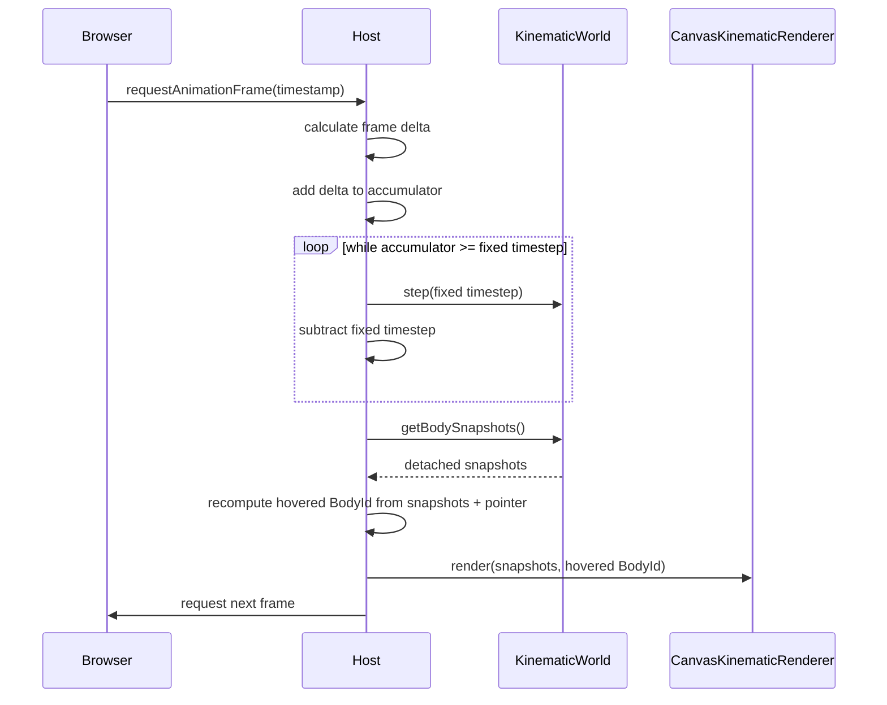

Variable browser frame delta is used as scheduling input, not as the numerical integration timestep.

The renderer remains unaware of `requestAnimationFrame` and of simulation stepping.

The host also owns pointer and wheel interaction. It tracks the active pointer, uses browser pointer capture for dragging, and converts browser client coordinates from CSS space into Canvas drawing-buffer coordinates. Display-space deltas are passed to `CanvasKinematicRenderer.panViewportBy(...)`; absolute display coordinates are passed through the renderer's inverse mapping queries to produce the live world-coordinate readout and through its body-marker hit test to produce the live body readout.

For wheel/trackpad zoom, the host normalizes wheel deltas, applies zoom sensitivity and minimum/maximum scale policy, prevents page scrolling while the Canvas owns the wheel interaction, and supplies an absolute requested scale together with the pointer's Canvas display-space anchor. `CanvasKinematicRenderer` delegates the anchor-preserving geometry to `ViewportTransform`.

For picking and hover, the host retains the latest detached snapshots used for rendering and supplies those same observations to `CanvasKinematicRenderer.findBodyAtDisplayPoint(...)`. It owns the current pointer position and transient hovered `BodyId`, then supplies that identifier back to `render(...)` as per-frame presentation input.

Hover is recomputed during the animation loop because simulation bodies move independently of pointer events. A stationary pointer can therefore gain or lose a hovered body as the rendered snapshots change. The renderer remains independent from DOM pointer/wheel-event APIs and does not persist hover identity.

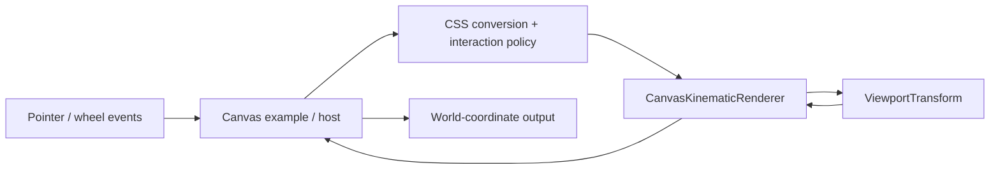

---

## 16. Architectural principles demonstrated today

Several project principles are now demonstrated by the implementation.

### Simulation and visualization are independent

The engine contains no rendering dependency.

### State ownership is explicit

`KinematicWorld` owns authoritative body state.

### Observation does not expose world storage

Consumers receive detached observations.

### Behavior can be injected

The numerical integration algorithm is supplied through `KinematicIntegrator`.

### Composition is preferred over inheritance

Integrators implement a small behavior contract rather than participating in a deep class hierarchy.

### Public boundaries are deliberate

External engine consumers are expected to import from `src/engine/mod.ts`.

### Abstractions are introduced from concrete needs

`ViewportTransform` was introduced only after SVG and Canvas independently demonstrated the same viewport geometry and coordinate-conversion responsibility. Its visible-world bounds were added only after both grid implementations independently derived the same continuous viewport extent. Inverse mapping was added only after pointer-coordinate inspection created a concrete display-to-world consumer.

### Canvas drives visualization evolution

Canvas and canvas-like interactive rendering are the primary visualization target. SVG is maintained as a useful secondary renderer when compatibility remains reasonable, but SVG parity does not constrain useful Canvas capabilities.

There is still no generalized renderer hierarchy, camera framework, event bus, entity-component system, or dependency-injection container.

Those abstractions have not been justified by the implementation.

---

## 17. What architecture this is — and is not

Some current ideas resemble well-known architectural patterns, but vLab2D is not attempting to implement a formal architecture methodology.

For example:

- injected integrators resemble the **Strategy pattern**;
- `mod.ts` acts as a **module facade/public boundary**;
- world-owned state and detached observations reinforce **encapsulation**;
- external composition follows **dependency inversion** where replaceable behavior is involved.

However, vLab2D is not currently claiming to be Clean Architecture, Hexagonal Architecture, an Entity Component System, Domain-Driven Design, an event-driven architecture, or a plugin framework.

Those labels would imply structures and constraints the project has not needed.

---

## 18. Implemented, intended, and future architecture

It is useful to keep these categories separate.

### Implemented

```text
✓ public engine boundary through mod.ts
✓ mathematical Vector2 values
✓ kinematic state
✓ replaceable kinematic integrators
✓ single-state KinematicSimulation
✓ multi-body KinematicWorld
✓ world-local BodyId
✓ world-owned authoritative body state
✓ detached body observations
✓ atomic world stepping
✓ independent SVG visualization
✓ independent Canvas 2D visualization
✓ shared ViewportTransform
✓ shared world-to-display coordinate mapping
✓ shared display-to-world coordinate mapping
✓ shared continuous visible world bounds
✓ mutable world-space viewport center
✓ mutable viewport display scale
✓ programmatic viewport centering in Canvas and SVG
✓ programmatic viewport scale in Canvas and SVG
✓ Canvas display-space panning operation
✓ pointer-drag panning in the Canvas browser host
✓ Canvas pointer world-coordinate inspection
✓ pointer-anchored wheel / trackpad zoom
✓ Canvas display-space body-marker picking
✓ live body-under-pointer inspection
✓ transient host-owned hover identity
✓ per-frame Canvas hover highlighting
✓ equivalent SVG and Canvas spatial references
✓ Canvas integer grid
✓ Canvas world axes
✓ Canvas world-origin marker
✓ external host/example composition
✓ browser requestAnimationFrame host
✓ fixed-timestep accumulator loop
✓ simulation/render cadence separation
```

### Established architectural principles

```text
→ simulation remains independent from presentation
→ authoritative state remains engine-owned
→ external mutation uses validated APIs
→ observation should not leak writable engine state
→ genuinely variable behavior may use injected strategies
→ composition is preferred over unnecessary inheritance
→ abstractions should be earned by concrete use cases
```

### Future directions, not current architecture

Possible future capabilities include:

```text
? pinch zoom
? persistent body selection
? selected-body inspector
? experiment orchestration
? synchronized multiple worlds
? UI controls
? collision detection and response
? forces
? richer body models
? logging / inspection
? diagnostic overlays
```

These are directions, not promises about concrete class or folder structure.

---

## 19. Shared viewport transformation

SVG and Canvas previously implemented the same world-to-display transformation independently.

That duplication produced the evidence needed to extract `ViewportTransform`.

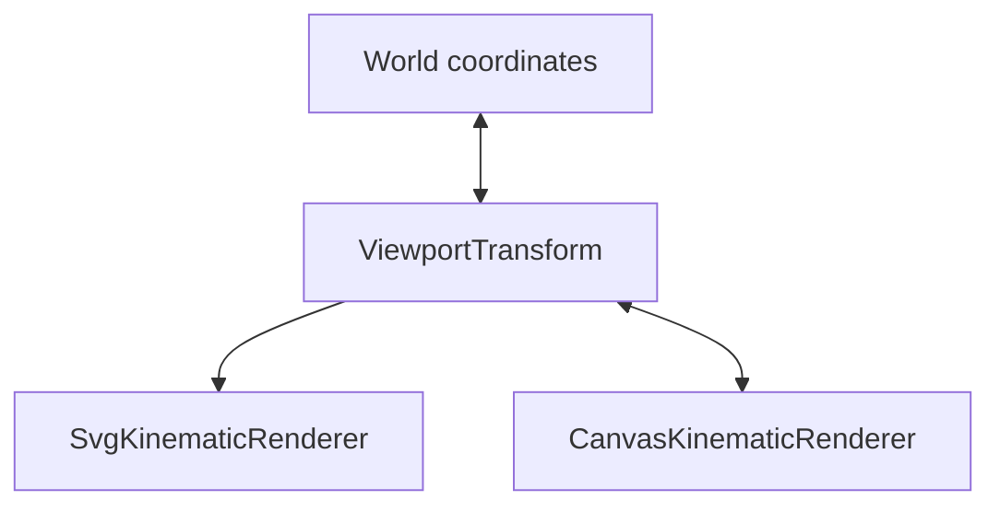

The shared transform owns:

- immutable viewport width and height;
- mutable pixels per world unit;
- a mutable world-space position mapped to the viewport center;
- inversion between mathematical positive Y and display positive Y;
- conversion from world coordinates into display coordinates;
- inverse conversion from display coordinates into world coordinates.

The renderers retain responsibility for rendering-specific behavior.

Viewport dimensions remain immutable, while the world-space center and display scale are mutable so the visible region can move and change magnification without reconstructing the renderer. The transform is created internally by each renderer.

It is not currently an injected strategy because the project has not demonstrated a need to substitute transformation behavior independently from renderer construction.

The abstraction also remains independent from engine-domain values such as `Vector2`; its coordinate operations accept and return numbers. The inverse API stays scalar as well, avoiding a new point type or per-query allocation before a concrete need justifies one.

### Continuous visible world bounds

SVG and Canvas later independently derived the same continuous world-space extent in order to determine which integer grid coordinates were visible. That duplication established a second viewport responsibility.

`ViewportTransform` now exposes the minimum and maximum visible world coordinates on each axis:

```text
minWorldX
maxWorldX
minWorldY
maxWorldY
```

These bounds are derived from viewport dimensions, the mutable scale, and the current world-space center without allocating a separate bounds object.

The responsibility boundary is:

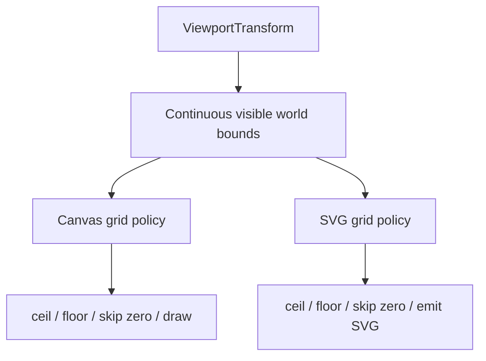

Continuous extent belongs to viewport geometry. Discrete grid selection remains renderer behavior: each renderer decides which integer coordinates to draw, reserves zero for the world axes, applies presentation styling, and uses its own drawing technology.

This keeps `ViewportTransform` useful beyond grid rendering while avoiding a grid-aware viewport abstraction. Panning changes the world-space center, and zoom changes the scale, so visible bounds follow both pieces of mutable viewport state rather than remaining symmetric around the world origin.

`CanvasKinematicRenderer.panViewportBy(...)` translates display-space drag displacement into a center change. The browser host owns Pointer Events and CSS-pixel conversion, preserving the renderer's independence from DOM input mechanics.

### Inverse display-to-world mapping

Pointer-coordinate inspection created the first concrete need to map a display position back into mathematical world space. The inverse equations belong to `ViewportTransform` because they are the reverse of the same viewport geometry already used for rendering.

`ViewportTransform` exposes scalar `displayToWorldX(...)` and `displayToWorldY(...)` operations. They account for the current world-space center, display scale, and inverted display Y axis. `CanvasKinematicRenderer` delegates these queries so its browser host can use the mapping without receiving the transform object itself. SVG does not expose a renderer-level inverse query because it currently has no consumer for one.

Browser client coordinates are not Canvas drawing-buffer coordinates. The host therefore converts Pointer Event coordinates using the Canvas bounding rectangle and drawing-buffer dimensions before invoking the renderer's inverse mapping. The host also owns presentation of the result, including decimal formatting and the DOM `<output>` element.

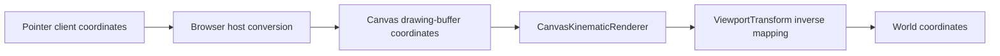

### Mutable scale and anchor-preserving zoom

Programmatic zoom introduced the first need for display scale to change after renderer construction. `ViewportTransform` therefore treats `pixelsPerUnit` as mutable viewport state rather than immutable constructor-only configuration.

`setPixelsPerUnit(...)` changes magnification while preserving the current world-space center. Because forward mapping, inverse mapping, and visible-world bounds all read the same current scale, they remain coherent after the change.

Interactive zoom created a stronger geometric requirement: the world point underneath the pointer should remain underneath the pointer while scale changes. `setPixelsPerUnitAroundDisplayPoint(...)` implements that invariant by:

1. resolving the world coordinate currently underneath the display-space anchor;
2. calculating the center required to keep that world coordinate at the same display location under the new scale;
3. validating the requested scale, anchor, and candidate center;
4. committing the new scale and center only after all candidate values are valid.

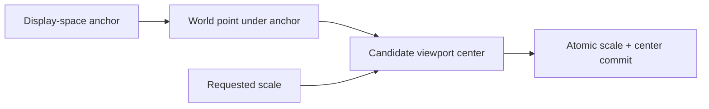

Both renderers expose programmatic scale changes because mutable scale is shared viewport geometry. Canvas additionally exposes its current scale and an anchor-aware scale operation because the browser host has a concrete interactive consumer for those capabilities.

The browser host owns wheel/trackpad interpretation: browser-coordinate conversion, delta-mode normalization, exponential zoom sensitivity, minimum/maximum scale limits, and cancellation of page scrolling during Canvas zoom. These are interaction policies rather than `ViewportTransform` invariants.

### Canvas body picking

The first body-picking capability is intentionally tied to Canvas presentation geometry.

`KinematicWorld` exposes detached body identity and kinematic state but does not currently define body shape or physical radius. `CanvasKinematicRenderer`, however, already owns the circular display marker used to draw each body. The renderer therefore has the information required to answer whether a Canvas drawing-buffer point lies inside a rendered marker without inventing engine geometry.

`findBodyAtDisplayPoint(...)` accepts detached snapshots and a display-space point. For each snapshot it maps the body's world position through the current viewport transform, compares squared display-space distance against the squared marker radius, and returns the nearest hit `BodyId`.

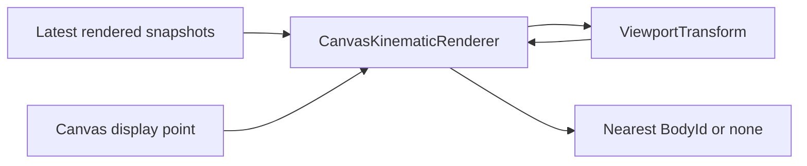

Squared distance avoids an unnecessary square root while expressing the same circular containment test. Choosing the nearest hit avoids depending on snapshot order when rendered markers overlap.

The browser host deliberately reuses the same detached snapshots that produced the visible frame when performing the hit test. Picking is therefore an observation of rendered presentation state, not a second read from authoritative world storage during the input event.

This does not establish physical body geometry, collision shape, persistent selection state, or a generic picking framework.

### Transient hover highlighting

Hover builds directly on the Canvas picking query while preserving state ownership boundaries.

The browser host owns the transient hovered `BodyId` because hover is interaction/presentation state rather than simulation state. `CanvasKinematicRenderer` remains stateless about hover identity: `render(...)` receives an optional highlighted body identifier for the current frame and draws a simple halo around that body's existing marker.

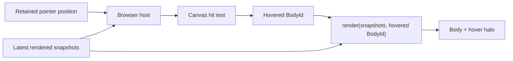

The host recomputes hover after obtaining each frame's latest detached snapshots. This is necessary because bodies move even when the pointer does not. The hover readout and halo can therefore appear or disappear under a stationary pointer without waiting for another DOM pointer event.

The same snapshot set drives hit testing and rendering, so the highlighted identity corresponds to the observations visible in that frame.

No persistent selected-body state, click semantics, style/theme abstraction, `WorldBounds` value type, renderer hierarchy, camera model, transformation matrix framework, point abstraction, or gesture framework has been introduced.

---

## 20. Architecture evolution rule

vLab2D follows a simple architectural rule:

> Concrete requirements create pressure; repeated pressure earns abstractions.

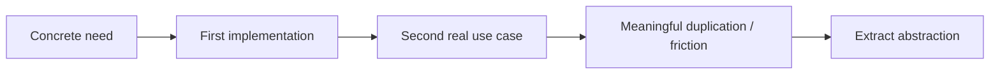

This keeps the code understandable while still allowing the architecture to mature.

The architecture documentation should evolve in the same way.

When this overview becomes too large, focused documents can be extracted from it, for example:

```text
docs/architecture/
├── README.md
├── engine.md
├── visualization.md
├── runtime.md
└── coordinate-systems.md
```

Those files should be created only when the amount of real architecture makes the split useful.

For now, this README is the architecture entry point and overview.
