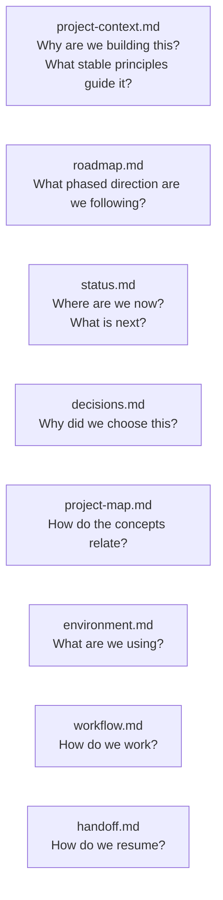

# Project Documentation

This section contains the project-level documentation for vLab2D: its purpose, current state, development strategy, decisions, development approach, environment, and continuity rules.

It describes **why the project exists, where it is going, and how it is developed** rather than documenting individual source modules or implementation APIs.

## Where to start

Choose the document that matches what you need:

| Document                                   | Purpose                                                                                                 |
| ------------------------------------------ | ------------------------------------------------------------------------------------------------------- |
| [`project-context.md`](project-context.md) | Stable project identity, goals, constraints, guiding principles, and long-term architectural direction |
| [`roadmap.md`](roadmap.md)                 | Current phased strategy, action plan, and future development direction                                  |
| [`status.md`](status.md)                   | Current implementation checkpoint and the next small development goal                                   |
| [`decisions.md`](decisions.md)             | Durable architectural, engineering, and workflow decisions with rationale                               |
| [`project-map.md`](project-map.md)         | Visual/conceptual map of the project, lifecycle, layers, and possible evolution                          |
| [`environment.md`](environment.md)         | Development environment, versions, tooling constraints, and environment-specific notes                  |
| [`workflow.md`](workflow.md)               | Development lifecycle, learning approach, testing standards, documentation rules, and working agreement |
| [`handoff.md`](handoff.md)                 | Procedure for restoring context and continuing the project from an authoritative Git baseline           |

## Reading paths

### Understanding the project

For a first introduction beyond the repository README:

1. [`project-context.md`](project-context.md)
2. [`project-map.md`](project-map.md)
3. [`roadmap.md`](roadmap.md)
4. [`status.md`](status.md)

This gives the stable vision first, then the conceptual relationships, followed by the phased strategy and current implementation checkpoint.

### Continuing development

When resuming development:

1. establish the latest authoritative Git baseline;
2. read [`handoff.md`](handoff.md) for the continuity procedure;
3. read [`project-context.md`](project-context.md) for stable architectural principles;
4. read [`roadmap.md`](roadmap.md) for the active phase and intended sequence;
5. read [`status.md`](status.md) for the current checkpoint and next goal;
6. consult [`decisions.md`](decisions.md), [`workflow.md`](workflow.md), and other documents as required by the task.

The repository at the confirmed baseline remains the source of truth for actual code, tests, configuration, and committed documentation.

### Understanding why something was designed a particular way

Start with [`decisions.md`](decisions.md).

The decision log records durable choices and their rationale. Source code, tests, and Git history provide the concrete implementation and historical context.

### Understanding what comes next

Start with [`roadmap.md`](roadmap.md), then use [`status.md`](status.md) to see exactly which slice is currently active.

The roadmap is directional and adaptive. It should guide sequencing without becoming a frozen final specification.

## Documentation responsibilities

Each document has one primary responsibility.



Information should have one authoritative home. Other documents may summarize or link to it when useful, but they should avoid becoming competing sources of truth.

Git remains the source of implementation history. `status.md` is a current-state dashboard, not a changelog. `roadmap.md` is the phased strategy, not a promise about exact future APIs.

## Documentation hierarchy

The repository README is the project front door.

Documentation beneath `docs/` should be organized into coherent sections. Each section can provide its own `README.md` as an entry point and index.

The intended navigation model is:

```text
README.md
    ↓
documentation section
    ↓
section README.md
    ↓
focused documents
```

For example:

```text
README.md
└── docs/
    ├── project/
    │   ├── README.md
    │   ├── project-context.md
    │   ├── roadmap.md
    │   ├── status.md
    │   ├── decisions.md
    │   ├── project-map.md
    │   ├── environment.md
    │   ├── workflow.md
    │   └── handoff.md
    │
    └── architecture/
        ├── README.md
        └── ...
```

`docs/architecture/` explains implemented software architecture. `docs/project/` records stable project direction, decisions, strategy, current status, workflow, and continuity.

Both sections should evolve from concrete project needs rather than attempting to specify a large final architecture in advance.
