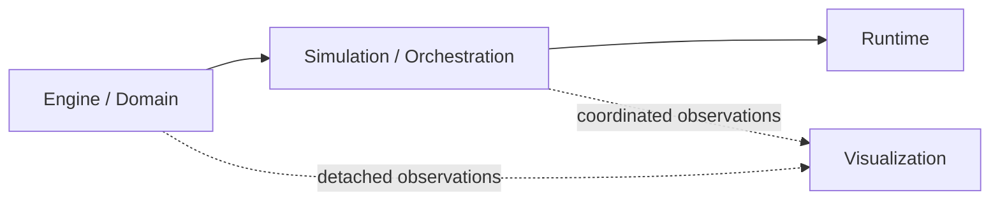

# vLab2D — Project Context

> Canonical stable project-context document. A new chat should read this file first; `handoff.md` defines the resume procedure, `workflow.md` defines the working agreement, and `roadmap.md` records the current phased development strategy.

## 1. Project identity

Working description:

**A modular interactive visual 2D physics laboratory for learning, experimentation, and enjoyment.**

This is a hobby/learning project, not an attempt to build a production-grade or full-featured 2D physics engine.

The project should remain exploratory: we use known algorithms and established techniques, understand them by implementing them, and choose future directions based on curiosity and what becomes interesting while working.

## 2. Primary goals

1. Learn TypeScript through a substantial but enjoyable project.
2. Learn physics-simulation concepts by implementing small, understandable versions of established techniques.
3. Build something relaxing, colorful, informative, and satisfying to watch.
4. Make invisible simulation state visible through optional visual indicators and diagnostics.
5. Support experiments comparing two or more simulated worlds under different conditions.
6. Practice project management: scope control, milestones, decisions, refactoring, prioritization, and maintaining project continuity.
7. Preserve enough project context that a fresh chat can continue with minimal loss of context.

## 3. Guiding philosophy

- Direction, not a fixed destination.
- Small complete steps rather than an ambitious master specification.
- Curiosity drives features.
- Prefer known techniques over inventing algorithms unnecessarily.
- Understand before optimizing.
- Do not implement a feature merely because a professional physics engine would have it.
- Avoid premature abstractions. Let abstractions appear when a second real use case makes them useful.
- Prefer focused responsibilities and clear separation of concerns.
- Prefer explicit dependency injection for replaceable collaborators/policies rather than hidden construction or global reach-through.
- Use OOP pragmatically where it clarifies the domain; prefer composition over deep inheritance.
- Decide relationship cardinality from the domain rather than assuming one-to-one for convenience.
- Prefer immutable reusable definitions where the concept represents intrinsic properties.
- Separate intrinsic properties, initial conditions, and runtime state.
- State-owning contexts own authoritative runtime state; reusable definitions do not become mutable escape hatches into that state.
- Prefer safe, unsurprising defaults while allowing concrete options to override them.
- Visual clarity and beauty are part of the project, not merely decoration.
- Documentation and code comments are part of the learning experience: explain non-obvious behavior, algorithms, assumptions, tradeoffs, and decisions; do not narrate obvious code.
- Use vanilla TypeScript and keep dependencies minimal; prefer implementing relevant functionality from scratch, with Deno/Deno standard-library tooling as appropriate infrastructure.
- Explain meaningful technical choices with rationale, alternatives, pros/cons, and the important “why not” arguments.
- Prefer industry best practices and established patterns when they fit the learning goal; explain when/why the project deliberately uses a simpler variant.
- Treat tests as part of the feature and optimize for confidence in behavior and edge cases rather than coverage percentages.
- Use Mermaid diagrams and practical analogies when they materially improve understanding of structural or abstract concepts.
- The physics engine is infrastructure; experiments and observation are the content.
- Canvas and canvas-like interactive rendering are the primary visualization target. Keep SVG as a useful secondary companion where support remains natural and reasonably inexpensive; do not constrain useful Canvas capabilities merely to preserve SVG parity.

## 4. Current conceptual architecture

The project now uses four conceptual layers as its architectural direction:



These are responsibility boundaries rather than a requirement to build a large framework.

### Engine / Domain

The engine/domain layer owns physical definitions, mathematical values, authoritative world state, and concrete simulation policies.

A foundational lifecycle rule applies to domain concepts:

```text
intrinsic properties
    immutable reusable definition

initial conditions
    supplied when the definition enters a state-owning context

runtime state
    owned exclusively by that context
```

For example, `Body` is a reusable definition. World-specific position and velocity are initial conditions supplied when adding that Body to a World. The World then owns the evolving runtime state for each independent body instance.

The same reusable definition may be instantiated multiple times, including across different Worlds, without sharing runtime state.

Potential responsibilities as the engine grows:

- reusable Body definitions;
- world-local body identity and runtime state;
- numerical integration;
- gravity and other environment properties;
- forces when concrete equations require them;
- geometry and collision behavior when later phases justify them;
- deterministic stepping where practical.

### Simulation / Orchestration

Simulation coordinates one or more independent Worlds.

The intended deterministic core operation is conceptually:

```text
simulation.step(dt)
```

Potential responsibilities:

- coordinate one or more Worlds;
- synchronize stepping for controlled comparisons;
- track simulation-level time if/when needed;
- keep orchestration independent from browser scheduling and visualization.

Multiple Worlds are a core experimental requirement rather than a speculative abstraction.

### Visualization

Rendering remains independent from authoritative simulation state.

Canvas and canvas-like interactive rendering are the primary visualization target and should drive the design of interactive visualization capabilities. SVG remains a valuable secondary renderer for static snapshots, debugging captures, exports, and documentation images where maintaining equivalent or reduced behavior remains reasonable.

Visualization design should not collapse to the lowest common denominator between Canvas and SVG. If a useful Canvas capability does not map naturally to SVG, prefer the Canvas design and let SVG adapt, provide a reduced/static equivalent, or omit that feature rather than compromising the primary interactive path.

The same simulation state may eventually be represented by multiple views or observers. Visualization consumes detached observations and should not become the owner of engine runtime state.

Possible indicators include:

- velocity vector;
- acceleration vector;
- direction / speed;
- bounds;
- collision/contact points;
- collision normals;
- centers / pivots;
- trails;
- active/inactive/sleeping state;
- labels or selected-body information.

### Runtime

Runtime drives Simulation in a particular host environment.

For a browser runtime, likely responsibilities include:

- wall-clock scheduling;
- `requestAnimationFrame`;
- fixed-timestep accumulation;
- calling deterministic simulation steps;
- coordinating render cadence;
- host-specific pointer/wheel/event mechanics where appropriate.

`run()` belongs to runtime/application execution rather than to the deterministic Simulation model.

### UI / Controls

The options/control panel remains optional rather than intrinsic to simulation or visualization.

Possible controls:

- start;
- pause;
- resume;
- single step;
- reset;
- experiment/world selection;
- visualization toggles;
- colors and indicator customization;
- physics/world parameters.

### Logging / Observation

An optional console/logger should remain independent from renderers and physical algorithms.

Possible event categories:

- simulation lifecycle;
- collisions;
- body state changes;
- warnings/errors;
- metrics;
- debugging observations.

The same information might later feed a console, graph, exporter, or other observer without changing the simulation core.

## 5. Multi-world experiments

Multi-world comparison is an important project capability, not merely a future cosmetic feature.

Desired properties:

- two or more worlds can start from the same reusable definitions and comparable initial conditions;
- one parameter can be changed while keeping others equal;
- worlds can advance synchronously;
- worlds may use different numerical integrators;
- worlds can be rendered side by side or overlaid;
- differences between worlds may be visualized or measured.

Important learning themes:

- numerical integration behavior;
- determinism;
- sensitivity to initial conditions;
- chaotic systems / butterfly effect;
- energy drift and stability.

## 6. Repository boundary and architectural migration

The repository began with deliberately small boundaries:

- `src/engine/` — self-contained simulation engine; `mod.ts` is its public consumer entry point;
- `src/visualization/` — rendering/diagnostic presentation concerns, outside the engine;
- `docs/project/` — continuity, decisions, status, workflow, environment, roadmap, and project map;
- `tests/` — reserved for project-level/bootstrap tests; feature tests should normally be colocated.

The project is now incrementally moving toward the four-layer architecture rather than adding empty folders in advance.

The likely direction is:

```text
src/
├── engine/
├── simulation/
├── visualization/
└── runtime/
```

Deeper structure should still appear only when concrete responsibilities justify it.

## 7. Development roadmap

The current phased strategy lives in [`roadmap.md`](roadmap.md).

At a high level:

1. **Phase 1 — Structure and lifecycle refactoring:** no new features; reorganize current behavior around Body → World → Simulation → Runtime.
2. **Phase 2 — Geometry / single-shape learning:** introduce immutable Shape geometry incrementally while shapeless particle-like Bodies remain valid.
3. **Phase 3 — Geometry becomes physics:** collision detection/response and related structure only when geometry creates a concrete need.
4. **Phase 4+ — Richer bodies and presentation:** compound bodies, physical materials, appearance/textures, and other concepts only as previous phases justify them.

The roadmap is directional and adaptive, not a frozen specification.

## 8. Continuity principle

Project continuity is a first-class requirement. Stable identity, goals, constraints, architecture, decisions, environment, workflow, roadmap, and current status must remain recoverable from the repository rather than depending on conversation history.

The detailed development/learning agreement lives in `workflow.md`. The phased strategy lives in `roadmap.md`. The procedure for resuming the project in a fresh chat lives in `handoff.md`. The current operational state lives in `status.md`.

The continuity documents do not replace the source repository, tests, configuration, or Git history; a faithful handoff needs the repository as well.

## 9. Repository identity

Repository: <https://github.com/fa-ribeiro/vLab2D>

Current implementation state deliberately does **not** live in this document. Read `status.md` for the current checkpoint and next step. This file should remain focused on stable project identity, goals, constraints, architecture, and continuity principles rather than repeating operational status.
