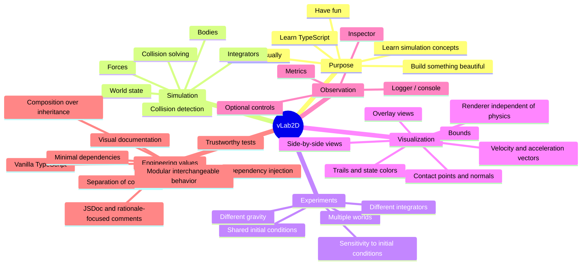
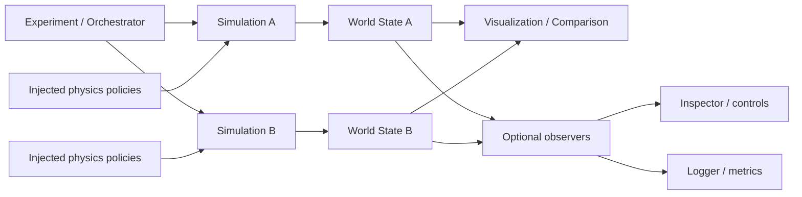
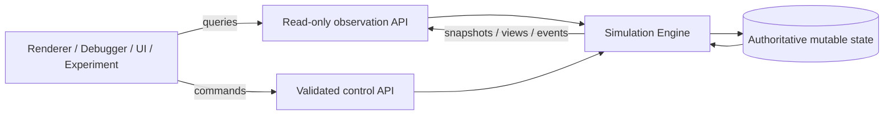

# vLab2D — Project Map

Last updated: 2026-09-26

This is an orientation map, not a frozen architecture or roadmap.

## Conceptual flow

The exact boundary between `World`, `Simulation`, and injected policies remains intentionally open until early implementations provide evidence.

## Development loop

```mermaid
flowchart LR
    A[Understand problem] --> B[Compare approaches]
    B --> C[Explain rationale / why not]
    C --> D[Implement smallest step]
    D --> E[Document + test]
    E --> F[Observe / run]
    F --> G[User review & approval]
    G --> H[Sync affected project docs]
    H --> I[Verify + inspect staged diff]
    I --> J[Commit]
    J --> K[Next feature]
```

## Engine boundary

The engine is the only authority allowed to mutate simulation state. Observation and control are separate concerns: outsiders may inspect safe representations of state and request changes, while the engine validates and applies those changes consistently.
