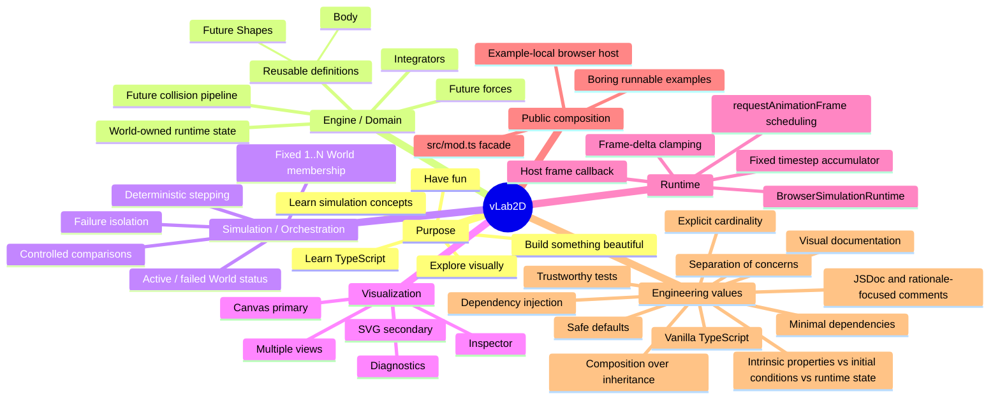
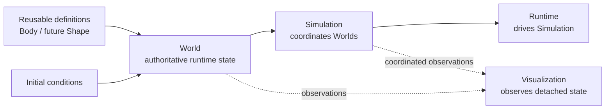
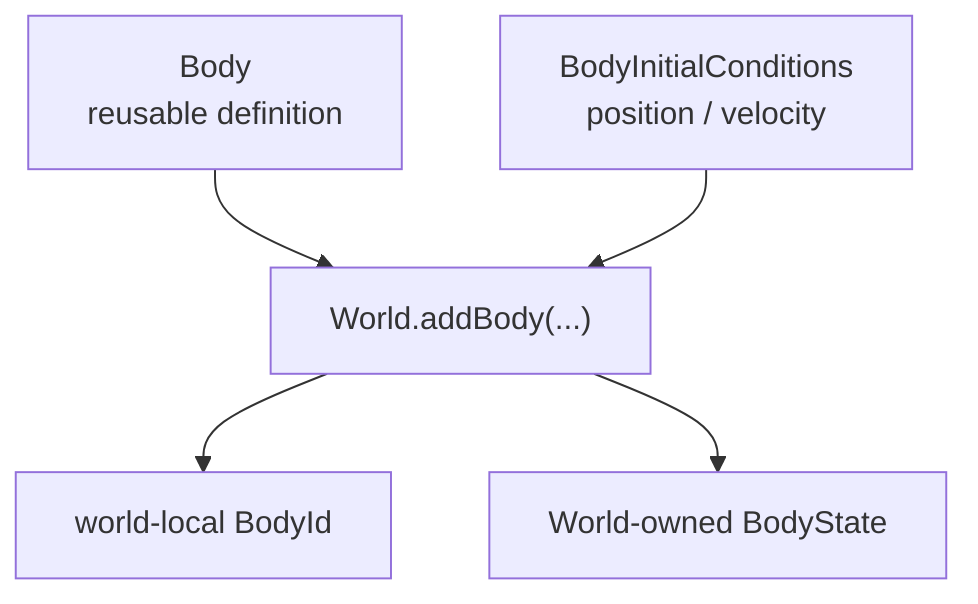
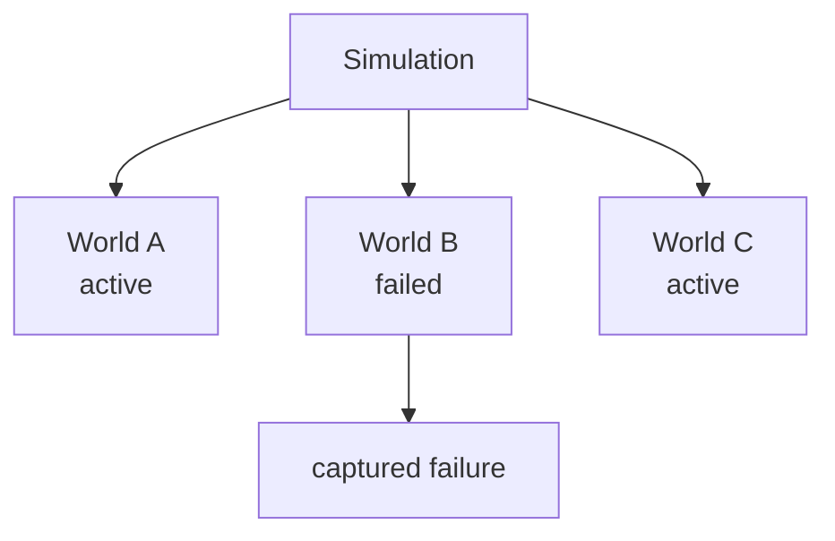
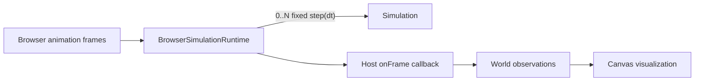
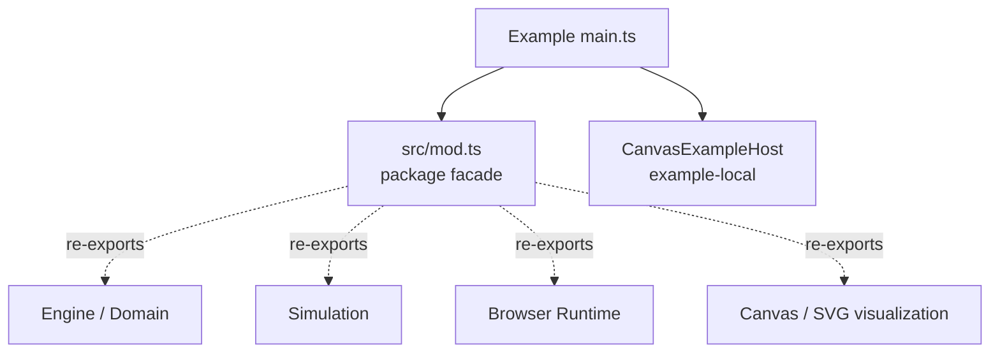
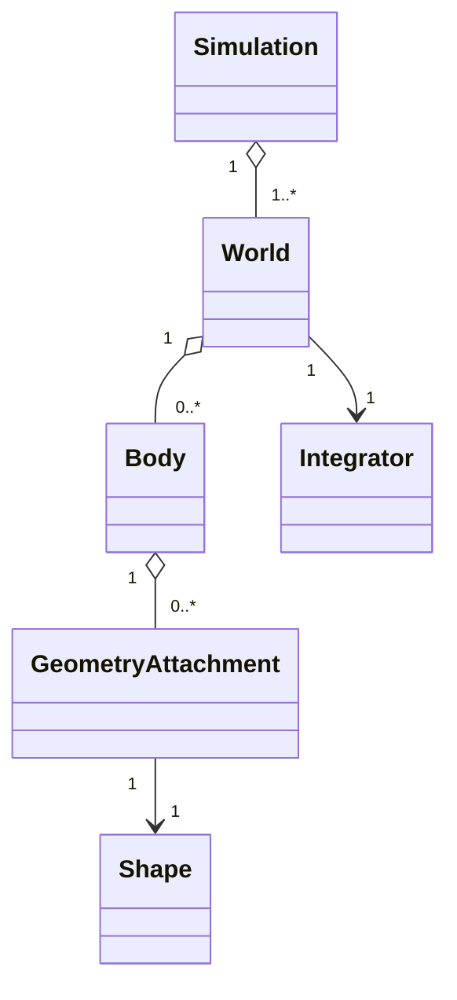
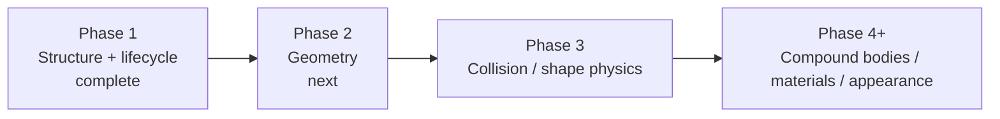
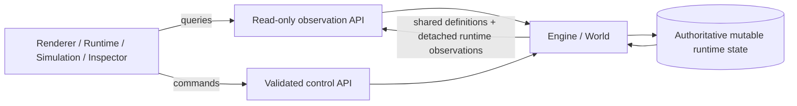

# vLab2D — Project Map

Last updated: 2026-09-28

This is an orientation map, not a frozen architecture or roadmap.


```mermaid
mindmap
  root((vLab2D))
    Purpose
      Learn TypeScript
      Learn simulation concepts
      Have fun
      Build something beautiful
      Explore visually
    Engine / Domain
      Reusable definitions
        Body
        Future Shapes
      World-owned runtime state
      Integrators
      Future forces
      Future collision pipeline
    Simulation / Orchestration
      Fixed 1..N World membership
      Deterministic stepping
      Active / failed World status
      Failure isolation
      Controlled comparisons
    Visualization
      Canvas primary
      SVG secondary
      Inspector
      Diagnostics
      Multiple views
    Runtime
      BrowserSimulationRuntime
      requestAnimationFrame scheduling
      Frame-delta clamping
      Fixed timestep accumulator
      Host frame callback
    Public composition
      src/mod.ts facade
      Boring runnable examples
      Example-local browser host
    Engineering values
      Intrinsic properties vs initial conditions vs runtime state
      Safe defaults
      Explicit cardinality
      Vanilla TypeScript
      Minimal dependencies
      Separation of concerns
      Dependency injection
      Composition over inheritance
      JSDoc and rationale-focused comments
      Trustworthy tests
      Visual documentation
```

## Architectural flow


```mermaid
flowchart LR
    DEF["Reusable definitions<br/>Body / future Shape"]
    INIT["Initial conditions"]
    WORLD["World<br/>authoritative runtime state"]
    SIM["Simulation<br/>coordinates Worlds"]
    RUNTIME["Runtime<br/>drives Simulation"]
    VIS["Visualization<br/>observes detached state"]

    DEF --> WORLD
    INIT --> WORLD
    WORLD --> SIM --> RUNTIME

    WORLD -. observations .-> VIS
    SIM -. coordinated observations .-> VIS
```

The central lifecycle rule is:

```text
intrinsic properties
    → reusable immutable definition

initial conditions
    → insertion into a state-owning context

runtime state
    → owned by that context
```

The same reusable definition may create multiple independent runtime instances.

## Current Body / World relationship


```mermaid
flowchart TD
    BODY["Body<br/>reusable definition"]
    ADD["World.addBody(...)"]
    INIT["BodyInitialConditions<br/>position / velocity"]
    ID["world-local BodyId"]
    STATE["World-owned BodyState"]

    BODY --> ADD
    INIT --> ADD
    ADD --> ID
    ADD --> STATE
```

`Body` currently has no intrinsic properties. This is intentional during Phase 1.

## Current Simulation relationship


```mermaid
flowchart TD
    SIM["Simulation"]
    W1["World A<br/>active"]
    W2["World B<br/>failed"]
    W3["World C<br/>active"]
    ERR["captured failure"]

    SIM --> W1
    SIM --> W2
    SIM --> W3
    W2 --> ERR
```

Simulation owns fixed World membership and execution status only. Worlds continue to own their own physical state.

For a valid timestep, `Simulation.step(dt)` visits active Worlds in deterministic constructor order. If one World throws, that World becomes terminally failed and later active Worlds still receive the same timestep. Failed Worlds are skipped on subsequent Simulation steps.

## Current Runtime relationship


```mermaid
flowchart LR
    BROWSER["Browser animation frames"]
    RUNTIME["BrowserSimulationRuntime"]
    SIM["Simulation"]
    HOST["Host onFrame callback"]
    WORLD["World observations"]
    VIS["Canvas visualization"]

    BROWSER --> RUNTIME
    RUNTIME -->|"0..N fixed step(dt)"| SIM
    RUNTIME --> HOST
    HOST --> WORLD --> VIS
```

Runtime owns wall-clock scheduling and fixed-timestep accumulation. Simulation remains deterministic and host-independent.

The current Canvas host supplies the Runtime frame callback and still owns rendering, pointer/wheel interaction, selection/hover state, DOM inspection output, and World observation.

## Current package composition boundary


```mermaid
flowchart TD
    API["src/mod.ts<br/>package facade"]
    ENGINE["Engine / Domain"]
    SIM["Simulation"]
    RUNTIME["Browser Runtime"]
    VIS["Canvas / SVG visualization"]
    MAIN["Example main.ts"]
    HOST["CanvasExampleHost<br/>example-local"]

    API -. re-exports .-> ENGINE
    API -. re-exports .-> SIM
    API -. re-exports .-> RUNTIME
    API -. re-exports .-> VIS

    MAIN --> API
    MAIN --> HOST
```

`src/mod.ts` is the convenient package-facing import surface. It does not replace the narrower layer boundaries used internally.

The Canvas entry point remains the composition root, while DOM and interaction mechanics live in an example-local host because they have not earned a reusable source-level abstraction.

## Future cardinality direction

Cardinality is decided per relationship rather than assumed to be one-to-one.


```mermaid
classDiagram
    class Simulation
    class World
    class Body
    class GeometryAttachment
    class Shape
    class Integrator

    Simulation "1" o-- "1..*" World
    World "1" o-- "0..*" Body
    World "1" --> "1" Integrator
    Body "1" o-- "0..*" GeometryAttachment
    GeometryAttachment "1" --> "1" Shape
```

The Body/geometry part of this diagram is a future direction rather than current implementation. Phase 2 may exercise only zero-or-one Shape while learning the model, without encoding a permanently singular relationship.

## Development phases


```mermaid
flowchart LR
    P1["Phase 1<br/>Structure + lifecycle<br/>complete"]
    P2["Phase 2<br/>Geometry<br/>next"]
    P3["Phase 3<br/>Collision / shape physics"]
    P4["Phase 4+<br/>Compound bodies / materials / appearance"]

    P1 --> P2 --> P3 --> P4
```

The detailed and authoritative phased strategy lives in [`roadmap.md`](roadmap.md).

## Development loop


```mermaid
flowchart LR
    A[Establish baseline] --> B[Understand problem]
    B --> C[Compare approaches]
    C --> D[Scope smallest step]
    D --> E[Implement]
    E --> F[Test + verify]
    F --> G[User review]
    G --> H[Sync affected docs]
    H --> I[Inspect staged diff]
    I --> J[Commit]
    J --> K[New authoritative baseline]
```

## Engine boundary


```mermaid
flowchart LR
    EXT[Renderer / Runtime / Simulation / Inspector] -->|queries| Q[Read-only observation API]
    Q --> ENG[Engine / World]
    EXT -->|commands| C[Validated control API]
    C --> ENG
    ENG --> STATE[(Authoritative mutable runtime state)]
    STATE --> ENG
    ENG -->|shared definitions + detached runtime observations| Q
```

The engine remains the only authority allowed to mutate simulation runtime state. Observation and control are separate concerns: outsiders may inspect shared immutable definitions together with detached runtime-state representations and request changes, while the engine validates and applies those changes consistently.
