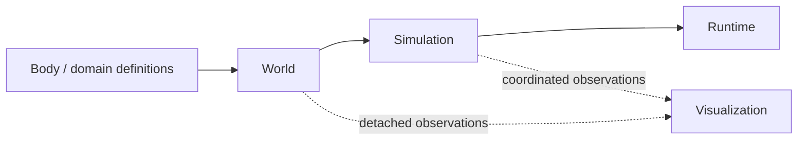
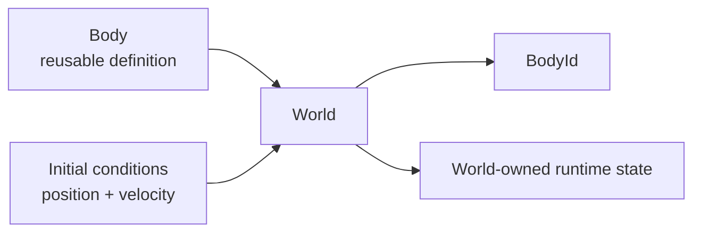

# Project Roadmap

This document is the authoritative home for vLab2D's current phased development strategy.

The roadmap gives the project a stable direction without turning that direction into a fixed final specification. Individual APIs, class names, folder layouts, and later phases may change when implementation evidence shows a better design.

The normal project workflow still applies inside every phase: establish the exact baseline, understand the problem, compare options, scope the smallest useful change, implement, test, verify, review, synchronize documentation, commit, and establish the next baseline.

## Guiding strategy

vLab2D is transitioning from feature discovery toward a small reusable architecture.

The long-term conceptual flow is:



The four conceptual layers are:

1. **Engine / Domain**
2. **Simulation / Orchestration**
3. **Visualization**
4. **Runtime**

The project remains incremental. The purpose of the roadmap is to make future work easier to place, not to pre-design all future classes.

## Foundational lifecycle rule

The central lifecycle model is:

```text
intrinsic properties
    immutable reusable definition

initial conditions
    supplied when the definition enters a state-owning context

runtime state
    owned exclusively by that context
```

For the current Body/World boundary:



The same reusable definition may create multiple independent runtime instances.

## Phase 1 — Structure and lifecycle refactoring

**Status:** complete.

**Primary goal:** reorganize the behavior that already exists. Do not add new simulation features.

Phase 1 should progressively move the project toward:

```text
Body → World → Simulation → Runtime
```

while keeping Visualization separate.

### 1A — Body definition and World insertion lifecycle

**Status:** implemented.

Current result:

- `Body` is an immutable reusable definition with no intrinsic properties yet;
- `BodyInitialConditions` carries world-specific position and velocity;
- `World.addBody(...)` creates independent world-local runtime instances;
- position and velocity default to zero;
- World copies initial conditions into authoritative runtime state;
- the same Body definition can be reused;
- examples no longer construct `KinematicState` merely to add a body.

No shapes, mass, materials, fixtures, or new simulation behavior were introduced.

### 1B — Naming and state-model cleanup

Phase 1B is split into two semantic checkpoints rather than one mass rename.

#### 1B.1 — Clarify body runtime state

**Status:** implemented.

Current result:

- `KinematicState` is removed as a constructible public class;
- `BodyState` is a readonly structural runtime-data contract containing position and velocity;
- `BodyState` lives with World-owned runtime concepts rather than with reusable `Body` definitions;
- `KinematicBodySnapshot` is renamed to `BodySnapshot`;
- integrators consume and produce `BodyState` while `KinematicIntegrator` keeps its deliberately narrow name;
- the earlier single-state `KinematicSimulation` and its tests are retired;
- no replacement `Simulation` is introduced yet.

This checkpoint clarifies that runtime state is data owned by the World, not a caller-created domain object.

#### 1B.2 — Establish the domain World

**Status:** implemented.

Current result:

- `KinematicWorld` is renamed to `World`;
- the source/test files become `world.ts` and `world.test.ts`;
- world-level `acceleration` is renamed to `gravity`;
- `setAcceleration(...)` becomes `setGravity(...)`;
- constructor arguments remain explicit, so this slice does not introduce default gravity or a default integrator;
- `KinematicIntegrator` remains deliberately narrow and continues receiving acceleration as its mathematical input;
- example filenames and renderer names retain their current kinematic qualifiers until later concrete requirements justify broader names.

This checkpoint makes the domain boundary explicit without changing equations, numerical integration behavior, timestep behavior, or visualization behavior.

### 1C — Simulation / orchestration

**Status:** implemented.

The first real `Simulation` is intentionally small and host-independent.

Current result:

- Simulation coordinates a fixed set of `1..N` unique Worlds;
- membership is copied at construction and cannot be changed through caller array mutation;
- `getWorlds()` returns a detached membership observation;
- every member World begins with `active` execution status;
- `getWorldStatus(world)` reports `active`, `failed`, or `undefined` for a non-member;
- `step(dt)` validates the timestep before touching any World;
- every active World is stepped once, in deterministic constructor order, with the same `dt`;
- when a World throws, Simulation records that World as terminally `failed`, retains the original thrown value, and continues with later Worlds;
- failed Worlds are skipped on subsequent steps;
- World physical state remains owned exclusively by each World;
- Simulation does not aggregate body snapshots or provide a physical-state facade;
- Simulation has no clock, start/pause/run lifecycle, browser scheduling, rendering, retry/reset behavior, or cross-World transaction.

A World failure is treated as experimental output rather than a reason to abort the entire multi-World comparison.

### 1D — Runtime

**Status:** implemented.

The first concrete Runtime is browser-specific and intentionally narrow.

Current result:

- `BrowserSimulationRuntime` lives under `src/runtime/browser/`;
- Runtime receives a `Simulation` and explicit fixed-timestep configuration;
- `run()` invokes the initial host frame callback and starts browser animation-frame scheduling;
- the first animation-frame timestamp establishes the wall-clock baseline;
- later frame deltas are clamped before entering the accumulator;
- accumulated wall time is consumed through zero or more deterministic `simulation.step(fixedTimestep)` calls;
- the host `onFrame` callback runs once after the current browser frame's Simulation steps;
- calling `run()` more than once does not create duplicate animation loops;
- Runtime knows nothing about Canvas, renderers, body snapshots, pointer input, or DOM output;
- pointer/wheel interaction remains in the current Canvas host because Phase 1D only extracts scheduling pressure that is already proven;
- pause/stop/restart lifecycle, interpolation, and generalized scheduler abstractions remain deferred.

`run()` now belongs concretely to Runtime/application execution rather than to deterministic Simulation.

### 1E — Module/folder organization and boring examples

**Status:** implemented.

Phase 1 closes with consolidation rather than another architectural expansion.

Current result:

- `src/mod.ts` is the package-facing composition facade;
- `src/engine/mod.ts` remains the narrower engine-layer boundary;
- runnable examples import package-facing concepts from `src/mod.ts`;
- Canvas-specific DOM interaction and presentation state moved from `main.ts` into the example-local `canvas-example-host.ts`;
- Canvas `main.ts` now reads primarily as composition: create World/body definitions, create Simulation, create renderer/host, create Runtime, run;
- SVG remains a similarly direct deterministic composition example;
- no reusable interaction framework was introduced because there is still only one concrete browser-interaction consumer;
- no source-folder rename was performed solely to match an aspirational tree;
- `kinematics/` and the current renderer names remain because their responsibilities are still accurate.

The implemented Phase 1 source shape is:

```text
src/
├── mod.ts
├── engine/
│   ├── body/
│   ├── kinematics/
│   ├── math/
│   └── world/
├── simulation/
├── visualization/
└── runtime/
    └── browser/
```

Phase 1 acceptance criterion:

```text
create definitions
create World
add bodies with initial conditions
create Simulation
create renderer / example host
create Runtime
run
```

is now represented directly by the Canvas entry point.

## Phase 2 — Geometry / single-shape learning

**Status:** active.

**Primary goal:** introduce geometry incrementally from concrete variants while preserving the ownership boundaries established in Phase 1.

### 2A — Circle

Circle is the proof-of-concept geometry used to learn the Body/geometry relationship before generalizing a Shape abstraction.

#### 2A.1 — Circle domain model

**Status:** implemented.

Current result:

- `Circle(radius)` is immutable reusable geometry expressed in simulation/world units;
- radius must be positive and finite;
- `Body` accepts optional intrinsic Circle geometry through `BodyOptions.shape`;
- `new Body()` remains a valid shapeless particle-like definition;
- the same Circle definition may be reused by multiple Body definitions;
- Circle owns no world position, velocity, orientation, or other runtime state;
- no generic `Shape` interface/base class is introduced yet.

Zero radius is not used to encode a particle. Absence of domain geometry remains semantically distinct from a point-like or zero-area Shape that might become useful for a future concrete domain reason.

#### 2A.2 — Geometry observation

**Status:** next.

Establish how immutable Body definition information accompanies detached World observations so Visualization can distinguish:

```text
shapeless Body
Circle Body
```

without reaching into authoritative World internals.

#### 2A.3 — Circle rendering

After the observation boundary is clear, render Circle radius as actual domain geometry scaled through the viewport.

Shapeless Bodies should retain a fixed presentation marker. This keeps domain geometry distinct from the visual marker used to make a geometry-free entity visible.

#### 2A.4 — Circle-aware picking

Once Circle rendering exists, revisit Canvas picking so finite Circle geometry can participate through its rendered/domain extent while shapeless Bodies can continue using presentation-marker picking.

### 2B — Box / Rectangle

Box/Rectangle is the planned second concrete geometry variant.

It should be introduced only after Circle has clarified the basic geometry model. Box creates concrete pressure for orientation-aware geometry and is therefore the natural point to revisit:

- a generalized `Shape` contract;
- Body/world orientation;
- angular velocity;
- shape-local orientation when later needed.

A Circle can also rotate physically even though circular symmetry makes orientation irrelevant to its outline. Deferring rotational runtime state during Circle work must not be interpreted as a claim that circular Bodies cannot rotate.

### Longer-term geometry cardinality

The architecture should not assume permanently that a Body has exactly one Shape.

The intended relationship remains eventually:

```text
Body → 0..N geometry attachments
```

Phase 2 deliberately exercises zero-or-one geometry while the model is learned. Compound bodies remain deferred.

## Phase 3 — Geometry becomes physics

**Status:** intentionally open.

If and when geometry needs to influence physical interaction, introduce only the concepts demanded by concrete collision requirements.

Possible subjects include:

- bounds / broad-phase queries;
- shape intersection;
- narrow-phase collision detection;
- contact points and normals;
- collision response / solving;
- a world-level collision pipeline.

The exact pipeline and abstractions must be earned by implementation evidence rather than designed in Phase 1 or 2.

## Phase 4+ — Richer bodies and presentation

**Status:** intentionally open and likely to split into smaller phases later.

Possible subjects include:

- multiple geometry attachments / compound bodies;
- physical material properties such as density, friction, or restitution;
- mass when actual equations require it;
- appearance concepts such as colors, textures, sprites, or visual materials;
- higher-level models that compose physical Body definitions with presentation metadata;
- richer environmental effects such as drag, fluids, or wind.

Physical material and visual appearance are separate concerns and should not be collapsed into one concept merely because both may inform how an object is described.

## Scope discipline

The roadmap deliberately avoids promising concrete future APIs.

In every phase:

- implement/generalize/abstract only after a real need;
- prefer safe, unsurprising defaults;
- decide relationship cardinality explicitly;
- preserve authoritative state ownership;
- keep visualization independent from simulation state;
- let new requirements reshape earlier hypotheses when evidence justifies it.

The roadmap may be revised as the project teaches us more.
