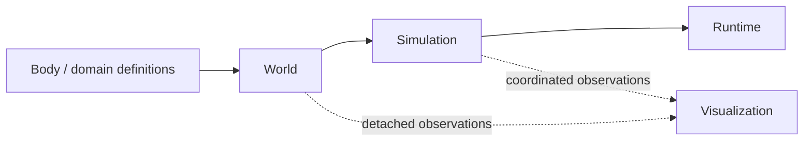
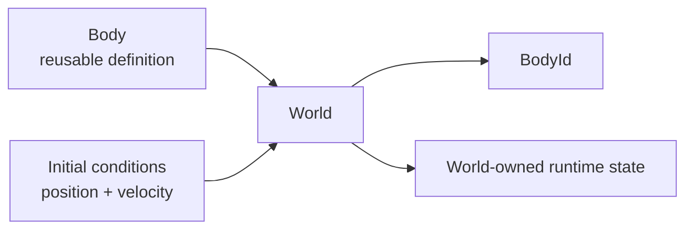

# Project Roadmap

This document is the authoritative home for vLab2D's current phased development strategy.

The roadmap gives the project a stable direction without turning that direction into a fixed final specification. Individual APIs, class names, folder layouts, and later phases may change when implementation evidence shows a better design.

The normal project workflow still applies inside every phase: establish the exact baseline, understand the problem, compare options, scope the smallest useful change, implement, test, verify, review, synchronize documentation, commit, and establish the next baseline.

## Guiding strategy

vLab2D is transitioning from feature discovery toward a small reusable architecture.

The long-term conceptual flow is:



The four conceptual layers are:

1. **Engine / Domain**
2. **Simulation / Orchestration**
3. **Visualization**
4. **Runtime**

The project remains incremental. The purpose of the roadmap is to make future work easier to place, not to pre-design all future classes.

## Foundational lifecycle rule

The central lifecycle model is:

```text
intrinsic properties
    immutable reusable definition

initial conditions
    supplied when the definition enters a state-owning context

runtime state
    owned exclusively by that context
```

For the current Body/World boundary:



The same reusable definition may create multiple independent runtime instances.

## Phase 1 — Structure and lifecycle refactoring

**Primary goal:** reorganize the behavior that already exists. Do not add new simulation features.

Phase 1 should progressively move the project toward:

```text
Body → World → Simulation → Runtime
```

while keeping Visualization separate.

### 1A — Body definition and World insertion lifecycle

**Status:** implemented.

Current result:

- `Body` is an immutable reusable definition with no intrinsic properties yet;
- `BodyInitialConditions` carries world-specific position and velocity;
- `KinematicWorld.addBody(...)` creates independent world-local runtime instances;
- position and velocity default to zero;
- World copies initial conditions into authoritative runtime state;
- the same Body definition can be reused;
- examples no longer construct `KinematicState` merely to add a body.

No shapes, mass, materials, fixtures, or new simulation behavior were introduced.

### 1B — Naming and state-model cleanup

Review existing names against their now-clear responsibilities.

Primary candidates:

- `KinematicWorld` → determine whether its current semantics justify `World`;
- `KinematicState` → determine whether it remains a useful public concept, should become `BodyState`, or should become internal;
- `KinematicBodySnapshot` → consider a broader observation name if the World concept broadens;
- `KinematicIntegrator` → rename/generalize only if the demonstrated contract is genuinely broader;
- `KinematicSimulation` → determine whether the old single-state simulation has been superseded and can be retired.

This is a semantic review, not a mass rename. Keep names that still accurately describe real responsibilities.

### 1C — Simulation / orchestration

Introduce the smallest real `Simulation` concept only after the Body/World model is clear.

Intended responsibility:

- coordinate one or more Worlds;
- provide deterministic `step(dt)` orchestration;
- avoid browser scheduling and visualization responsibilities.

Multi-world capability is a real project goal, so the design should not unnecessarily assume that Simulation permanently owns exactly one World.

### 1D — Runtime

Extract host scheduling only after Simulation exists.

Intended browser-runtime responsibilities include:

- wall-clock frame scheduling;
- fixed-timestep accumulation;
- calling `simulation.step(...)`;
- render cadence;
- host/browser interaction mechanics where appropriate.

`run()` belongs to Runtime/application execution rather than to the deterministic Simulation model.

### 1E — Module/folder organization and boring examples

Reorganize folders as concrete responsibilities become stable.

The likely direction is:

```text
src/
├── engine/
│   ├── body/
│   ├── integration/
│   ├── math/
│   └── world/
├── simulation/
├── visualization/
└── runtime/
    └── browser/
```

This tree remains a direction, not a requirement to create empty folders in advance.

A major Phase 1 acceptance criterion is that runnable examples become mostly composition:

```text
create definitions
create World
add bodies with initial conditions
create Simulation
create Runtime/View
run
```

`examples/.../main.ts` should become intentionally boring.

## Phase 2 — Geometry / single-shape learning

**Primary goal:** introduce the Shape concept only after Phase 1 establishes stable ownership and lifecycle boundaries.

### Shape definition

A Shape should be an immutable reusable geometry definition expressed in simulation/world units rather than display pixels.

Possible simple variants, introduced one at a time as useful:

- circle;
- box/rectangle;
- regular convex polygon.

Do not implement a family of Shapes merely because the roadmap lists them.

### Shapeless bodies remain valid

Geometry stays optional.

A Body with no geometry can continue acting as a particle for capabilities that require only identity and motion state.

### Body/Shape integration

The architecture should not assume that a Body can permanently have only one Shape.

The intended relationship is eventually:

```text
Body → 0..N geometry attachments
```

However, Phase 2 should deliberately exercise **zero-or-one attached shape** while the model is learned.

Questions to resolve from concrete use include:

- shape-local position relative to the Body;
- shape-local orientation;
- Body world orientation;
- angular velocity;
- geometry-derived bounds/centroid;
- rendering and picking based on domain geometry.

Compound bodies remain deferred.

## Phase 3 — Geometry becomes physics

**Status:** intentionally open.

If and when geometry needs to influence physical interaction, introduce only the concepts demanded by concrete collision requirements.

Possible subjects include:

- bounds / broad-phase queries;
- shape intersection;
- narrow-phase collision detection;
- contact points and normals;
- collision response / solving;
- a world-level collision pipeline.

The exact pipeline and abstractions must be earned by implementation evidence rather than designed in Phase 1 or 2.

## Phase 4+ — Richer bodies and presentation

**Status:** intentionally open and likely to split into smaller phases later.

Possible subjects include:

- multiple geometry attachments / compound bodies;
- physical material properties such as density, friction, or restitution;
- mass when actual equations require it;
- appearance concepts such as colors, textures, sprites, or visual materials;
- higher-level models that compose physical Body definitions with presentation metadata;
- richer environmental effects such as drag, fluids, or wind.

Physical material and visual appearance are separate concerns and should not be collapsed into one concept merely because both may inform how an object is described.

## Scope discipline

The roadmap deliberately avoids promising concrete future APIs.

In every phase:

- implement/generalize/abstract only after a real need;
- prefer safe, unsurprising defaults;
- decide relationship cardinality explicitly;
- preserve authoritative state ownership;
- keep visualization independent from simulation state;
- let new requirements reshape earlier hypotheses when evidence justifies it.

The roadmap may be revised as the project teaches us more.
