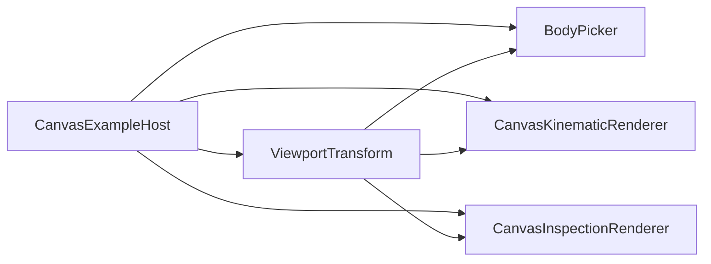

# Project Status

## Current checkpoint

vLab2D has completed its Phase 1 structural refactor and is now well into Phase 2 geometry/orientation learning.

The implemented architecture has four concrete responsibility areas:

```text
Engine / Domain
    reusable definitions + World-owned authoritative state

Simulation / Orchestration
    deterministic coordination of one or more Worlds

Runtime
    browser wall-clock scheduling + fixed-timestep accumulation

Visualization
    detached observation + rendering + visual interaction queries
```

The current package-facing execution path is:

```text
Body definition
    ↓
World
    ↓
Simulation
    ↓
BrowserSimulationRuntime

World snapshots
    ↓
Visualization
```

Phase 2 currently supports shapeless, Circle, Rectangle, and RegularPolygon body definitions; World-owned orientation and angular velocity; constant-angular-velocity rotational kinematics; geometry-aware Canvas/SVG rendering; orientation-aware Canvas hover/selection feedback; geometry/orientation-aware Canvas picking; and optional Canvas inspection overlays for geometry contour, body origin, orientation, and velocity.

The latest Visualization refinement makes inspection configuration explicit plain data: each indicator owns its visibility and presentation parameters, a renderer-neutral default style supplies shared color/line width, and indicators may partially override that style. The Canvas renderer still receives the current configuration per render call and owns no persistent user settings.

### Simulation engine

The public engine currently provides:

- `Vector2`, an immutable two-dimensional mathematical value;
- scalar numeric validation helpers under engine math;
- `Circle`, immutable geometry with a positive finite radius in world units;
- `Rectangle`, immutable centered geometry with positive finite width and height in world units;
- `RegularPolygon`, immutable centered regular-polygon geometry with an integer vertex count of at least `3`, a positive finite circumradius, and precomputed local vertices;
- `Body`, an immutable reusable definition with optional geometry;
- `BodyShape`, currently the concrete union `Circle | Rectangle | RegularPolygon`;
- `BodyInitialConditions`, optional world-specific position, velocity, orientation, and angular velocity;
- `BodyState`, readonly runtime data containing position, velocity, orientation, and angular velocity;
- `KinematicIntegrator`, the narrow integration strategy used by World;
- Explicit Euler and Semi-Implicit Euler implementations;
- `BodyId`, an opaque world-local runtime identity;
- `BodySnapshot`, detached observation combining identity, immutable definition, and detached runtime state;
- `World`, authoritative owner of body runtime state and environmental gravity.

The ownership model is:

```text
Body / Circle / Rectangle / RegularPolygon
    immutable reusable definition data

BodyInitialConditions
    insertion-time state
    position / velocity / orientation / angularVelocity

World
    authoritative runtime state owner

BodyState
    position / velocity / orientation / angularVelocity

BodySnapshot
    world-local identity
    + shared immutable definition
    + detached runtime state
```

The same `Body` definition may be added multiple times. Each addition receives an independent `BodyId` and independent World-owned runtime state.

World coordinates use mathematical orientation:

```text
+X → right
+Y → up
positive orientation → counter-clockwise
positive angular velocity → counter-clockwise
```

Orientation is expressed in radians, defaults to `0`, and accepts any finite value. Angular velocity is expressed in radians per second, also defaults to `0`, and accepts any finite value. Orientation is intentionally not normalized yet.

Both current kinematic integrators now evolve translational position/velocity and rotational orientation. With no angular acceleration yet, they use the same rotational rule:

```text
nextOrientation = orientation + angularVelocity × dt
nextAngularVelocity = angularVelocity
```

Angular acceleration, torque, moment of inertia, damping, and collision-driven rotation have not been introduced.

`World.step(dt)` remains atomic: all candidate next states are calculated and validated before any authoritative body state is replaced.

### Simulation orchestration

`Simulation` coordinates a fixed set of `1..N` unique World references.

It owns:

- deterministic World visitation order;
- validation of the shared timestep before World execution;
- per-World active/failed execution status;
- isolation of one World failure from later active Worlds.

It does not own body state, gravity, integrators, rendering, browser scheduling, or interaction state.

### Browser Runtime

`BrowserSimulationRuntime` owns browser execution mechanics:

```text
requestAnimationFrame
wall-clock frame deltas
maximum frame-delta clamping
fixed-timestep accumulation
0..N Simulation.step(dt) calls
host onFrame callback
```

The current Canvas example uses:

```text
fixed timestep:       1 / 60 second
maximum frame delta:  0.25 second
```

Runtime remains independent from Canvas, DOM input, picking, hover, selection, and World snapshots.

### Shared viewport transformation

`ViewportTransform` owns rendering-technology-independent viewport geometry:

- immutable viewport dimensions;
- mutable world-space center;
- mutable display scale (`pixelsPerUnit`);
- continuous visible-world bounds;
- world-to-display coordinate conversion;
- display-to-world coordinate conversion;
- display-space panning geometry;
- anchor-preserving zoom geometry.

It knows nothing about Canvas, SVG, DOM events, World, Body, snapshots, or `Vector2`.

The Canvas and SVG paths now compose it differently because their concrete requirements differ.

#### Canvas

The Canvas composition root creates **one** `ViewportTransform` and shares it among the components that must observe the same viewport state:



This prevents drawing, hit testing, panning, zooming, and coordinate inspection from drifting apart.

#### SVG

`SvgKinematicRenderer` still creates and owns its transform internally. SVG currently has no separate picker or host interaction collaborator that needs to share the same mutable viewport instance.

The two paths are intentionally not forced into identical constructor/API shapes.

### Canvas visualization

`CanvasKinematicRenderer` now has a focused drawing responsibility.

It renders:

- the integer world grid;
- world axes;
- the world origin marker;
- shapeless fallback markers;
- Circle geometry;
- Rectangle geometry;
- RegularPolygon geometry;
- hover presentation;
- selection presentation.

It consumes a `ViewportTransform` supplied by composition and no longer acts as a façade for viewport interaction or picking.

Geometry semantics are:

```text
shapeless Body
    fixed display-space marker radius

Circle
    radius in world units
    display radius = radius × pixelsPerUnit

Rectangle
    centered local width/height in world units
    scaled through pixelsPerUnit
    rotated by BodyState.orientation

RegularPolygon
    centered local convex regular polygon
    circumradius in world units
    vertex 0 on local +X
    local vertices ordered counter-clockwise
    rotated by BodyState.orientation
```

Canvas display Y points downward, so the renderer applies `-orientation` to represent positive world-space counter-clockwise rotation.

Rectangle hover and selection outlines are drawn inside the same local transformed coordinate frame as the Rectangle itself. The interaction feedback therefore follows the oriented geometry.

Circle orientation is part of runtime pose even though a plain circular outline remains visually unchanged by rotation.

### Canvas body picking

`BodyPicker` is now a separate Visualization collaborator rather than a `CanvasKinematicRenderer` method.

It receives:

```text
shared ViewportTransform
fixed shapeless-body presentation radius
display-space pick tolerance
```

and answers:

```text
Which observed Body is close enough to this display-space point
to be the user's intended target?
```

Picking behavior currently measures display-space distance to visible/pick geometry:

- shapeless Body → fixed circular presentation marker;
- Circle → world-scaled circular geometry;
- Rectangle → world-scaled Rectangle geometry with current orientation;
- RegularPolygon → exact world-scaled polygon geometry with current orientation.

The Canvas example supplies a small display-space `pickTolerance`, allowing thin or small geometry to remain easy to acquire without changing its domain dimensions.

For a rotated Rectangle, the picker transforms the pointer displacement into body-local coordinates and computes Euclidean distance to the simple centered Rectangle bounds. This yields a true rounded tolerance around corners.

When several bodies lie within tolerance, the nearest geometry wins. If geometry distances tie—most commonly because the pointer lies inside overlapping bodies—the nearest displayed center breaks the tie. Snapshot order is not a picking-priority contract.

Picking remains a visual interaction query. It is **not** collision detection and does not establish collision shapes, broad-phase structures, or physical contact semantics.

### Canvas example host

`CanvasExampleHost` remains example-local.

It owns the concrete browser/application policies that currently have one consumer:

- pointer and wheel events;
- pointer capture;
- browser CSS coordinate to Canvas drawing-buffer conversion;
- click-versus-drag interpretation;
- wheel-delta normalization;
- zoom sensitivity and limits;
- viewport pan/zoom commands;
- world-coordinate pointer readout;
- transient hovered `BodyId`;
- persistent selected `BodyId`;
- selected-body read-only inspection;
- per-frame rendering orchestration.

The host uses `ViewportTransform` directly for coordinate and viewport operations, `BodyPicker` for hit testing, `CanvasKinematicRenderer` for normal drawing, and `CanvasInspectionRenderer` for optional diagnostic overlays.

Normal scene rendering happens first and inspection rendering happens afterward so diagnostics compose as an overlay without clearing or owning the normal scene.

Hover is recomputed against the latest detached observations every frame because bodies can move under a stationary pointer.

Selection stores identity rather than a snapshot. The host resolves the selected `BodyId` against fresh snapshots each frame to present current position and velocity without retaining stale state or reading mutable World storage.

### Canvas inspection visualization

`CanvasInspectionRenderer` is a separate diagnostic renderer. It observes the same detached `BodySnapshot[]` values and the same shared `ViewportTransform` as normal Canvas rendering, but it does not clear the surface or own normal appearance.

Renderer-neutral `InspectionOptions` is plain serializable configuration data. It currently contains:

```text
defaultStyle
    color
    lineWidth

geometryContour
    visible
    style?

bodyOrigin
    visible
    radius
    style?

orientation
    visible
    length
    style?

velocity
    visible
    projectionTime
    arrowheadSize
    minimumVisibleLength
    style?
```

An indicator without a style override inherits `defaultStyle`. An indicator may override only selected style properties; omitted properties continue to inherit from the default. This keeps inspection configuration renderer-neutral and leaves a clean future path for launch-time presets, runtime editing, and validated persistence without putting configuration ownership into the renderer.

Current indicator semantics are:

- geometry contour — Circle/Rectangle/RegularPolygon domain boundary, scaled through the viewport;
- body origin — fixed display-space marker at `BodyState.position`;
- orientation — fixed display-space line along Body-local `+X` / `0°`;
- velocity — arrow from the Body origin in the current velocity direction, with shaft length representing `velocity × projectionTime`.

Velocity shaft length therefore scales with world velocity and viewport scale. Its arrowhead uses a configured fixed display-space size. A velocity vector shorter than `minimumVisibleLength` in display space is omitted as a visualization decision; the Body may still be physically moving.

A shapeless Body has no geometry contour. Its body origin and velocity remain meaningful. The current inspection renderer suppresses its orientation glyph because there is no concrete geometry providing a useful local frame to inspect.

“Body origin” is intentionally not defined as centroid or center of mass. Those concepts may diverge if future geometry, mass distribution, or compound bodies require them.

The visualization source tree is now grouped by responsibility:

```text
src/visualization/
├── inspection/
├── interaction/
├── rendering/
└── viewport/
```

This is an organizational refinement only; it does not introduce a renderer hierarchy or inspection framework.

### SVG visualization

`SvgKinematicRenderer` remains the secondary static renderer.

It renders the same current geometry semantics as Canvas:

- fixed fallback marker for shapeless Bodies;
- world-scaled Circle geometry;
- world-scaled Rectangle geometry;
- world-scaled RegularPolygon geometry;
- orientation expressed through SVG rotation.

It remains useful for deterministic snapshots, debugging captures, exports, and documentation images.

Canvas remains the primary interactive visualization target. SVG parity should be preserved only when the adaptation remains natural and reasonably inexpensive.

### Package facade and composition

`src/mod.ts` remains the package-facing composition facade. Complete examples can compose the established public concepts without depending on deep layer paths.

The Canvas entry point is intentionally small:

```text
create World + Bodies
create Simulation
create ViewportTransform
create normal renderer
create inspection renderer
create picker
create example host
create Runtime
run
```

No generic application, renderer, picker, interaction, or dependency-injection framework has been introduced.

### Deliberately deferred

Current implementation pressure still does not justify:

- collision detection or response;
- forces beyond current World gravity input;
- mass or material properties;
- angular acceleration, torque, moment of inertia, rotational damping, or collision-driven rotation;
- compound geometry attachments;
- a generic Shape interface/base hierarchy;
- `Transform2D`;
- `Vector2.rotate()` merely for native Canvas/SVG transform use;
- a generic renderer hierarchy;
- a generic picking framework;
- editable body-state UI;
- a materials/textures/sprites appearance system;
- a diagnostic-overlay plug-in framework;
- SVG inspection composition;
- pinch zoom or generalized gesture handling.

Normal rendering, future appearance, interaction feedback, and optional diagnostics remain distinct concerns.

## Next step

The RegularPolygon capability is now established across the Engine and Visualization layers. The shape stores immutable local geometry, rendering and inspection follow its oriented polygon boundary, and BodyPicker uses exact polygon geometry rather than its circumcircle.

The next planned work is **narrow-phase collision detection only**. Collision response remains explicitly out of scope for the first collision passes.

The initial collision design should support the geometry that now actually exists—Circle, Rectangle, and RegularPolygon—while preserving the distinction that a shapeless Body has no collision geometry. The design should also observe the new pressure around local/world transforms and convex polygon operations before introducing abstractions such as `Transform2D` or a generic convex-shape interface.
