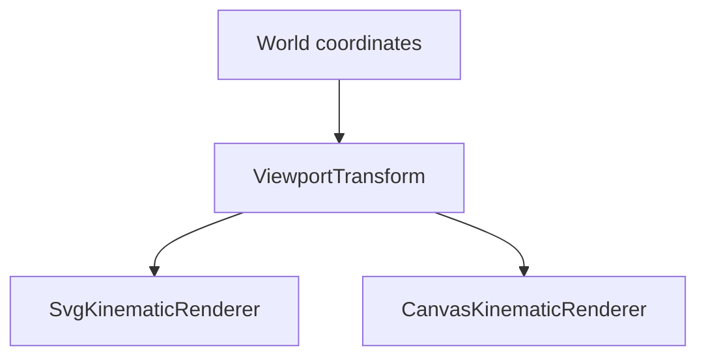
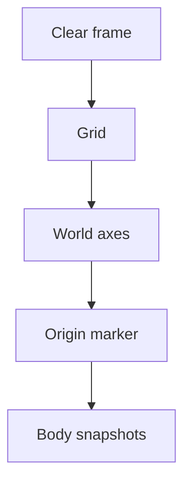

# Project Status

## Current checkpoint

vLab2D now has a small multi-body simulation engine, reproducible SVG visualization, and live Canvas 2D animation with fixed simulation timing.

SVG and Canvas share a `ViewportTransform` for mathematical world-to-display coordinate conversion, and both rendering paths now provide spatial reference information through a grid, world axes, and an origin marker.

### Simulation engine

The public engine API currently provides:

- `Vector2`, an immutable two-dimensional vector value.
- `KinematicState`, representing position and velocity at a particular instant.
- `KinematicIntegrator`, a narrow strategy contract for advancing kinematic state.
- `ExplicitEulerIntegrator`.
- `SemiImplicitEulerIntegrator`.
- `KinematicSimulation`, the earlier single-state runtime.
- `BodyId`, an opaque world-local identifier.
- `KinematicBodySnapshot`, a detached observation of body identity and state.
- `KinematicWorld`, which owns and advances multiple identified body states.

`KinematicWorld` owns authoritative body state and advances every body using an injected `KinematicIntegrator`.

External consumers receive detached observations rather than references to internal world storage.

World stepping remains atomic: candidate states for all bodies are calculated and validated before any authoritative state is replaced.

### Shared viewport transformation

`ViewportTransform` owns the world-to-display coordinate mapping shared by SVG and Canvas.

It stores immutable viewport configuration:

- viewport width;
- viewport height;
- display units per world unit.

It maps the mathematical world coordinate system:

```text
+x → right
+y → up
```

into display coordinates where positive Y points downward:

```text
displayX = width / 2 + worldX × pixelsPerUnit

displayY = height / 2 - worldY × pixelsPerUnit
```

The world origin therefore maps to the center of the viewport.



The transform contains no rendering behavior and has no dependency on SVG, Canvas, or engine-domain types such as `Vector2`.

Viewport validation for width, height, and scale belongs to `ViewportTransform`.

### SVG visualization

`SvgKinematicRenderer` produces reproducible static SVG output containing:

1. an integer-coordinate grid;
2. world X and Y axes;
3. a world-origin marker;
4. simulated bodies.

Body positions and spatial references use `ViewportTransform`.

SVG remains useful for snapshots, debugging captures, exports, and documentation images.

### Canvas visualization

`CanvasKinematicRenderer` now provides the same basic spatial context in the live browser view.

Each frame is rendered in this order:

```text
grid
axes
origin
bodies
```

The grid marks visible non-zero integer world coordinates. The zero-coordinate lines are represented by the world axes instead.

Axes pass through the transformed world origin, and the origin is rendered as a small crosshair.

Bodies remain the foreground layer.



Canvas spatial references and body positions all use `ViewportTransform`.

The renderer still performs no simulation calculations and does not own or mutate engine state.

### Fixed-timestep browser loop

Browser rendering is driven by `requestAnimationFrame`, but simulation advancement is independent from display refresh rate.

The browser callback timestamp measures real elapsed time. That time is accumulated and consumed in fixed simulation steps:


The current simulation timestep is:

```text
1 / 60 second
```

A fast display may render frames without advancing the simulation. A slower display may require multiple fixed simulation steps before one render.

The browser host limits unusually large frame deltas before adding them to the accumulator so a delayed or suspended tab does not attempt excessive simulation catch-up.

Interpolation between fixed simulation states remains deliberately deferred.

### Emerging visualization duplication

Both SVG and Canvas now independently determine which integer world coordinates are visible before rendering their grids.

The current calculation derives the visible world extent from:

- viewport width and height;
- pixels per world unit;
- the centered world origin.

This is a new concrete duplication created by the second spatial-reference implementation.

It has not yet been extracted.

## Next step

Review the duplicated visible-world-range calculations used by the SVG and Canvas grids.

The next small architectural question is:

> Does continuous visible world extent belong to `ViewportTransform`?

If the answer is supported by the current implementations, extract only the smallest reusable representation needed by both renderers.

Integer-grid policy should remain renderer/grid behavior. A viewport abstraction should describe visible world geometry rather than become responsible for deciding which grid lines to draw.

Do not yet introduce:

- pan;
- zoom;
- cameras;
- transformation matrices;
- renderer interfaces;
- generalized drawing backends.

Once visible viewport geometry has a clear home, pan and zoom can be approached from a better-defined coordinate model.
