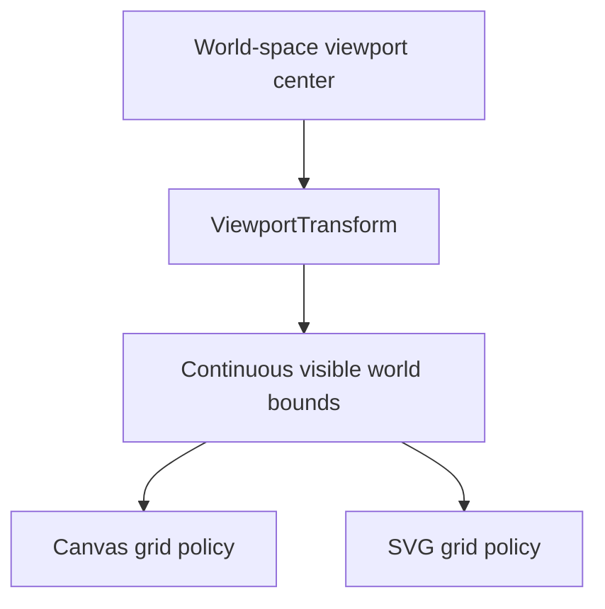
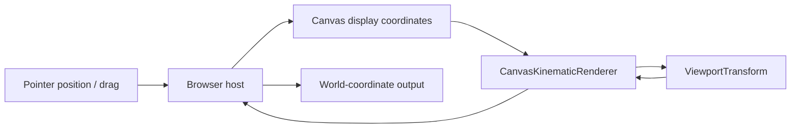
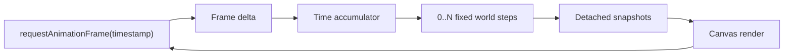

# Project Status

## Current checkpoint

vLab2D now has a small multi-body simulation engine, reproducible SVG visualization, and live Canvas 2D animation with fixed simulation timing.

Canvas is the primary visualization target. SVG remains a useful secondary renderer for static snapshots, debugging captures, exports, and documentation where maintaining it remains reasonable.

Both renderers share `ViewportTransform` for viewport geometry and world-to-display coordinate conversion. The transform now also provides inverse display-to-world mapping for interaction and inspection.

### Simulation engine

The public engine API currently provides:

- `Vector2`, an immutable two-dimensional vector value.
- `KinematicState`, representing position and velocity at a particular instant.
- `KinematicIntegrator`, a narrow strategy contract for advancing kinematic state.
- `ExplicitEulerIntegrator`.
- `SemiImplicitEulerIntegrator`.
- `KinematicSimulation`, the earlier single-state runtime.
- `BodyId`, an opaque world-local identifier.
- `KinematicBodySnapshot`, a detached observation of body identity and state.
- `KinematicWorld`, which owns and advances multiple identified body states.

`KinematicWorld` owns authoritative body state and advances every body using an injected `KinematicIntegrator`.

External consumers receive detached observations rather than references to internal world storage.

World stepping remains atomic: candidate states for all bodies are calculated and validated before any authoritative state is replaced.

### Shared viewport transformation

`ViewportTransform` owns viewport geometry shared by the visualization paths.

It stores immutable configuration:

- viewport width;
- viewport height;
- display units per world unit.

It also owns a mutable world-space viewport center. The configured world position `(centerWorldX, centerWorldY)` maps to the center of the display; the world origin is centered by default.

The forward mapping is:

```text
displayX = width / 2 + (worldX - centerWorldX) × pixelsPerUnit

displayY = height / 2 - (worldY - centerWorldY) × pixelsPerUnit
```

The inverse mapping is:

```text
worldX = centerWorldX + (displayX - width / 2) / pixelsPerUnit

worldY = centerWorldY - (displayY - height / 2) / pixelsPerUnit
```

The transform exposes the continuous world-space extent currently visible through the viewport:

```text
minWorldX
maxWorldX
minWorldY
maxWorldY
```

Those bounds move with the viewport center. Continuous extent remains viewport geometry; integer-grid selection remains renderer policy.



`setCenter(...)` validates both center coordinates before changing either one, so a rejected update cannot leave a partially changed viewport center.

The transform contains no rendering behavior and has no dependency on SVG, Canvas, browser events, or engine-domain types such as `Vector2`.

### Canvas visualization

`CanvasKinematicRenderer` is the primary live visualization path.

Each frame is rendered in this order:

```text
grid
axes
origin
bodies
```

The renderer exposes focused viewport operations and queries:

- `setViewportCenter(worldX, worldY)` delegates world-space centering to `ViewportTransform`;
- `panViewportBy(deltaX, deltaY)` accepts a displacement in Canvas display units and converts it into the corresponding world-center change;
- `displayToWorldX(displayX)` and `displayToWorldY(displayY)` expose the transform's inverse scalar mapping without leaking the transform object itself.

The integer grid, axes, origin marker, and body positions all consume the same transform, so changing the viewport center moves the complete world view coherently.

The live browser example adds pointer-drag panning and pointer-coordinate inspection. Browser input remains host responsibility: the example tracks one active pointer, uses pointer capture, and converts browser CSS coordinates into Canvas drawing-buffer coordinates before calling renderer viewport operations or queries.



The world-coordinate readout is ordinary DOM presentation owned by the host. Formatting such as decimal precision does not enter `ViewportTransform` or the renderer.

The renderer remains unaware of DOM pointer events and performs no simulation calculations or engine-state mutation.

Canvas regression tests cover forward and inverse coordinate mapping, spatial references, viewport centering, display-space panning, frame clearing, and validation behavior.

### SVG visualization

`SvgKinematicRenderer` remains the secondary static visualization path.

It renders the same basic spatial references and consumes the same continuous visible bounds, while retaining SVG-specific output behavior. `setViewportCenter(...)` exposes the same programmatic world-space centering where that shared viewport model maps naturally to SVG. The shared transform has inverse coordinate mathematics, but the SVG renderer does not expose an inverse query because no concrete SVG consumer currently needs it. Focused SVG regression tests verify displaced body and axis mapping.

SVG remains useful for reproducible snapshots, debugging captures, exports, and documentation images. Future visualization work should preserve SVG support when doing so remains natural and reasonably inexpensive, but SVG compatibility must not constrain useful Canvas capabilities.

### Fixed-timestep browser loop

Browser rendering is driven by `requestAnimationFrame`, but simulation advancement is independent from display refresh rate.

The browser callback timestamp measures real elapsed time. That time is accumulated and consumed in fixed simulation steps:



The current simulation timestep is:

```text
1 / 60 second
```

A fast display may render frames without advancing the simulation. A slower display may require multiple fixed simulation steps before one render.

The browser host limits unusually large frame deltas before adding them to the accumulator so a delayed or suspended tab does not attempt excessive simulation catch-up.

Interpolation between fixed simulation states remains deliberately deferred.

## Next step

Introduce the smallest Canvas-first zoom capability by allowing the viewport display scale to change programmatically.

The first zoom step should remain geometry-focused rather than gesture-driven:

- allow `ViewportTransform` to change its display units per world unit through a validated operation;
- keep world-to-display and display-to-world mapping mutually coherent after a scale change;
- update continuous visible-world bounds from the current center and scale;
- prove the behavior with focused transform and Canvas tests;
- preserve the current viewport center unless a later interaction requirement demonstrates a need for anchor-aware zoom.

Do not yet introduce:

- mouse-wheel, trackpad, or pinch zoom;
- body picking or selection;
- a camera class;
- transformation matrices;
- renderer interfaces;
- generalized drawing backends.
