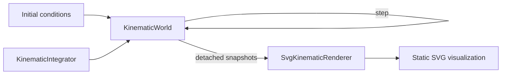
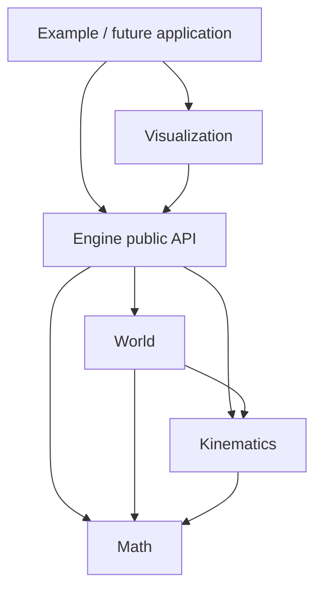

# Project Status

## Current checkpoint

vLab2D now has a small multi-body simulation engine, a useful static visualization workbench, and structured project and architecture documentation.

### Simulation engine

The public engine API currently provides:

- `Vector2`, an immutable two-dimensional vector value.
- `KinematicState`, representing position and velocity at a particular instant.
- `KinematicIntegrator`, a narrow strategy contract for advancing kinematic state.
- `ExplicitEulerIntegrator`, which advances position using the velocity at the beginning of the timestep.
- `SemiImplicitEulerIntegrator`, which updates velocity first and then advances position using the updated velocity.
- `KinematicSimulation`, the earlier single-state runtime used to establish controlled mutation, validation, and injected integration behavior.
- `BodyId`, an opaque world-local identifier for a simulated body.
- `KinematicBodySnapshot`, a detached observation of one body's identity and kinematic state.
- `KinematicWorld`, which owns and advances the kinematic state of multiple identified bodies.

`KinematicWorld` can create and observe bodies, apply a shared world acceleration, and advance every body using an injected `KinematicIntegrator`.

The world's authoritative body state remains private. External consumers observe detached state rather than receiving references to the world's internal storage.

World stepping is transactional: all candidate body states are computed and validated before any authoritative state is replaced. A failed step leaves every body at its previous state.

### Visualization

`SvgKinematicRenderer` provides the first concrete visualization path outside the engine.

It consumes detached `KinematicBodySnapshot` values and renders:

- simulated bodies as SVG circles;
- a low-opacity grid at integer world coordinates;
- world X and Y axes;
- the world origin.

The renderer maps the engine's mathematical coordinate system into SVG display coordinates while keeping simulation and presentation concerns separate.

The visual hierarchy currently uses a faint grid, partially transparent axes, the origin marker, and body markers rendered above the reference frame.

The example in `examples/kinematic-world-svg.ts` advances a small `KinematicWorld` and writes:

```text
generated/kinematic-world.svg
```

The generated SVG is useful as a static simulation view, debugging snapshot, reproducible visual artifact, and source image for project documentation.

The current end-to-end runtime path is:



### Documentation structure

Documentation is now organized into indexed sections under `docs/`.

The repository currently has:

```text
docs/
├── architecture/
│   └── README.md
│
└── project/
    ├── README.md
    ├── project-context.md
    ├── status.md
    ├── decisions.md
    ├── project-map.md
    ├── environment.md
    ├── workflow.md
    └── handoff.md
```

`docs/project/README.md` is the entry point for project identity, status, decisions, workflow, environment, and continuity information.

`docs/architecture/README.md` is the entry point for understanding how the implemented software fits together.

The repository README links to those section-level entry points rather than maintaining a flat list of every documentation file.

### Architecture documentation

The first architecture overview now documents the system that exists in the repository today.

It explains and visualizes:

- repository and subsystem boundaries;
- dependency direction;
- the public engine boundary through `src/engine/mod.ts`;
- authoritative world-state ownership;
- observation versus control;
- detached snapshots;
- world-owned bodies identified through `BodyId`;
- injected numerical integration behavior;
- atomic world stepping;
- the current kinematic state model;
- the relationship between `KinematicSimulation` and `KinematicWorld`;
- the visualization boundary;
- world-to-display coordinate conversion;
- host/example composition;
- the complete runtime data flow.

The architecture overview uses Mermaid diagrams to make structural relationships and runtime flows visible.

It deliberately distinguishes between:

1. architecture implemented in the current code;
2. established architectural principles;
3. possible future directions.

This prevents future ideas from being presented as though they already exist.

The high-level implemented dependency direction is:



The engine remains independent from visualization and host/application concerns.

## Next step

Return to visualization and establish the first minimal animated rendering path.

The next feature should introduce a browser-based Canvas renderer capable of repeatedly drawing observed body positions.

The first Canvas increment should remain intentionally small.

It should prove:

- browser-hosted Canvas rendering;
- repeated redraw;
- consumption of engine observations rather than engine internals;
- preservation of the simulation/visualization boundary;
- the same mathematical coordinate orientation already established by SVG.

It should not yet add:

- pan or zoom;
- playback controls;
- trails;
- vectors;
- body inspection;
- rich styling;
- a generic renderer interface;
- a generalized application framework.

The existing SVG renderer should remain the static rendering, export, documentation, and snapshot mechanism.

Once SVG and Canvas both contain genuine world-to-display transformation needs, the project should review their duplication and consider extracting a reusable viewport/world-to-display transform.

That transform is expected to become the foundation for later interactive pan and zoom.
