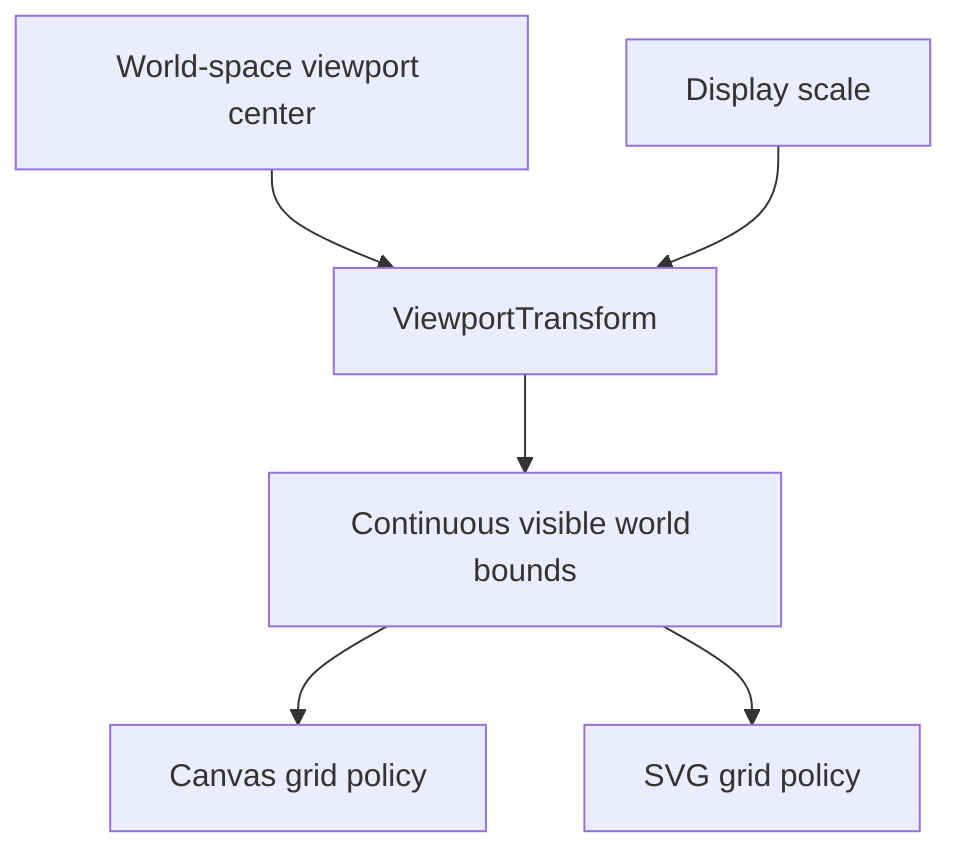
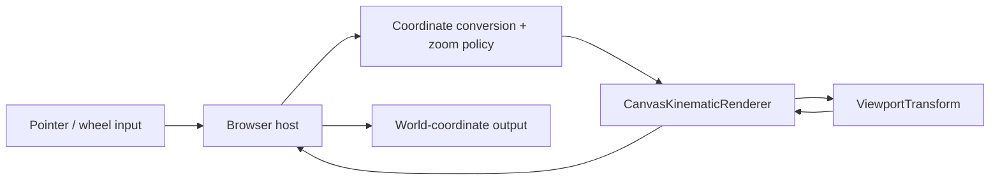
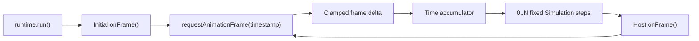

# Project Status

## Current checkpoint

vLab2D now has a small multi-body simulation engine, deterministic multi-World Simulation orchestration, a concrete browser Runtime, reproducible SVG visualization, live Canvas 2D animation with fixed simulation timing, and its first intrinsic geometry definition.

**Phase 1 — Structure and lifecycle refactoring is complete.** The project now has concrete `Body → World → Simulation → Runtime` boundaries, a separate Visualization layer, and a package-facing composition facade.

**Phase 2 — Geometry / single-shape learning is active.** Circle geometry is established and detached World observations now expose the immutable Body definition needed by Visualization.

Canvas is the primary visualization target. SVG remains a useful secondary renderer for static snapshots, debugging captures, exports, and documentation where maintaining it remains reasonable.

Both renderers share `ViewportTransform` for viewport geometry, bidirectional world/display coordinate conversion, mutable world-space centering, and mutable display scale. The Canvas path additionally supports anchored interactive zoom, display-space picking of rendered body markers, live hover highlighting, persistent click selection, and live read-only selected-body inspection.

### Simulation engine

The public engine API currently provides:

- `Vector2`, an immutable two-dimensional vector value.
- `Circle`, immutable circular geometry expressed in simulation/world units.
- `Body`, a reusable body definition with optional Circle geometry.
- `BodyOptions`, optional intrinsic Body configuration.
- `BodyInitialConditions`, optional world-specific initial position and velocity.
- `BodyState`, a readonly runtime-state contract containing position and velocity.
- `KinematicIntegrator`, a narrow strategy contract for advancing `BodyState` from acceleration.
- `ExplicitEulerIntegrator`.
- `SemiImplicitEulerIntegrator`.
- `BodyId`, an opaque world-local identifier.
- `BodySnapshot`, an observation of world-local identity, the reusable immutable Body definition, and detached runtime state.
- `World`, which owns and advances multiple identified body runtime instances.

The current Body/World lifecycle now distinguishes three categories explicitly:

```text
Circle
    immutable reusable geometry definition

Body
    reusable intrinsic definition
    optional Circle geometry

BodyInitialConditions
    world-specific position / velocity supplied at insertion

BodyState inside World
    authoritative evolving runtime state
```

Circle radius is expressed in world units and must be positive and finite.

`new Body()` remains valid and has no domain geometry. For current capabilities it can continue to behave as a particle-like entity with identity and motion but no spatial extent.

`new Body({ shape: new Circle(0.5) })` attaches one reusable Circle definition. The reference is retained directly because Circle is immutable.

Phase 2 deliberately supports only zero-or-one Circle geometry at this checkpoint. No general `Shape` contract has been introduced yet; Box/Rectangle will provide a second concrete geometry variant and the evidence needed to generalize the abstraction.

`BodySnapshot` now keeps the intrinsic/runtime split visible to observers:

```text
BodySnapshot
    id
        world-local runtime identity

    definition
        shared immutable Body definition
        optional Circle geometry

    state
        detached World-owned position / velocity
```

The `definition` reference is intentionally shared rather than copied because Body definitions are reusable immutable intrinsic data, not authoritative mutable World state. The snapshot object and `state` observation remain detached from World storage.

`World.addBody(...)` may instantiate the same `Body` definition multiple times. Each addition receives an independent world-local `BodyId` and independent runtime state. Position and velocity default to zero, and supplied vectors are copied before they become authoritative world state.

`World` owns authoritative body state and advances every body using an injected `KinematicIntegrator`.

External consumers receive detached observations rather than references to internal world storage.

World stepping remains atomic: candidate states for all bodies are calculated and validated before any authoritative state is replaced.

### Simulation orchestration

`src/simulation/simulation.ts` now provides the real `Simulation` orchestration layer.

A `Simulation`:

- coordinates a fixed set of `1..N` unique Worlds;
- preserves deterministic constructor order when stepping Worlds;
- validates the timestep before touching any World;
- passes the same valid `dt` to every active World;
- records each member World as either `active` or terminally `failed`;
- captures the original thrown value when a World fails;
- continues stepping later Worlds after one World throws;
- skips failed Worlds on subsequent steps;
- exposes detached World membership through `getWorlds()`;
- exposes detached execution observations through `getWorldStatus(world)`.

Simulation owns orchestration status, not physical state. Each `World` remains authoritative over its bodies, gravity, integrator, and last valid runtime state.

A World failure is therefore experimental information rather than a Simulation-wide abort condition. Because `World.step(...)` is atomic, a failed World remains at its last valid authoritative state while other active Worlds can continue evolving.

Simulation deliberately has no clock, start/pause/run lifecycle, browser scheduling, renderer, Canvas dimensions, pointer input, body snapshot aggregation, retry API, or cross-World transaction.

### Shared viewport transformation

`ViewportTransform` owns viewport geometry shared by the visualization paths.

It stores immutable viewport dimensions:

- viewport width;
- viewport height.

It owns mutable viewport state:

- the world-space viewport center;
- display units per world unit (`pixelsPerUnit`).

The configured world position `(centerWorldX, centerWorldY)` maps to the center of the display; the world origin is centered by default.

The forward mapping is:

```text
displayX = width / 2 + (worldX - centerWorldX) × pixelsPerUnit

displayY = height / 2 - (worldY - centerWorldY) × pixelsPerUnit
```

The inverse mapping is:

```text
worldX = centerWorldX + (displayX - width / 2) / pixelsPerUnit

worldY = centerWorldY - (displayY - height / 2) / pixelsPerUnit
```

The transform exposes the continuous world-space extent currently visible through the viewport:

```text
minWorldX
maxWorldX
minWorldY
maxWorldY
```

Those bounds are derived from the current center and scale. Increasing `pixelsPerUnit` zooms in by showing a smaller world-space extent; decreasing it zooms out.



`setCenter(...)` validates both center coordinates before changing either one. `setPixelsPerUnit(...)` validates a new positive finite scale while preserving the current world-space center.

For anchor-aware zoom, `setPixelsPerUnitAroundDisplayPoint(...)` changes scale and center together so the world coordinate underneath the supplied display-space anchor remains unchanged. Requested scale, anchor coordinates, and candidate center are validated before any viewport state is committed, preserving the update atomically.

The transform contains no rendering behavior and has no dependency on SVG, Canvas, browser events, wheel-delta conventions, or engine-domain types such as `Vector2`.

### Canvas visualization

`CanvasKinematicRenderer` is the primary live visualization path.

Each frame is rendered in this order:

```text
grid
axes
origin
bodies
```

The renderer exposes focused viewport operations and queries:

- `setViewportCenter(worldX, worldY)` delegates world-space centering to `ViewportTransform`;
- `setViewportScale(pixelsPerUnit)` changes scale while preserving the current world-space center;
- `panViewportBy(deltaX, deltaY)` accepts a displacement in Canvas display units and converts it into the corresponding world-center change;
- `viewportScale` exposes the current scale read-only for host interaction policy;
- `setViewportScaleAroundDisplayPoint(...)` changes scale while preserving the world point underneath a Canvas display-space anchor;
- `displayToWorldX(displayX)` and `displayToWorldY(displayY)` expose the transform's inverse scalar mapping without leaking the transform object itself;
- `findBodyAtDisplayPoint(...)` tests detached snapshots against the rendered circular body markers and returns the nearest hit `BodyId`, or `undefined` when no marker contains the point;
- `render(...)` accepts optional hovered and selected body identifiers for the current frame while remaining stateless about both interaction identities.

The integer grid, axes, origin marker, and body positions all consume the same transform, so panning and zooming move and magnify the complete world view coherently.

The live browser example adds pointer-drag panning, pointer-coordinate inspection, wheel/trackpad zoom, body picking, hover highlighting, and persistent click selection. Browser input remains host responsibility: the example tracks one active pointer, uses pointer capture, converts browser CSS coordinates into Canvas drawing-buffer coordinates, normalizes wheel deltas, calculates an exponential zoom factor, clamps the requested scale to host-defined limits, and passes renderer-facing values rather than DOM event objects.

For picking, hover, and selection, the host retains detached observations rather than asking the renderer or engine to own interaction state. It owns both the transient hovered `BodyId` and the persistent selected `BodyId`, and supplies those identities to `render(...)` for the current frame.

The pointer position is retained by the host and hover is recalculated every animation frame, not only on `pointermove`. Bodies continue moving while the pointer can remain stationary, so frame-time reevaluation keeps the body readout and hover ring synchronized with the currently rendered observations.

Selection changes only after a primary-pointer interaction completes without moving beyond the host-defined click tolerance. Movement beyond that tolerance is treated as drag navigation: the viewport pans, but selection remains unchanged. Clicking a rendered body stores that body's `BodyId`; clicking empty Canvas clears selection. Pointer leave clears hover inspection but does not clear persistent selection.

The selected-body inspector stores no snapshot of its own. On each frame, the host resolves `selectedBodyId` against the latest `renderedSnapshots` and presents the matching snapshot's current position and velocity. This keeps the inspector synchronized with the observation set used for rendering while preserving `World` as the authoritative owner of mutable body state.

If no body is selected, or if a selected identity cannot be resolved in the current observation set, the inspector displays unavailable values rather than implicitly changing selection. Body-removal semantics therefore remain a separate future decision.



The anchor-aware transform preserves the world coordinate underneath the pointer while the scale changes. The host currently prevents page scrolling during Canvas wheel zoom and owns scale limits and sensitivity; those are interaction policy rather than transform invariants.

The coordinate, hovered-body, selected-body, position, and velocity readouts remain ordinary DOM presentation owned by the host. The transient hovered `BodyId` and persistent selected `BodyId` are both host-owned interaction/presentation state. The inspector derives current values from detached observations rather than retaining a selected snapshot. Formatting such as decimal precision does not enter `ViewportTransform`, the renderer, or the engine.

Body picking is deliberately a visualization query rather than an engine query. `World` currently stores kinematic position and velocity but no physical shape or radius. The hit radius comes from the Canvas renderer's display-space body marker, so placing the query in `World` would incorrectly turn presentation geometry into simulation geometry.

When multiple rendered markers contain the pointer, the Canvas renderer chooses the hit whose rendered center is nearest to the pointer instead of depending on snapshot ordering, which is not part of the world's public contract.

The renderer remains unaware of DOM pointer and wheel events, does not retain hover or selection state between frames, and performs no simulation calculations or engine-state mutation.

Canvas regression tests cover forward and inverse coordinate mapping, spatial references, viewport centering, programmatic scale changes, display-space panning, anchor-preserving scale changes, body-marker hit testing, nearest-hit behavior, hover highlighting, selection highlighting, combined hover-and-selection presentation, frame clearing, and validation behavior.

### SVG visualization

`SvgKinematicRenderer` remains the secondary static visualization path.

It renders the same basic spatial references and consumes the same continuous visible bounds, while retaining SVG-specific output behavior. `setViewportCenter(...)` exposes shared programmatic world-space centering, and `setViewportScale(...)` exposes shared programmatic viewport scale changes where those geometry operations map naturally to SVG.

The shared transform has inverse coordinate mathematics and anchor-aware scale geometry, but the SVG renderer does not expose Canvas-oriented inverse or anchored-interaction queries because no concrete SVG consumer currently needs them. Focused SVG regression tests verify displaced mapping and programmatic scale changes.

SVG remains useful for reproducible snapshots, debugging captures, exports, and documentation images. Future visualization work should preserve SVG support when doing so remains natural and reasonably inexpensive, but SVG compatibility must not constrain useful Canvas capabilities.

### Browser Runtime

`src/runtime/browser/simulation-runtime.ts` now owns browser-driven Simulation execution.

`BrowserSimulationRuntime` receives:

- a `Simulation`;
- a positive finite fixed timestep;
- a positive finite maximum frame delta;
- a host `onFrame` callback.

`run()` presents the initial frame immediately, then schedules browser frames through `requestAnimationFrame`. The first browser timestamp establishes the wall-clock baseline. Later frame deltas are converted to seconds, clamped to the configured maximum, accumulated, and consumed through zero or more fixed `simulation.step(dt)` calls before `onFrame` runs once.



The Canvas example currently configures:

```text
fixed timestep:     1 / 60 second
maximum frame delta: 0.25 second
```

The Runtime owns scheduling and accumulation, but not rendering. Its `onFrame` callback is host-defined; the current Canvas host uses it to obtain fresh World snapshots, refresh pointer/selection inspection, and invoke the renderer.

The Runtime also does not own pointer/wheel interaction, Canvas dimensions, World state, or Simulation failure status. It continues scheduling even when individual Worlds become failed because Simulation contains those failures internally.

Calling `run()` more than once is idempotent. Pause/stop/restart lifecycle, interpolation, and alternative scheduling policies remain deliberately deferred.

### Package facade and example composition

`src/mod.ts` is now the package-facing composition facade.

It re-exports the established concepts needed by runnable experiments:

- Engine/domain concepts from `src/engine/mod.ts`;
- `Simulation` and its World-status observation type;
- `BrowserSimulationRuntime` and its options type;
- the concrete Canvas and SVG renderers.

Layer-specific modules remain in place. In particular, `src/engine/mod.ts` is still the engine-layer boundary used where a narrower dependency is appropriate.

The Canvas example now separates composition from example-specific browser mechanics:

```text
main.ts
    create World + Bodies
    create Simulation
    create renderer
    create example host
    create Runtime
    run

canvas-example-host.ts
    DOM outputs
    pointer / wheel events
    picking
    hover / selection
    inspector formatting
    per-frame rendering
```

`CanvasExampleHost` deliberately remains under `examples/`. There is still only one concrete consumer for those policies, so moving them into `src/runtime/` or inventing a reusable interaction framework would be premature.

No folder rename was performed merely to match an aspirational tree. `kinematics/`, the current renderer names, and the established source boundaries remain because their present responsibilities are still accurate.

## Next step

Continue **Phase 2A — Circle** with **2A.3 — Circle rendering**.

The observation boundary is now established:

- `BodySnapshot.id` identifies the World runtime instance;
- `BodySnapshot.definition` shares the immutable reusable Body definition;
- `BodySnapshot.state` remains a detached runtime-state observation;
- Circle geometry is therefore visible to Visualization without a shape-specific World query or access to World internals.

The next slice should make Canvas and SVG render Circle radius as domain geometry scaled through `ViewportTransform`, while shapeless Bodies retain their existing fixed display-space presentation marker.

Picking should remain unchanged until **2A.4**, so rendering and interaction geometry evolve one concern at a time.

The phased strategy is maintained in [`roadmap.md`](roadmap.md).
