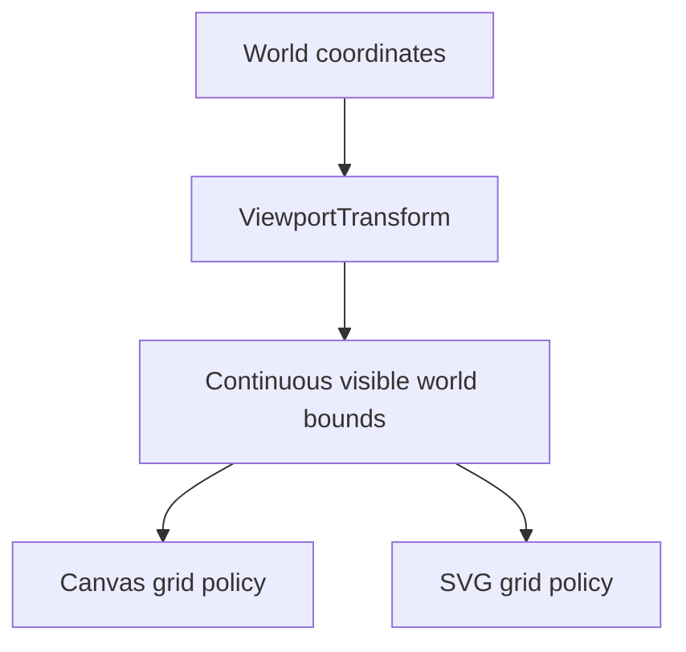
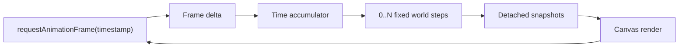

# Project Status

## Current checkpoint

vLab2D now has a small multi-body simulation engine, reproducible SVG visualization, and live Canvas 2D animation with fixed simulation timing.

Canvas is the primary visualization target. SVG remains a useful secondary renderer for static snapshots, debugging captures, exports, and documentation where maintaining it remains reasonable.

Both renderers share `ViewportTransform` for world-to-display coordinate conversion and continuous visible-world geometry.

### Simulation engine

The public engine API currently provides:

- `Vector2`, an immutable two-dimensional vector value.
- `KinematicState`, representing position and velocity at a particular instant.
- `KinematicIntegrator`, a narrow strategy contract for advancing kinematic state.
- `ExplicitEulerIntegrator`.
- `SemiImplicitEulerIntegrator`.
- `KinematicSimulation`, the earlier single-state runtime.
- `BodyId`, an opaque world-local identifier.
- `KinematicBodySnapshot`, a detached observation of body identity and state.
- `KinematicWorld`, which owns and advances multiple identified body states.

`KinematicWorld` owns authoritative body state and advances every body using an injected `KinematicIntegrator`.

External consumers receive detached observations rather than references to internal world storage.

World stepping remains atomic: candidate states for all bodies are calculated and validated before any authoritative state is replaced.

### Shared viewport transformation

`ViewportTransform` owns viewport geometry shared by the visualization paths.

It stores immutable configuration:

- viewport width;
- viewport height;
- display units per world unit.

It maps mathematical world coordinates:

```text
+x → right
+y → up
```

into display coordinates where positive Y points downward:

```text
displayX = width / 2 + worldX × pixelsPerUnit

displayY = height / 2 - worldY × pixelsPerUnit
```

With the current centered viewport, the world origin maps to the display center.

The transform also exposes the continuous world-space extent currently visible through the viewport:

```text
minWorldX
maxWorldX
minWorldY
maxWorldY
```

For example, a `100 × 60` viewport at `20` display units per world unit sees:

```text
X: -2.5 ... +2.5
Y: -1.5 ... +1.5
```

This geometry belongs to the viewport rather than to any particular grid renderer.



The renderers remain responsible for grid policy. They convert the continuous bounds into visible integer coordinates with `ceil` / `floor`, skip zero because the axes own that coordinate, and draw using their own rendering technology.

The transform contains no rendering behavior and has no dependency on SVG, Canvas, or engine-domain types such as `Vector2`.

### Canvas visualization

`CanvasKinematicRenderer` is the primary live visualization path.

Each frame is rendered in this order:

```text
grid
axes
origin
bodies
```

The integer grid consumes the continuous visible bounds from `ViewportTransform`. Axes and body positions use the same shared coordinate mapping.

Canvas now has explicit regression tests for:

- body coordinate mapping;
- frame clearing;
- world axes;
- the integer-coordinate grid;
- the world-origin marker;
- invalid display scale.

The renderer performs no simulation calculations and does not own or mutate engine state.

### SVG visualization

`SvgKinematicRenderer` remains the secondary static visualization path.

It renders the same basic spatial references and consumes the same continuous visible bounds, while retaining SVG-specific output behavior.

SVG remains useful for reproducible snapshots, debugging captures, exports, and documentation images. Future visualization work should preserve SVG support when doing so remains natural and reasonably inexpensive, but SVG compatibility must not constrain useful Canvas capabilities.

### Fixed-timestep browser loop

Browser rendering is driven by `requestAnimationFrame`, but simulation advancement is independent from display refresh rate.

The browser callback timestamp measures real elapsed time. That time is accumulated and consumed in fixed simulation steps:



The current simulation timestep is:

```text
1 / 60 second
```

A fast display may render frames without advancing the simulation. A slower display may require multiple fixed simulation steps before one render.

The browser host limits unusually large frame deltas before adding them to the accumulator so a delayed or suspended tab does not attempt excessive simulation catch-up.

Interpolation between fixed simulation states remains deliberately deferred.

## Next step

Introduce the smallest Canvas-first panning capability by allowing `ViewportTransform` to represent a world-space viewport center other than `(0, 0)`.

The first panning step should be programmatic rather than interactive:

- define the world coordinate represented by the viewport center;
- update world-to-display mapping around that center;
- update visible world bounds accordingly;
- prove the behavior through focused tests and the Canvas renderer;
- keep SVG working where the same viewport model applies naturally.

Do not yet introduce:

- mouse or pointer panning;
- zoom;
- a camera class;
- transformation matrices;
- renderer interfaces;
- generalized drawing backends.

This keeps the next step focused on viewport geometry before adding interaction mechanics.
