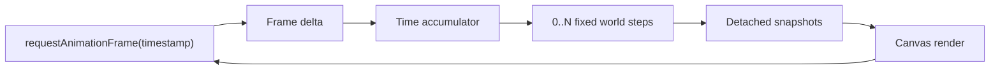

# Project Status

## Current checkpoint

vLab2D now has a small multi-body simulation engine, static SVG visualization, and live browser animation through Canvas 2D with simulation time decoupled from display refresh rate.

### Simulation engine

The public engine API currently provides:

- `Vector2`, an immutable two-dimensional vector value.
- `KinematicState`, representing position and velocity at a particular instant.
- `KinematicIntegrator`, a narrow strategy contract for advancing kinematic state.
- `ExplicitEulerIntegrator`.
- `SemiImplicitEulerIntegrator`.
- `KinematicSimulation`, the earlier single-state runtime.
- `BodyId`, an opaque world-local identifier.
- `KinematicBodySnapshot`, a detached observation of body identity and state.
- `KinematicWorld`, which owns and advances multiple identified body states.

`KinematicWorld` owns authoritative body state and advances every body using an injected `KinematicIntegrator`.

External consumers receive detached observations rather than references to internal world storage.

World stepping remains atomic: candidate states for all bodies are calculated and validated before any authoritative state is replaced.

### Visualization

Visualization remains outside the simulation engine.

Two concrete rendering paths now consume detached engine observations.

#### SVG

`SvgKinematicRenderer` produces static SVG output containing:

- simulated bodies;
- an integer-coordinate grid;
- X and Y axes;
- a world-origin marker.

SVG remains useful for snapshots, debugging captures, exports, and documentation images.

#### Canvas

`CanvasKinematicRenderer` draws body snapshots into a Canvas 2D drawing context.

It:

- clears each previous frame;
- converts mathematical world positions into display coordinates;
- draws observed bodies;
- performs no simulation calculations;
- does not own or mutate engine state.

The browser example under:

```text
examples/kinematic-world-canvas/
```

provides the first live visualization path.

### Fixed-timestep browser loop

Browser rendering is driven by `requestAnimationFrame`, but simulation advancement is no longer tied to the number of rendered frames.

The browser callback timestamp is used to measure real elapsed time.

That elapsed time is accumulated and consumed in fixed simulation steps:



The current simulation timestep is:

```text
1 / 60 second
```

A fast display may render frames in which no simulation step occurs. A slow display may require multiple fixed simulation steps before one render.

The world itself remains unaware of browser timing and rendering cadence.

The browser host also limits how much delayed real time may be added to the accumulator from one frame. This prevents a long-suspended or heavily delayed browser tab from attempting an excessive simulation catch-up when it resumes.

Interpolation between fixed simulation states is deliberately not implemented yet.

### Browser development workflow

The Canvas example is bundled for the browser using Deno.

The available tasks now include:

```text
canvas:build
canvas:watch
canvas:serve
```

`canvas:watch` automatically rebuilds the browser bundle when TypeScript source changes, while the generated files remain ignored derived artifacts.

A typical development setup is:

```text
source edit
    ↓
deno task canvas:watch
    ↓
automatic browser bundle
    ↓
deno task canvas:serve
    ↓
browser refresh
```

### Emerging visualization duplication

SVG and Canvas now independently implement the same essential world-to-display mapping:

```text
displayX = viewportWidth / 2 + worldX × pixelsPerUnit

displayY = viewportHeight / 2 - worldY × pixelsPerUnit
```

This is no longer hypothetical duplication: two concrete renderers now require the same transformation semantics.

No generic renderer abstraction has been introduced.

## Next step

Review the duplicated SVG and Canvas coordinate transformations and extract the smallest reusable world-to-display / viewport transformation that both renderers genuinely need.

The first shared transformation should cover only requirements already demonstrated by the two renderers, such as:

- viewport width and height;
- pixels per world unit;
- world origin placement;
- mathematical-to-display Y-axis inversion;
- conversion of world coordinates into display coordinates.

It should not yet introduce:

- pan;
- zoom;
- cameras;
- renderer interfaces;
- scene graphs;
- generalized drawing primitives.

Once SVG and Canvas both use the shared transformation successfully, pan and zoom can become a later extension built on a proven coordinate boundary.
