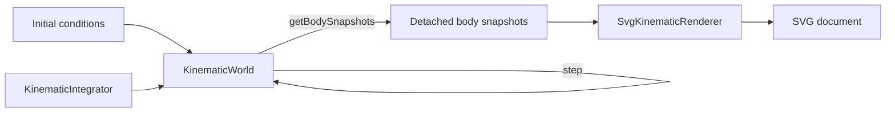

# Project Status

## Current checkpoint

vLab2D now has its first end-to-end path from simulation state to visible output.

### Simulation engine

The public engine API currently provides:

- `Vector2`, an immutable two-dimensional vector value.
- `KinematicState`, representing position and velocity at a particular instant.
- `KinematicIntegrator`, a narrow strategy contract for advancing kinematic state.
- `ExplicitEulerIntegrator`, which advances position using the velocity at the beginning of the timestep.
- `SemiImplicitEulerIntegrator`, which updates velocity first and then advances position using the updated velocity.
- `KinematicSimulation`, a state-owning single-state runtime used to establish controlled mutation, validation, and injected integration behavior.
- `BodyId`, an opaque world-local identifier for a simulated body.
- `KinematicBodySnapshot`, a detached observation of one body's identity and kinematic state.
- `KinematicWorld`, which owns and advances the kinematic state of multiple identified bodies.

`KinematicWorld` supports:

- creating bodies;
- observing an individual body's state;
- observing snapshots of all bodies in the world;
- configuring a world-level constant acceleration;
- advancing every body through time with an injected `KinematicIntegrator`.

All bodies currently share the same world acceleration and integration strategy.

The world's authoritative body state remains private. External consumers interact through `BodyId` values and detached observations rather than receiving references to the world's internal storage.

`getBodyState(...)` returns a detached copy of an individual body's state.

`getBodySnapshots()` returns detached observations containing body identity and state without exposing the world's private `Map`.

World stepping remains transactional: all candidate body states are computed and validated before any authoritative state is replaced. A failed step leaves every body at its previous state.

### Visualization

The project has its first concrete visualization implementation: `SvgKinematicRenderer`.

The renderer:

- lives outside the simulation engine under `src/visualization/`;
- consumes `KinematicBodySnapshot` values rather than engine internals;
- performs no physics calculations and does not mutate simulation state;
- maps mathematical world coordinates into SVG display coordinates;
- places the mathematical world origin at the center of the viewport;
- preserves positive X to the right;
- converts positive world Y into upward visual motion despite SVG's downward-positive Y axis;
- renders each observed body as a simple SVG circle;
- renders the world origin as a small crosshair at the mapped display position of world coordinate `(0, 0)`.

The origin marker is calculated through the same world-to-display mapping used for body positions rather than being hard-coded directly to the current viewport center.

This keeps the marker conceptually tied to world space and prepares the visualization code for a future reusable transform supporting viewport movement such as pan and zoom.

The example in `examples/kinematic-world-svg.ts` creates a `KinematicWorld`, advances several bodies using `SemiImplicitEulerIntegrator`, observes the resulting world through the public snapshot API, and writes the rendered result to:

```text
generated/kinematic-world.svg
```

The generated SVG now provides both visible body positions and an explicit spatial reference for the world origin.

The current end-to-end flow is:



The simulation engine remains independent from visualization. The renderer depends only on information exposed through the engine's public observation boundary.

## Next step

Continue enriching the static SVG viewer with simple spatial reference information.

The next small goal should render the world X and Y axes through the world origin.

The axes should:

- use the existing world-to-display mapping;
- make the mathematical coordinate orientation visually obvious;
- remain entirely within the visualization subsystem;
- avoid introducing a generalized transform abstraction before the first minimal Canvas renderer demonstrates its concrete requirements.

No engine changes, animation loop, pan/zoom behavior, velocity vectors, trails, or richer renderer abstraction are needed yet.

The SVG renderer remains our static visualization, documentation, and snapshot mechanism while the project moves gradually toward a future animated Canvas renderer.
