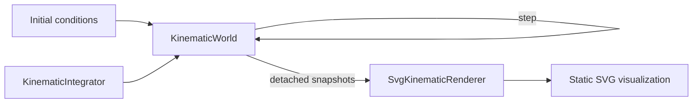
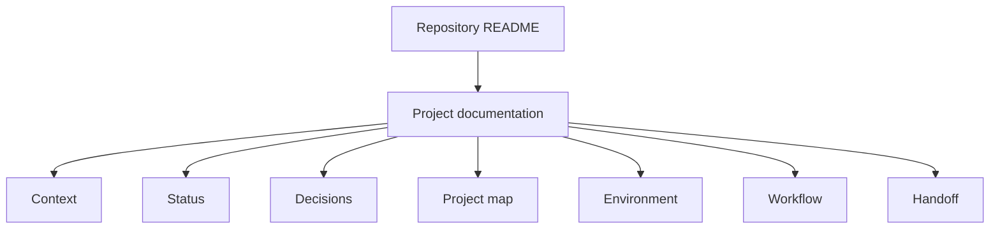

# Project Status

## Current checkpoint

vLab2D now has a small multi-body simulation engine, a useful static visualization workbench, and the first level of structured project documentation.

### Simulation engine

The public engine API currently provides:

- `Vector2`, an immutable two-dimensional vector value.
- `KinematicState`, representing position and velocity at a particular instant.
- `KinematicIntegrator`, a narrow strategy contract for advancing kinematic state.
- `ExplicitEulerIntegrator`, which advances position using the velocity at the beginning of the timestep.
- `SemiImplicitEulerIntegrator`, which updates velocity first and then advances position using the updated velocity.
- `KinematicSimulation`, the earlier single-state runtime used to establish controlled mutation, validation, and injected integration behavior.
- `BodyId`, an opaque world-local identifier for a simulated body.
- `KinematicBodySnapshot`, a detached observation of one body's identity and kinematic state.
- `KinematicWorld`, which owns and advances the kinematic state of multiple identified bodies.

`KinematicWorld` can create and observe bodies, apply a shared world acceleration, and advance every body using an injected `KinematicIntegrator`.

The world's authoritative body state remains private. External consumers observe detached state rather than receiving references to the world's internal storage.

World stepping is transactional: all candidate body states are computed and validated before any authoritative state is replaced. A failed step leaves every body at its previous state.

### Visualization

`SvgKinematicRenderer` provides the first concrete visualization path outside the engine.

It consumes detached `KinematicBodySnapshot` values and renders:

- simulated bodies as SVG circles;
- a low-opacity grid at integer world coordinates;
- world X and Y axes;
- the world origin.

The renderer maps the engine's mathematical coordinate system into SVG display coordinates while keeping simulation and presentation concerns separate.

The visual hierarchy currently uses a faint grid, partially transparent axes, the origin marker, and body markers rendered above the reference frame.

The example in `examples/kinematic-world-svg.ts` advances a small `KinematicWorld` and writes:

```text
generated/kinematic-world.svg
```

The generated SVG is useful as a static simulation view, debugging snapshot, reproducible visual artifact, and potential source image for project documentation.

The current end-to-end path is:



### Documentation structure

Project-level documentation now has its own entry point:

```text
docs/project/README.md
```

The repository README links to documentation sections rather than acting as a flat index of every individual document.

`docs/project/README.md` explains the purpose of the project documentation, provides suggested reading paths, and routes readers to focused documents for:

- project context;
- current status;
- decisions;
- conceptual maps;
- environment;
- workflow;
- continuity and handoff.

The intended documentation hierarchy is:



This establishes a pattern that future documentation areas can follow without allowing the repository README to grow into an unstructured documentation catalog.

## Next step

Create the first dedicated architecture-documentation section.

The goal is to explain the current architecture of vLab2D to both contributors and curious readers without turning the documentation into a speculative final-system design.

The next small step should introduce:

```text
docs/architecture/
└── README.md
```

The architecture entry point should explain the architecture that is supported by the implementation today, including the major boundaries between:

- simulation engine;
- authoritative world state;
- integration policies;
- public observation and control boundaries;
- visualization;
- examples or host/application code.

It should use diagrams where they help show dependencies and data flow.

The document should clearly distinguish:

- implemented architecture;
- architectural principles already accepted by the project;
- future possibilities that have not yet been implemented.

The root `README.md` can then link to both the project-documentation and architecture-documentation sections.

After this architecture checkpoint, development can return to visualization with the first minimal animated Canvas renderer.

That Canvas implementation should initially prove live repeated rendering only. Once both SVG and Canvas require the same world-to-display behavior, extracting a reusable viewport transform will be justified and can later support interactive pan and zoom.
