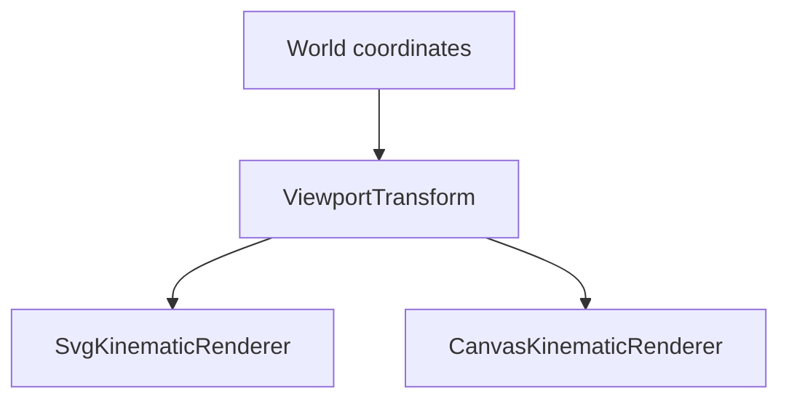
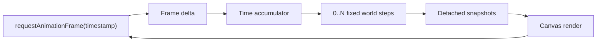

# Project Status

## Current checkpoint

vLab2D now has a small multi-body simulation engine, reproducible SVG visualization, live Canvas 2D animation with fixed simulation timing, and a shared viewport transformation used by both rendering paths.

### Simulation engine

The public engine API currently provides:

- `Vector2`, an immutable two-dimensional vector value.
- `KinematicState`, representing position and velocity at a particular instant.
- `KinematicIntegrator`, a narrow strategy contract for advancing kinematic state.
- `ExplicitEulerIntegrator`.
- `SemiImplicitEulerIntegrator`.
- `KinematicSimulation`, the earlier single-state runtime.
- `BodyId`, an opaque world-local identifier.
- `KinematicBodySnapshot`, a detached observation of body identity and state.
- `KinematicWorld`, which owns and advances multiple identified body states.

`KinematicWorld` owns authoritative body state and advances every body using an injected `KinematicIntegrator`.

External consumers receive detached observations rather than references to internal world storage.

World stepping remains atomic: candidate states for all bodies are calculated and validated before any authoritative state is replaced.

### Visualization

Visualization remains outside the simulation engine.

Two concrete rendering paths consume detached engine observations:

- `SvgKinematicRenderer` for reproducible static output;
- `CanvasKinematicRenderer` for live browser rendering.

Neither renderer advances simulation time or mutates engine state.

### Shared viewport transformation

`ViewportTransform` now owns the world-to-display coordinate mapping shared by SVG and Canvas.

It stores immutable viewport configuration:

- viewport width;
- viewport height;
- display units per world unit.

It maps the mathematical world coordinate system:

```text
+x → right
+y → up
```

into display coordinates where positive Y points downward:

```text
displayX = width / 2 + worldX × pixelsPerUnit

displayY = height / 2 - worldY × pixelsPerUnit
```

The world origin therefore maps to the center of the viewport.



The transform contains no rendering behavior and has no dependency on SVG, Canvas, or engine-domain types such as `Vector2`.

Both renderers continue to expose their existing constructors and create their viewport transformation internally.

Viewport validation for width, height, and scale now belongs to `ViewportTransform`. Renderer-specific validation, such as body radius, remains with the renderer that owns that concept.

### SVG

`SvgKinematicRenderer` produces static SVG output containing:

- simulated bodies;
- an integer-coordinate grid;
- X and Y axes;
- a world-origin marker.

Body positions, grid positions, axes, and origin placement now use `ViewportTransform`.

SVG remains useful for snapshots, debugging captures, exports, and documentation images.

### Canvas

`CanvasKinematicRenderer` draws detached body snapshots into a Canvas 2D drawing context.

It:

- clears each previous frame;
- maps body positions using `ViewportTransform`;
- draws observed bodies;
- performs no simulation calculations;
- does not own or mutate engine state.

The browser example under:

```text
examples/kinematic-world-canvas/
```

provides the live visualization path.

### Fixed-timestep browser loop

Browser rendering is driven by `requestAnimationFrame`, but simulation advancement is independent from display refresh rate.

The browser callback timestamp measures real elapsed time. That time is accumulated and consumed in fixed simulation steps:



The current simulation timestep is:

```text
1 / 60 second
```

A fast display may render frames without advancing the simulation. A slower display may require multiple fixed simulation steps before one render.

The world remains unaware of browser timing and rendering cadence.

The browser host limits unusually large frame deltas before adding them to the accumulator so a delayed or suspended tab does not attempt excessive simulation catch-up.

Interpolation between fixed simulation states remains deliberatel
