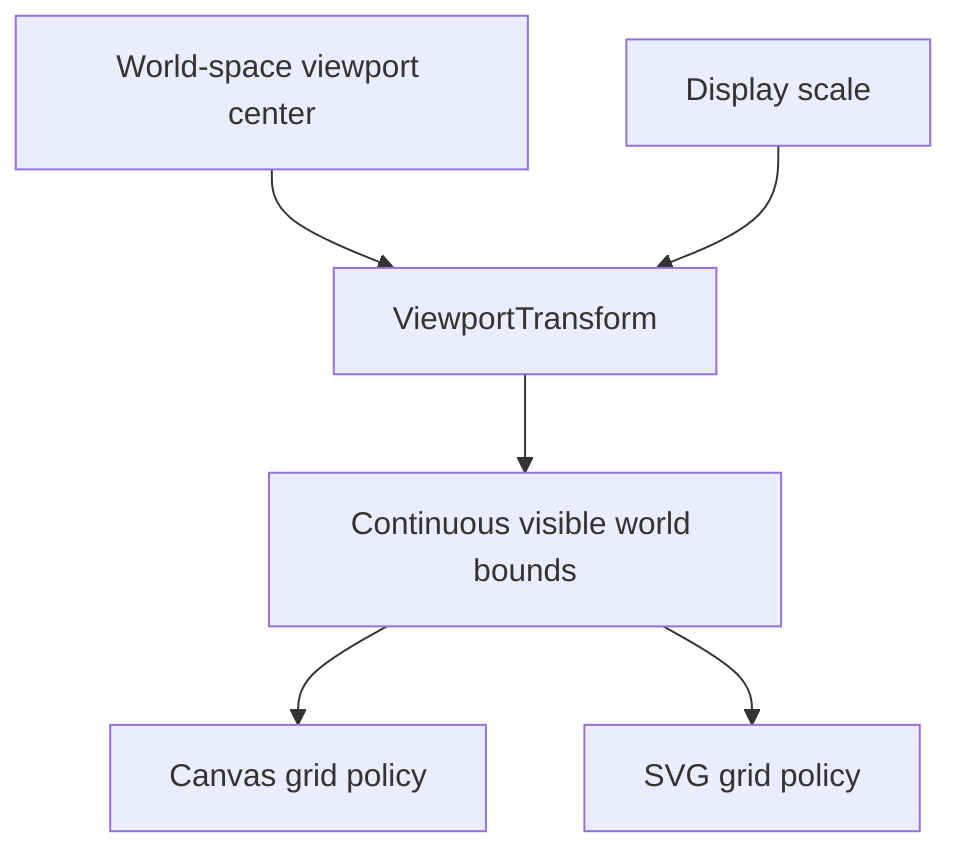
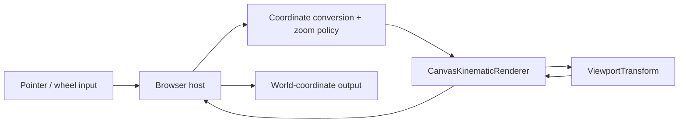
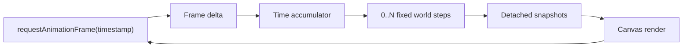

# Project Status

## Current checkpoint

vLab2D now has a small multi-body simulation engine, reproducible SVG visualization, and live Canvas 2D animation with fixed simulation timing.

Canvas is the primary visualization target. SVG remains a useful secondary renderer for static snapshots, debugging captures, exports, and documentation where maintaining it remains reasonable.

Both renderers share `ViewportTransform` for viewport geometry, bidirectional world/display coordinate conversion, mutable world-space centering, and mutable display scale. The Canvas path additionally supports anchored interactive zoom, display-space picking of rendered body markers, and live hover highlighting.

### Simulation engine

The public engine API currently provides:

- `Vector2`, an immutable two-dimensional vector value.
- `KinematicState`, representing position and velocity at a particular instant.
- `KinematicIntegrator`, a narrow strategy contract for advancing kinematic state.
- `ExplicitEulerIntegrator`.
- `SemiImplicitEulerIntegrator`.
- `KinematicSimulation`, the earlier single-state runtime.
- `BodyId`, an opaque world-local identifier.
- `KinematicBodySnapshot`, a detached observation of body identity and state.
- `KinematicWorld`, which owns and advances multiple identified body states.

`KinematicWorld` owns authoritative body state and advances every body using an injected `KinematicIntegrator`.

External consumers receive detached observations rather than references to internal world storage.

World stepping remains atomic: candidate states for all bodies are calculated and validated before any authoritative state is replaced.

### Shared viewport transformation

`ViewportTransform` owns viewport geometry shared by the visualization paths.

It stores immutable viewport dimensions:

- viewport width;
- viewport height.

It owns mutable viewport state:

- the world-space viewport center;
- display units per world unit (`pixelsPerUnit`).

The configured world position `(centerWorldX, centerWorldY)` maps to the center of the display; the world origin is centered by default.

The forward mapping is:

```text
displayX = width / 2 + (worldX - centerWorldX) × pixelsPerUnit

displayY = height / 2 - (worldY - centerWorldY) × pixelsPerUnit
```

The inverse mapping is:

```text
worldX = centerWorldX + (displayX - width / 2) / pixelsPerUnit

worldY = centerWorldY - (displayY - height / 2) / pixelsPerUnit
```

The transform exposes the continuous world-space extent currently visible through the viewport:

```text
minWorldX
maxWorldX
minWorldY
maxWorldY
```

Those bounds are derived from the current center and scale. Increasing `pixelsPerUnit` zooms in by showing a smaller world-space extent; decreasing it zooms out.



`setCenter(...)` validates both center coordinates before changing either one. `setPixelsPerUnit(...)` validates a new positive finite scale while preserving the current world-space center.

For anchor-aware zoom, `setPixelsPerUnitAroundDisplayPoint(...)` changes scale and center together so the world coordinate underneath the supplied display-space anchor remains unchanged. Requested scale, anchor coordinates, and candidate center are validated before any viewport state is committed, preserving the update atomically.

The transform contains no rendering behavior and has no dependency on SVG, Canvas, browser events, wheel-delta conventions, or engine-domain types such as `Vector2`.

### Canvas visualization

`CanvasKinematicRenderer` is the primary live visualization path.

Each frame is rendered in this order:

```text
grid
axes
origin
bodies
```

The renderer exposes focused viewport operations and queries:

- `setViewportCenter(worldX, worldY)` delegates world-space centering to `ViewportTransform`;
- `setViewportScale(pixelsPerUnit)` changes scale while preserving the current world-space center;
- `panViewportBy(deltaX, deltaY)` accepts a displacement in Canvas display units and converts it into the corresponding world-center change;
- `viewportScale` exposes the current scale read-only for host interaction policy;
- `setViewportScaleAroundDisplayPoint(...)` changes scale while preserving the world point underneath a Canvas display-space anchor;
- `displayToWorldX(displayX)` and `displayToWorldY(displayY)` expose the transform's inverse scalar mapping without leaking the transform object itself;
- `findBodyAtDisplayPoint(...)` tests detached snapshots against the rendered circular body markers and returns the nearest hit `BodyId`, or `undefined` when no marker contains the point;
- `render(...)` accepts an optional body identifier to highlight for that frame while remaining stateless about which body is hovered.

The integer grid, axes, origin marker, and body positions all consume the same transform, so panning and zooming move and magnify the complete world view coherently.

The live browser example adds pointer-drag panning, pointer-coordinate inspection, wheel/trackpad zoom, body picking, and hover highlighting. Browser input remains host responsibility: the example tracks one active pointer, uses pointer capture, converts browser CSS coordinates into Canvas drawing-buffer coordinates, normalizes wheel deltas, calculates an exponential zoom factor, clamps the requested scale to host-defined limits, and passes renderer-facing values rather than DOM event objects.

For picking and hover, the host retains the latest detached snapshots used for rendering and passes those same snapshots to `findBodyAtDisplayPoint(...)`. It owns the transient hovered `BodyId` and supplies that identifier back to `render(...)` for the current frame.

The pointer position is retained by the host and hover is recalculated every animation frame, not only on `pointermove`. Bodies continue moving while the pointer can remain stationary, so frame-time reevaluation keeps the body readout and visual highlight synchronized with the currently rendered observations.



The anchor-aware transform preserves the world coordinate underneath the pointer while the scale changes. The host currently prevents page scrolling during Canvas wheel zoom and owns scale limits and sensitivity; those are interaction policy rather than transform invariants.

The coordinate and body readouts remain ordinary DOM presentation owned by the host. The transient hovered `BodyId` is also host-owned presentation state. Formatting such as decimal precision does not enter `ViewportTransform` or the renderer.

Body picking is deliberately a visualization query rather than an engine query. `KinematicWorld` currently stores kinematic position and velocity but no physical shape or radius. The hit radius comes from the Canvas renderer's display-space body marker, so placing the query in `KinematicWorld` would incorrectly turn presentation geometry into simulation geometry.

When multiple rendered markers contain the pointer, the Canvas renderer chooses the hit whose rendered center is nearest to the pointer instead of depending on snapshot ordering, which is not part of the world's public contract.

The renderer remains unaware of DOM pointer and wheel events, does not retain hover state between frames, and performs no simulation calculations or engine-state mutation.

Canvas regression tests cover forward and inverse coordinate mapping, spatial references, viewport centering, programmatic scale changes, display-space panning, anchor-preserving scale changes, body-marker hit testing, nearest-hit behavior, requested-body highlighting, frame clearing, and validation behavior.

### SVG visualization

`SvgKinematicRenderer` remains the secondary static visualization path.

It renders the same basic spatial references and consumes the same continuous visible bounds, while retaining SVG-specific output behavior. `setViewportCenter(...)` exposes shared programmatic world-space centering, and `setViewportScale(...)` exposes shared programmatic viewport scale changes where those geometry operations map naturally to SVG.

The shared transform has inverse coordinate mathematics and anchor-aware scale geometry, but the SVG renderer does not expose Canvas-oriented inverse or anchored-interaction queries because no concrete SVG consumer currently needs them. Focused SVG regression tests verify displaced mapping and programmatic scale changes.

SVG remains useful for reproducible snapshots, debugging captures, exports, and documentation images. Future visualization work should preserve SVG support when doing so remains natural and reasonably inexpensive, but SVG compatibility must not constrain useful Canvas capabilities.

### Fixed-timestep browser loop

Browser rendering is driven by `requestAnimationFrame`, but simulation advancement is independent from display refresh rate.

The browser callback timestamp measures real elapsed time. That time is accumulated and consumed in fixed simulation steps:



The current simulation timestep is:

```text
1 / 60 second
```

A fast display may render frames without advancing the simulation. A slower display may require multiple fixed simulation steps before one render.

The browser host limits unusually large frame deltas before adding them to the accumulator so a delayed or suspended tab does not attempt excessive simulation catch-up.

Interpolation between fixed simulation states remains deliberately deferred.

## Next step

Use the completed hover/picking path to explore the smallest meaningful persistent inspection interaction.

The leading candidate is click selection:

- distinguish transient hover from persistent selected-body identity;
- keep selection outside authoritative simulation state;
- define click semantics without interfering with pointer-drag panning;
- reuse the existing `BodyId` and detached observations rather than creating a second body model;
- keep selected-body details and richer inspector UI separate until selection ownership is proven.

Do not yet introduce:

- drag-to-move bodies;
- engine-owned physical shape solely to support interaction;
- a general styling/theme system;
- a camera class;
- transformation matrices;
- renderer interfaces;
- generalized drawing backends.
