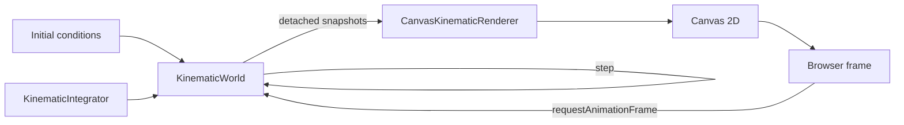

# Project Status

## Current checkpoint

vLab2D now has a small multi-body simulation engine and two concrete visualization paths: reproducible static SVG output and live browser animation through Canvas 2D.

### Simulation engine

The public engine API currently provides:

- `Vector2`, an immutable two-dimensional vector value.
- `KinematicState`, representing position and velocity at a particular instant.
- `KinematicIntegrator`, a narrow strategy contract for advancing kinematic state.
- `ExplicitEulerIntegrator`, which advances position using the velocity at the beginning of the timestep.
- `SemiImplicitEulerIntegrator`, which updates velocity first and then advances position using the updated velocity.
- `KinematicSimulation`, the earlier single-state runtime used to establish controlled mutation, validation, and injected integration behavior.
- `BodyId`, an opaque world-local identifier for a simulated body.
- `KinematicBodySnapshot`, a detached observation of one body's identity and kinematic state.
- `KinematicWorld`, which owns and advances the kinematic state of multiple identified bodies.

`KinematicWorld` owns authoritative body state, applies a shared world acceleration, and advances every body using an injected `KinematicIntegrator`.

External consumers observe detached state rather than receiving references to the world's internal storage.

World stepping remains transactional: candidate states for every body are computed and validated before any authoritative state is replaced.

### Visualization

Visualization remains outside the simulation engine and consumes detached observations exposed through the engine's public API.

Two concrete rendering paths now exist.

#### SVG

`SvgKinematicRenderer` produces a complete SVG document containing:

- simulated bodies;
- a coordinate grid;
- X and Y axes;
- a world-origin marker.

The SVG path is useful for static visualization, reproducible snapshots, debugging captures, exports, and documentation images.

#### Canvas

`CanvasKinematicRenderer` draws detached `KinematicBodySnapshot` values into a Canvas 2D drawing context.

The initial Canvas renderer deliberately remains small:

- it clears the previous frame;
- maps mathematical world coordinates into Canvas coordinates;
- renders observed bodies as circles;
- performs no simulation calculations;
- does not own or mutate engine state.

A browser example composes `KinematicWorld` and `CanvasKinematicRenderer` and repeatedly redraws the current snapshots using `requestAnimationFrame`.

The current live path is:

SVG and Canvas currently implement their world-to-display coordinate mapping independently.

This is the first concrete duplication suggesting that a reusable viewport/world-to-display transform may be valuable. No abstraction has yet been extracted.

### Browser/tooling path

The project now includes a browser-targeted Canvas example.

Deno is used to bundle the browser entry point, while a simple local file server provides the generated browser assets during development.

This keeps the first browser visualization path dependency-light and avoids introducing a frontend framework or application bundler.

### Documentation

Documentation is organized into section-level indexes:

- `docs/project/README.md` for project context, status, workflow, decisions, environment, and continuity;
- `docs/architecture/README.md` for implemented software structure, boundaries, ownership, dependencies, and runtime flows.

The architecture documentation now has a second real visualization implementation to describe rather than a hypothetical future renderer.

## Next step

Make simulation time independent from display refresh rate.

The current Canvas example deliberately advances the world once for each `requestAnimationFrame` callback using a fixed simulation timestep.

That proved the animation path, but it means a higher-refresh-rate display advances more simulation steps per real second than a lower-refresh-rate display.

The next small goal should introduce a proper fixed-timestep browser loop that separates:

- **simulation time** — advanced in deterministic fixed-size steps;
- **rendering time** — driven by browser display frames.

The feature should teach and demonstrate the accumulator/fixed-timestep pattern without yet adding:

- play/pause controls;
- interpolation;
- pan or zoom;
- diagnostic overlays;
- renderer interfaces;
- application frameworks.

After the animation loop is stable, review the duplicated SVG and Canvas world-to-display transformations and consider extracting the first shared viewport transformation abstraction.

That transformation can then provide the foundation for later pan and zoom.
