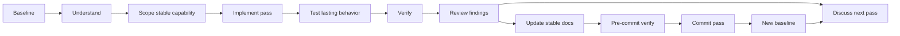

# Workflow and Working Arrangement

Last updated: 2026-09-30

## Development style

- Work in small, visible, satisfying increments.
- Prefer a runnable experiment over a large unfinished architecture.
- Introduce one meaningful capability/problem at a time when possible.
- Choose increments by **stable capability**, not by the smallest possible number of changed lines.
- Allow code to become slightly uncomfortable before extracting abstractions.
- Refactor because a real need has appeared, not because a pattern is fashionable.
- Prefer focused responsibilities and separation of concerns.
- Prefer composition over inheritance for varying behavior.
- Inject replaceable collaborators/policies explicitly when doing so clarifies dependencies or enables meaningful alternatives; avoid ceremonial DI for trivial values/helpers.
- Keep optional future ideas in a backlog rather than treating them as commitments.

## Capability-pass granularity

A development pass should end in a stable, useful capability worth keeping. The goal is not to keep every intermediate edit or compiler-visible state independently releasable.

A useful distinction is:

- **edit** — an implementation detail inside a pass; it may be incomplete or temporarily fail checks;
- **pass** — a coherent capability with implementation, lasting tests, relevant documentation, and a green verification boundary;
- **phase** — a larger architectural or product goal composed of several passes.

Within a pass:

- use compiler/type errors as navigation toward the places that must adapt;
- run focused tests whenever they help development;
- allow temporary red states while the coherent capability is still being assembled;
- do not automatically turn a short-lived intermediate limitation into production behavior;
- avoid adding guards, exceptions, tests, or JSDoc for a known temporary gap unless that gap is expected to survive for a meaningful period or the guard prevents dangerous/silent behavior;
- prefer tests that describe the intended lasting contract over tests that institutionalize behavior scheduled for immediate deletion;
- prefer documentation of stable boundaries over repeated documentation churn for transitory implementation states.

The complete `deno task verify` gate is required at the **pass boundary** and before committing the completed pass. It does not need to be green after every internal edit.

After each completed pass, stop and review what the implementation taught us before choosing the next pass. That checkpoint should explicitly consider:

- what assumptions were validated or disproved;
- what architectural pressure appeared in the real code;
- whether an abstraction is now earned by concrete duplication or coupling;
- what algorithms or data-model choices the next capability requires;
- which alternatives remain credible and what trade-offs they carry;
- whether the next pass should preserve the current design or deliberately reshape it.

This reflection checkpoint is part of the work, not overhead. It is where implementation evidence becomes architecture.

## Learning style

When a new technical problem appears:

1. State the problem clearly.
2. Identify the standard approaches that are appropriate for this level of project.
3. Explain the relevant idea and tradeoffs.
4. Choose the simplest approach that teaches something useful.
5. Implement a coherent capability pass.
6. Observe it visually and/or with diagnostics.
7. Compare alternatives when the comparison itself is interesting.
8. Review the lessons learned before defining the next pass.
9. Refactor only when the implementation gives us evidence that refactoring is useful.

## Documentation and code-comment style

Documentation is part of the learning process, not an afterthought.

Use comments and documentation to explain **why**, **what is non-obvious**, and **what tradeoff or algorithm is being used**. Avoid comments that merely restate syntax or obvious names.

Good candidates for comments/docs include:

- non-obvious invariants, units, coordinate conventions, or assumptions
- algorithms whose behavior is not obvious from the code alone
- numerical methods and why a particular method is being used
- tricky collision/geometry logic
- reasons behind an architectural or implementation choice
- known limitations, approximations, and intentionally simplified behavior
- important edge cases and surprising consequences
- public APIs whose contract is not obvious from the type signature

Usually avoid internal comments such as “x coordinate”, “increment index”, or comments that just translate a line of TypeScript into English. Prefer clear names and small functions for obvious code. Exported public API symbols are the exception: they may use concise JSDoc when documentation completeness requires it.

When introducing a significant algorithm, prefer a short nearby explanation plus, when useful, a more complete project note or reference. The code should remain readable without turning every file into a textbook.

Documentation should help a future version of the user answer: “Why did I write it this way, what idea is this implementing, and what should I be careful about if I change it?”

## ChatGPT collaboration rules

- Preserve the user's opportunity to learn; do not automatically replace exploration with large finished solutions.
- Help with architecture, debugging, algorithms, TypeScript, visualization, UI, and project management.
- Prefer explanations grounded in the concrete problem currently encountered.
- Clearly distinguish a learning implementation from a production solution.
- When proposing classes/interfaces, explain the responsibility and dependency boundary they are intended to protect.
- Do not introduce deep inheritance trees when composition or a simple function/object would express the behavior more clearly.
- Avoid expanding scope merely because a professional engine might include a feature.
- Treat compiler failures and temporary red states inside an active pass as development feedback, not automatically as new public contracts that need guards/tests/docs.
- Prefer finishing a coherent vertical capability over repeatedly formalizing temporary unsupported states that are scheduled to disappear within the same pass.
- Pause after each completed pass to discuss findings, lessons learned, architectural pressure, and options for the next pass before implementation continues.
- Track meaningful decisions in `decisions.md`.
- Track operational progress in `status.md`.
- Track tooling/version changes in `environment.md`.
- Update `project-context.md` if the project's identity, major goals, architecture, or handoff protocol changes.

## Baseline and file-editing protocol

The latest commit explicitly shared and verified in the collaboration is the authoritative repository baseline.

All proposed changes to existing project files must start from the exact contents of that baseline rather than from remembered chat snippets, earlier drafts, or reconstructed approximations.

When repository access is available:

1. verify the shared commit identifier;
2. retrieve the affected file from that exact commit;
3. apply only the changes required by the current feature or documentation pass;
4. preserve unaffected content;
5. review the resulting complete file against the intended project state.

If the active feature contains explicit uncommitted working changes, treat them as a layer on top of the latest verified baseline. Do not silently assume unrelated local changes.

When a new commit identifier is shared and verified, it becomes the new authoritative baseline and supersedes the previous baseline and earlier project snapshots.

### Documentation-file delivery

When a documentation pass changes Markdown files, prepare each affected file **in full** rather than presenting inline patches or replacement fragments.

For every affected Markdown file:

- derive the complete replacement from the exact baseline file plus the explicitly approved current changes;
- preserve all unaffected sections and formatting;
- create a standalone `.md` file using the repository-relative filename/path;
- share a direct file link that can be opened in the client file panel and downloaded as a drop-in replacement;
- when several documentation files change together, optionally also provide a ZIP preserving their repository-relative directory structure.

The generated file itself is the review artifact. Avoid wrapping the full Markdown source in chat code fences when a file artifact can be provided instead.

Client-side open/copy/download controls may vary by interface; the collaboration should provide the file artifact and download link without depending on a particular UI control being present.

## Documentation ownership and duplication rule

Prefer a **single authoritative home** for each kind of project information. Other documents may provide a short summary or link when that helps navigation, but should not reproduce the same detailed information.

- root `README.md` — repository front door: concise project presentation, environment summary, structure, normal commands, current-status summary, and links to documentation sections.
- section `README.md` files — entry points and indexes for coherent documentation areas. They explain what the section contains and route readers to focused documents without duplicating those documents.
- `docs/project/README.md` — index and orientation for project-level documentation.
- `project-context.md` — stable project identity, goals, constraints, architectural principles, and repository identity.
- `status.md` — only the current checkpoint and the next small goal; it is not a changelog or commit history.
- `decisions.md` — durable accepted/rejected architectural and workflow decisions with rationale.
- `environment.md` — development environment, versions, tooling constraints, and environment-specific notes; task definitions themselves live in `deno.json`.
- `workflow.md` — development/learning process and working agreement.
- `project-map.md` — visual conceptual map where diagrams materially improve understanding.
- `handoff.md` — how to resume the project; it should point to authoritative files rather than repeat their current contents.
- `deno.json` — authoritative project task definitions.

As documentation grows, prefer grouping related material into dedicated sections under `docs/`, each with its own `README.md` index. The repository README should link to those section indexes rather than becoming a flat catalog of every documentation file.

The Git commit history remains the source for historical implementation chronology. Do not duplicate that history in `status.md` or other continuity files unless a historical reference is specifically needed to explain a durable decision.

## Milestone versioning and Git tags

Git commit history remains the detailed implementation chronology. Version tags serve a different purpose: they identify selective project states that are meaningful enough to name, revisit, compare, demonstrate, or use as learning checkpoints.

vLab2D uses Semantic Versioning-shaped milestone tags:

```text
vMAJOR.MINOR.PATCH
```

Use annotated Git tags rather than lightweight tags. The Git tag name contains only the version, while the annotation gives the milestone a short human-readable label:

```text
tag:     v0.2.0
message: v0.2.0 - Interactive Canvas
```

Do not tag every feature, refactor, fix, or commit. A commit is a good milestone-tag candidate when it is:

- **complete** — implementation, tests, verification, and relevant documentation are synchronized;
- **coherent** — the tagged commit represents a recognizable project state rather than a partial feature;
- **demonstrable** — checking out the tag makes a meaningful capability observable or explainable;
- **worth revisiting** — the state is useful for comparison, learning, screenshots, regression investigation, or showing project evolution;
- **durable enough to name** — the milestone can be summarized clearly in a short label.

### Version meaning before `1.0.0`

vLab2D is in initial development and is expected to remain in the `0.x.y` range for a substantial period.

Before `1.0.0`:

- increment the **minor** version (`v0.X.0`) for a new meaningful project milestone: a coherent, demonstrable capability or a substantial intentional evolution of the still-unstable public design;
- increment the **patch** version (`v0.x.Y`) for a corrective or refining checkpoint that improves an existing tagged milestone without establishing a new project capability;
- bug fixes, validation corrections, small behavioral refinements, documentation corrections, and similar maintenance normally belong to patch-level evolution when they are significant enough to tag;
- an intentional breaking contract change before `1.0.0` must not be represented only by a patch increment;
- patch tags are optional checkpoints, not a requirement to tag every corrective commit.

A useful minor-version test is:

> If this tag were shown independently, can the new project capability be described in one short sentence?

If not, the change probably belongs in normal commit history rather than receiving a new minor milestone version.

### Meaning of `1.0.0`

`v1.0.0` is not earned by reaching a particular number of milestones.

Reserve `v1.0.0` for a deliberate point at which vLab2D has a coherent first mature laboratory shape and its public contracts are stable enough that compatibility becomes an explicit promise rather than an exploratory convenience.

After `1.0.0`, follow conventional Semantic Versioning more strictly:

- **major** — incompatible public-contract changes;
- **minor** — backward-compatible capabilities;
- **patch** — backward-compatible fixes and refinements.

### Tagging process

Evaluate milestone tagging only after the corresponding commit has completed the normal feature lifecycle and has been verified as a trustworthy repository checkpoint.

For a milestone tag:

1. identify the exact commit that represents the completed milestone;
2. choose the next semantic version according to the rules above;
3. create an annotated tag with a short milestone label;
4. inspect the tag before publishing it;
5. push the tag explicitly.

Example:

```sh
git tag -a v0.2.0 <commit> -m "v0.2.0 - Interactive Canvas"
git show v0.2.0
git push origin v0.2.0
```

Published version tags are historical markers. Do not move or reuse an existing published version tag to represent different code. If a tagged milestone needs a later correction that deserves its own checkpoint, create a new version instead.

## Continuity maintenance trigger

Update the continuity pack after any of the following:

- a goal becomes important or is dropped
- an architectural decision is made/reversed
- a new dependency/tool/framework is adopted
- environment commands or versions change
- a milestone is completed
- the next milestone changes materially
- a workflow/working-arrangement preference changes
- a significant unresolved issue should survive into another chat

Minor coding discussion does not need documentation unless it affects future work.

## Technical-choice explanation standard

When presenting a meaningful choice, include as applicable:

- what the concept/technology/algorithm is
- how it works at an appropriate level
- why it fits the current problem
- relevant industry best practice/pattern
- advantages
- disadvantages/tradeoffs
- credible alternatives
- why those alternatives are not preferred _for this step_
- whether the choice is a learning simplification or something we would also expect in production code

Do not hide important tradeoffs behind "best practice" language.

## Modularity and dependency policy

- Use vanilla TypeScript.
- Keep external dependencies minimal; prefer implementing relevant mechanisms ourselves.
- Deno and appropriate Deno standard-library utilities are acceptable infrastructure, particularly for tests.
- Make genuinely variable behavior replaceable/composable: integrators, collision detection, collision solving, forces, and similar policies should be able to evolve toward independent implementations as concrete alternatives appear.
- Let the folder/module structure make these boundaries visible without prematurely creating a framework.

## File and test naming conventions

- Prefer lowercase kebab-case for project-owned filenames, for example `project-context.md`, `collision-detector.ts`, or `semi-implicit-euler.ts`.
- Preserve widely established conventional filenames such as `README.md`, `CHANGELOG.md`, and `LICENSE`.
- Name tests with the `*.test.ts` form, for example `vector2.test.ts`.
- Colocate unit/module tests with the implementation they exercise.
- Reserve the root `tests/` tree for integration, end-to-end, bootstrap, or other project-level tests that do not belong naturally to one module.

## Testing standard

- Treat tests as part of the feature, not optional cleanup.
- Prefer Deno's native testing facilities and suitable Deno standard-library assertions/utilities.
- Test contracts and behavior rather than implementation details where practical.
- Include important edge cases and error paths.
- Numerical code should use assertions/tolerances appropriate to floating-point behavior rather than brittle exact comparisons when exact equality is not a valid contract.
- Prefer lasting behavioral tests over tests for known short-lived intermediate restrictions.
- Prefer a smaller suite we trust over superficial tests added only to increase coverage.

## Visual-learning standard

For structural, relational, process-oriented, or abstract topics, consider a Mermaid diagram alongside prose. Prefer the pattern **explanation + diagram + practical example** when it materially improves understanding. Do not diagram trivial concepts merely for decoration.

## Public API documentation standard

Treat the engine's exported API as a consumer-facing contract. Public observation/query and command/control members should receive JSDoc whenever callers need semantic information beyond the TypeScript signature.

For each meaningful public API, document as applicable:

- what the operation means in simulation terms
- parameter semantics and units
- coordinate-system/time conventions
- returned-data ownership and mutability guarantees
- whether the call mutates engine state or only observes it
- validation rules, rejected inputs, and errors
- when the state change takes effect
- invariants preserved by the operation
- relevant determinism or reproducibility behavior
- a concise example when usage is not self-evident

Every symbol that forms part of the exported public engine API must have JSDoc sufficient for `deno doc --lint`. For obvious accessors or trivial values, keep that documentation concise rather than padding it with artificial explanation. Non-obvious public contracts should receive fuller documentation. Documentation must teach correct use, not narrate syntax.

The public engine root module is part of the documentation-quality workflow: lint it with `deno doc --lint` and generate searchable HTML with `deno doc --html`. Prefer native Deno documentation tooling over a third-party generator unless a demonstrated project need justifies the dependency.

## Capability-pass feature lifecycle

vLab2D is developed in coherent, understandable, independently reviewable capability passes.

Each pass starts from an accepted repository baseline and should end in the smallest **stable and useful capability** worth keeping. Internal edits may temporarily be incomplete or fail checks; they do not need to become public behavior merely to preserve an artificial intermediate checkpoint.

The normal lifecycle is:

1. **Establish the baseline**
   - Start from the latest commit explicitly confirmed and verified as the project baseline.
   - Retrieve affected existing files from that exact commit before proposing or generating edits.
   - Review `status.md` to understand the current checkpoint and next capability goal.
   - If explicit uncommitted work exists for the active pass, treat it as a known layer on top of the baseline rather than replacing the baseline with an assumed local snapshot.

2. **Understand the problem**
   - Clarify the concepts, terminology, algorithms, and responsibilities involved.
   - Compare reasonable implementation options.
   - Discuss advantages, disadvantages, trade-offs, and common mistakes.
   - Prefer established techniques when they exist, adapting them to the scale and learning goals of vLab2D.

3. **Agree on the smallest stable capability**
   - Define what the pass should make genuinely usable by its end.
   - Explicitly identify what belongs to a later pass.
   - Choose the boundary so that known short-lived unsupported states inside the pass do not need to become durable contracts.
   - Avoid speculative abstractions and functionality whose need has not been demonstrated.

4. **Implement the capability**
   - Build the pass from the ground up.
   - Use compiler errors and focused tests to reveal downstream assumptions that must adapt.
   - Allow temporary red states while the coherent capability is still being assembled.
   - Explain important TypeScript, architectural, mathematical, and algorithmic decisions as they appear.
   - Keep modules focused and dependencies explicit.
   - Document exported public API symbols with JSDoc when their stable contract is known.
   - Comment internal code only when the comment adds meaning that the code itself does not communicate clearly.
   - Do not add temporary unsupported guards/tests/docs unless the limitation will intentionally survive the pass or prevents unsafe/silent behavior.

5. **Test lasting behavior**
   - Add colocated unit tests where appropriate.
   - Prioritize final behavioral contracts, invariants, edge cases, failure behavior, and regression protection over coverage metrics.
   - Avoid tests that merely mirror implementation details.
   - Avoid tests whose only purpose is to freeze an intermediate restriction scheduled to disappear before the pass ends.
   - Use test doubles when they help isolate the responsibility under test.

6. **Verify the pass**
   - Run focused tests while developing as useful.
   - At the completed pass boundary, run the complete project quality gate:

   ```sh
   deno task verify
   ```

7. **Review findings and lessons learned**
   - Review the implementation, API shape, naming, tests, documentation, and architectural fit.
   - Identify what the real implementation taught us: duplicated logic, awkward boundaries, new invariants, useful abstractions, or disproved assumptions.
   - Discuss architecture, algorithms, alternatives, and trade-offs for the next pass before implementing it.
   - A passing test suite is necessary but does not by itself mean the pass is understood or complete.

8. **Perform the pre-commit documentation review**
   - Update `status.md` to describe the new current checkpoint and the next capability goal.
   - Update `decisions.md` only when the pass establishes or changes a durable project decision.
   - Update other project documentation only when its authoritative information has actually changed.
   - Document the stable end state of the pass; avoid documenting temporary implementation states that no longer exist.
   - Avoid duplicating information between documents.
   - Prepare every affected Markdown file as a complete replacement derived from the exact baseline file plus the explicitly approved current pass changes.
   - Share each complete `.md` file as an open/download artifact rather than as inline Markdown patches or fenced full-file source.
   - When several Markdown files change together, a ZIP preserving repository-relative paths may also be provided for convenience.

9. **Perform the pre-commit verification**
   - Run `deno task verify` again after documentation changes.
   - Review `git status`, the diff, and the staged diff.
   - Confirm that implementation, tests, API documentation, and project documentation all describe the same stable pass result.

10. **Commit the completed pass**
    - Prefer one coherent commit containing the capability, its lasting tests, its API documentation, and the relevant project-documentation updates.
    - A small commit group is acceptable when there is a practical reason, but avoid manufacturing commits solely to preserve predictable temporary states.
    - The final commit should represent a trustworthy checkpoint that can be understood and resumed independently.

11. **Establish the new baseline**
    - After the commit is created, the commit identifier is shared explicitly.
    - Verify that commit and its relevant files through repository access when available.
    - Once verified, that commit becomes the new authoritative project baseline and supersedes the previous baseline and all earlier project snapshots.



The purpose of this lifecycle is not process for its own sake. Each pass should be small enough to understand completely, large enough to avoid wasting effort formalizing disposable intermediate states, and strong enough to serve as a reliable foundation for the next capability.
