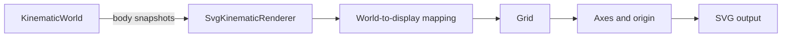

# Visualization

`src/visualization/` contains ways to represent simulation information visually.

Visualization is intentionally outside the engine boundary. Renderers and diagnostic views observe information exposed by the engine's public API rather than reaching into engine internals or mutating authoritative simulation state.

## Current implementation

The first visualization component is `SvgKinematicRenderer`.

It renders detached `KinematicBodySnapshot` values as simple SVG circles and provides a basic Cartesian reference frame.

The renderer is responsible for converting between the engine's mathematical world coordinate system and SVG display coordinates:

- positive world X points right;
- positive world Y points up;
- SVG positive Y points down;
- the world origin is currently mapped to the center of the SVG viewport.

The SVG reference frame contains:

1. a low-opacity coordinate grid at visible integer world coordinates;
2. a horizontal world X axis through world `y = 0`;
3. a vertical world Y axis through world `x = 0`;
4. a small marker at world coordinate `(0, 0)`;
5. body markers rendered above the spatial reference elements.

Each grid square represents one world unit at the renderer's current scale.

The grid deliberately omits lines at world `x = 0` and `y = 0`. Those positions belong to the coordinate axes and are rendered separately with stronger visual emphasis.

The axes remain partially transparent so they are distinct from the weaker grid while still allowing some visibility of the origin marker at their intersection.

Grid positions, axes, the origin marker, and simulated bodies all use the same world-to-display mapping.

The renderer contains no simulation or integration behavior.

A runnable example is available at:

```text
examples/kinematic-world-svg.ts
```

It advances a small `KinematicWorld`, obtains detached body snapshots through the engine's public API, and writes:

```text
generated/kinematic-world.svg
```

The generated SVG can serve as a lightweight visual workbench, static export, reproducible snapshot, and source image for project documentation.

The current visualization path is:



## Direction

The SVG renderer has reached a useful first static-visualization checkpoint.

It is expected to remain valuable as a static visualization, export, documentation illustration, and snapshot mechanism even after animated rendering is introduced.

Potential later SVG or diagnostic capabilities include:

- body labels;
- velocity and acceleration vectors;
- trails;
- collision bounds;
- contact points and normals;
- state-based styling;
- side-by-side world views;
- overlaid world views.

The next major visualization direction is a minimal interactive/browser rendering path using Canvas.

The first Canvas renderer should remain simple and validate live repeated rendering before introducing richer viewer behavior.

Once SVG and Canvas provide two concrete consumers of world-to-display coordinate conversion, a reusable viewport transform should be considered. That transform can later provide the natural foundation for pan, zoom, and other interactive camera behavior.

New visualization abstractions should continue to be introduced only when concrete requirements demonstrate their need.
