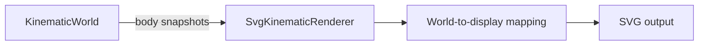

# Visualization

`src/visualization/` contains ways to represent simulation information visually.

Visualization is intentionally outside the engine boundary. Renderers and diagnostic views observe information exposed by the engine's public API rather than reaching into engine internals or mutating authoritative simulation state.

## Current implementation

The first visualization component is `SvgKinematicRenderer`.

It renders detached `KinematicBodySnapshot` values as simple SVG circles and provides basic spatial reference information.

The renderer is responsible for converting between the engine's mathematical world coordinate system and SVG display coordinates:

- positive world X points right;
- positive world Y points up;
- SVG positive Y points down;
- the world origin is currently mapped to the center of the SVG viewport.

The world origin is rendered as a small crosshair.

The origin marker is mapped from world coordinate `(0, 0)` through the same coordinate conversion used for simulated body positions. This keeps spatial reference rendering expressed in terms of world coordinates rather than depending directly on the current viewport-center implementation.

The renderer contains no simulation or integration behavior.

A runnable example is available at:

```text
examples/kinematic-world-svg.ts
```

It advances a small `KinematicWorld`, obtains detached body snapshots through the engine's public API, and writes:

```text
generated/kinematic-world.svg
```

The generated SVG can serve as both a lightweight visual workbench and a static snapshot suitable for inspection or documentation.

The current visualization path is:



## Direction

Visualization should continue to grow incrementally as concrete requirements appear.

The next small addition is the world X and Y axes.

Potential later capabilities include:

- coordinate grid;
- body labels;
- velocity and acceleration vectors;
- trails;
- collision bounds;
- contact points and normals;
- state-based styling;
- side-by-side world views;
- overlaid world views;
- interactive Canvas rendering;
- reusable viewport transformation supporting pan and zoom.

The SVG renderer is expected to remain useful as a static visualization, export, and documentation snapshot mechanism even after an animated renderer is introduced.

These are possibilities rather than a committed roadmap. New visualization abstractions should be introduced only when actual implementations demonstrate their need.
