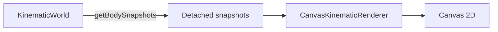
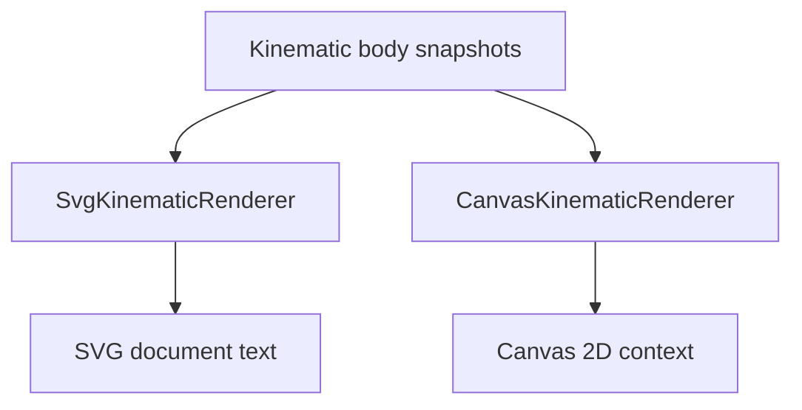

# Visualization

`src/visualization/` contains ways to represent simulation information visually.

Visualization is intentionally outside the engine boundary. Renderers and diagnostic views observe information exposed by the engine's public API rather than reaching into engine internals or mutating authoritative simulation state.

## Current implementations

The project currently has two concrete visualization implementations:

- `SvgKinematicRenderer` for static SVG output;
- `CanvasKinematicRenderer` for browser Canvas 2D rendering.

Both consume detached `KinematicBodySnapshot` values exposed by the simulation engine.

Neither renderer advances simulation time or performs physics calculations.

## SVG renderer

`SvgKinematicRenderer` produces a complete SVG document.

It currently renders:

1. a low-opacity coordinate grid at visible integer world coordinates;
2. a horizontal world X axis;
3. a vertical world Y axis;
4. a world-origin marker;
5. body markers above the spatial reference elements.

The SVG renderer is useful as a:

- static visual workbench;
- reproducible snapshot;
- debugging capture;
- export format;
- source image for project documentation.

A runnable example is available at:

```text
examples/kinematic-world-svg.ts
```

It writes:

```text
generated/kinematic-world.svg
```

## Canvas renderer

`CanvasKinematicRenderer` is the first live rendering implementation.

It receives a Canvas 2D drawing context and renders detached body snapshots directly into that context.

Each render:

1. clears the previous frame;
2. maps body positions from world coordinates to display coordinates;
3. draws the current bodies.

Clearing the previous frame is deliberate. Trails should become an explicit visualization capability rather than appearing accidentally because old frames were left on the canvas.

The first browser example is located under:

```text
examples/kinematic-world-canvas/
```

The browser host creates the simulation, advances it, obtains detached body snapshots, and supplies those snapshots to the Canvas renderer.



The browser's animation callback controls repeated execution. The renderer itself has no knowledge of `requestAnimationFrame`.

## Coordinate systems

The engine uses mathematical world coordinates:

- positive X points right;
- positive Y points up.

Both SVG and Canvas use display coordinate systems where positive Y points downward.

The two current renderers therefore independently perform equivalent mappings:

```text
displayX = viewportWidth / 2 + worldX × pixelsPerUnit

displayY = viewportHeight / 2 - worldY × pixelsPerUnit
```

The duplicated transformation is now a real architectural signal.

A shared viewport/world-to-display abstraction should be considered after the initial Canvas animation loop has been made stable. It should be extracted from the demonstrated needs of both renderers rather than designed as a speculative rendering framework.

## Rendering roles

The current renderers have intentionally different output models.



This is why the project does not yet define a generic renderer interface.

The two concrete implementations should continue to teach us which concepts are genuinely shared and which belong to particular rendering technologies.

## Direction

Near-term visualization work should proceed in small steps:

1. make browser simulation time independent from display refresh rate;
2. review and likely extract the duplicated world-to-display transformation;
3. use that transform as the foundation for future pan and zoom.

Later visualization capabilities may include:

- coordinate references in Canvas;
- body labels;
- velocity and acceleration vectors;
- trails;
- collision bounds;
- contact points and normals;
- state-based styling;
- side-by-side world views;
- overlaid world views.

The SVG renderer should remain useful for static output even as the live Canvas path grows.

New shared abstractions should continue to appear only when concrete implementations demonstrate their need.
