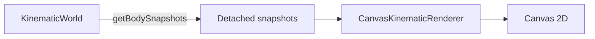
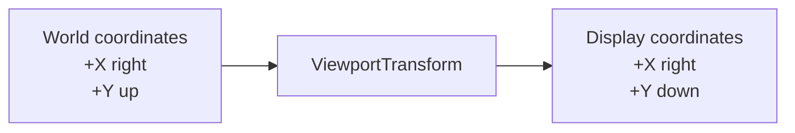
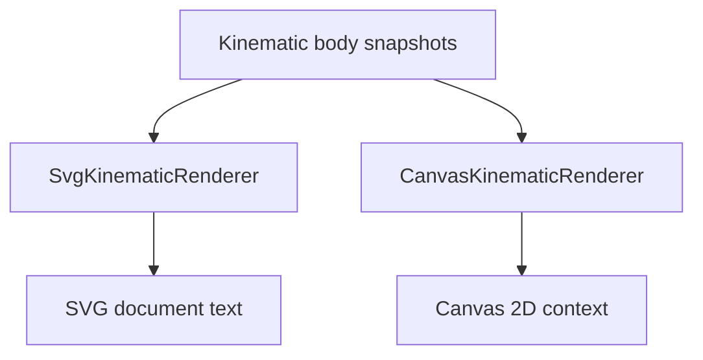

# Visualization

`src/visualization/` contains ways to represent simulation information visually.

Visualization is intentionally outside the engine boundary. Renderers and diagnostic views observe information exposed by the engine's public API rather than reaching into engine internals or mutating authoritative simulation state.

## Current implementations

The project currently has two concrete visualization implementations:

- `SvgKinematicRenderer` for static SVG output;
- `CanvasKinematicRenderer` for browser Canvas 2D rendering.

Both consume detached `KinematicBodySnapshot` values exposed by the simulation engine.

`ViewportTransform` provides the world-to-display coordinate mapping shared by both renderers.

Neither renderer advances simulation time or performs physics calculations.

## SVG renderer

`SvgKinematicRenderer` produces a complete SVG document.

It currently renders:

1. a low-opacity coordinate grid at visible integer world coordinates;
2. a horizontal world X axis;
3. a vertical world Y axis;
4. a world-origin marker;
5. body markers above the spatial reference elements.

The SVG renderer is useful as a:

- static visual workbench;
- reproducible snapshot;
- debugging capture;
- export format;
- source image for project documentation.

A runnable example is available at:

```text
examples/kinematic-world-svg.ts
```

It writes:

```text
generated/kinematic-world.svg
```

## Canvas renderer

`CanvasKinematicRenderer` provides the live rendering implementation.

It receives a Canvas 2D drawing context and renders detached body snapshots directly into that context.

Each frame is rendered in this order:

1. clear the previous frame;
2. render the integer-coordinate grid;
3. render the world X and Y axes;
4. render the world-origin marker;
5. render the current bodies.



The grid omits zero-coordinate lines because those positions are represented by the world axes.

Spatial references and body positions use the shared `ViewportTransform`.

Clearing the previous frame remains deliberate. Trails should become an explicit visualization capability rather than appearing accidentally because old frames were left on the canvas.

The browser host controls repeated execution. The renderer itself has no knowledge of `requestAnimationFrame`.

## Animation timing

The browser host separates rendering cadence from simulation cadence.

`requestAnimationFrame` provides frame timestamps, which are converted into elapsed seconds and accumulated. The host consumes that accumulated time through fixed-size world steps before rendering the latest body snapshots.


The renderer itself remains unaware of this timing mechanism. `CanvasKinematicRenderer` only draws the snapshots it receives.

Variable frame delta is therefore a scheduling input rather than the numerical integration timestep.

## Coordinate systems

The engine uses mathematical world coordinates:

- positive X points right;
- positive Y points up.

SVG and Canvas use display coordinate systems where positive Y points downward.

The shared `ViewportTransform` owns the conversion between those coordinate systems:

```text
displayX = viewportWidth / 2 + worldX × pixelsPerUnit

displayY = viewportHeight / 2 - worldY × pixelsPerUnit
```

The world origin maps to the center of the viewport.



`ViewportTransform` contains no rendering behavior.

It stores only immutable viewport geometry and scale and exposes numeric coordinate conversion operations.

Both `SvgKinematicRenderer` and `CanvasKinematicRenderer` own a transform internally while retaining their existing public constructor shapes.

This abstraction was introduced only after both concrete renderers independently demonstrated the same coordinate-mapping responsibility.

## Rendering roles

The current renderers have intentionally different output models.



This is why the project does not yet define a generic renderer interface.

The two concrete implementations should continue to teach us which concepts are genuinely shared and which belong to particular rendering technologies.

## Direction

SVG and Canvas now share coordinate conversion through `ViewportTransform` and both render equivalent basic spatial references.

The next visualization review should examine the duplicated calculation used by both renderers to determine the visible world range for their integer grids.

The distinction to preserve is:

```text
ViewportTransform
    visible world geometry

Grid rendering
    which world coordinates should receive grid lines
```

If the current duplication supports it, the smallest useful visible-bounds capability should be added to `ViewportTransform`.

Pan, zoom, cameras, renderer interfaces, richer diagnostics, and generalized rendering abstractions remain deferred until concrete requirements establish their shape.
