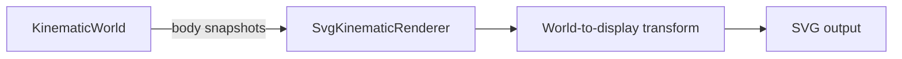

# Visualization

`src/visualization/` contains ways to represent simulation information visually.

Visualization is intentionally outside the engine boundary. Renderers and diagnostic views observe information exposed by the engine's public API rather than reaching into engine internals or mutating authoritative simulation state.

## Current implementation

The first visualization component is `SvgKinematicRenderer`.

It renders detached `KinematicBodySnapshot` values as simple SVG circles.

The renderer is responsible for converting between the engine's mathematical world coordinate system and SVG display coordinates:

- positive world X points right;
- positive world Y points up;
- SVG positive Y points down;
- the world origin is currently mapped to the center of the SVG viewport.

The renderer contains no simulation or integration behavior.

A runnable example is available at:

```text
examples/kinematic-world-svg.ts
```

It advances a small `KinematicWorld`, obtains detached body snapshots through the engine's public API, and writes:

```text
generated/kinematic-world.svg
```

This establishes the first complete visualization path:



## Direction

Visualization should continue to grow incrementally as concrete requirements appear.

Potential future capabilities include:

- coordinate axes and origin indicators;
- velocity and acceleration vectors;
- trails;
- collision bounds;
- contact points and normals;
- state-based styling;
- side-by-side world views;
- overlaid world views;
- interactive rendering.

These are possibilities rather than a committed roadmap. New visualization abstractions should be introduced only when actual implementations demonstrate their need.
