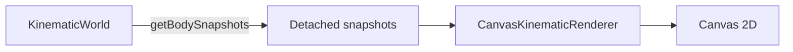
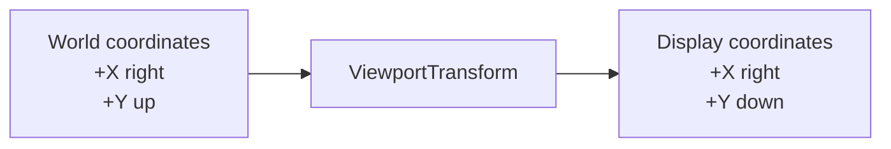
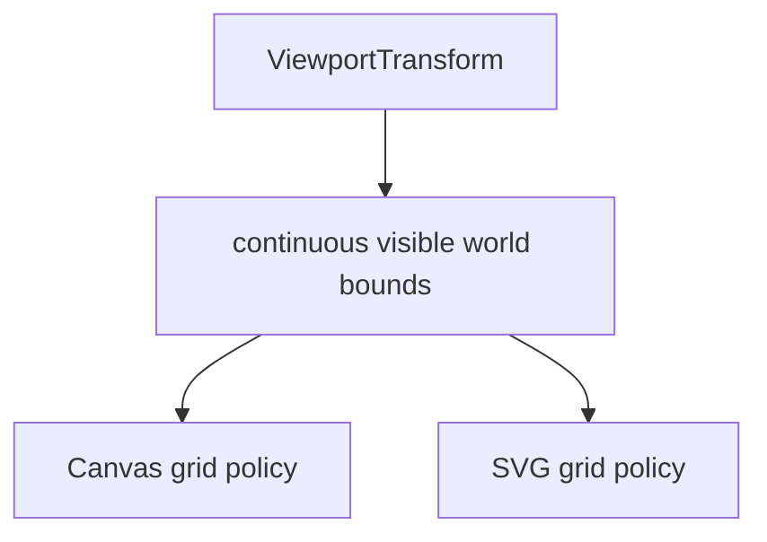
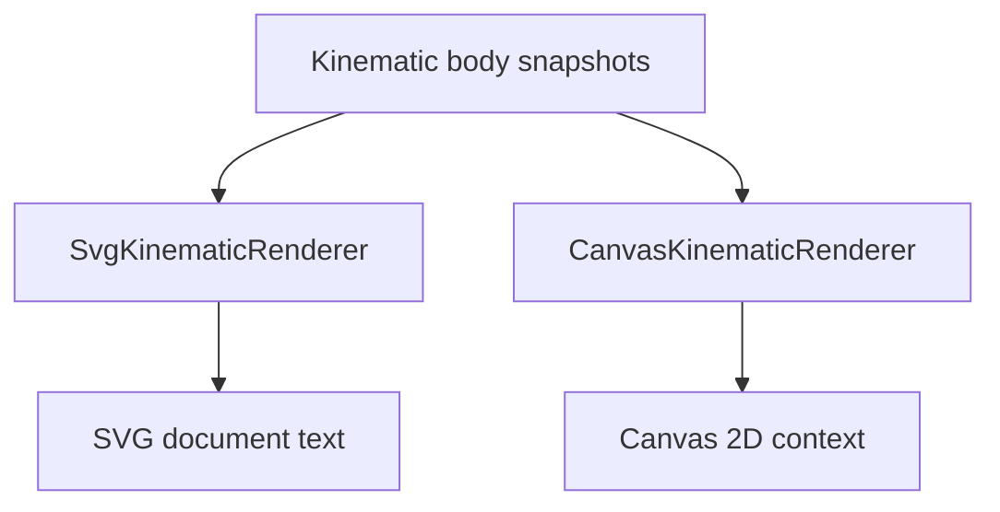

# Visualization

`src/visualization/` contains ways to represent simulation information visually.

Visualization is intentionally outside the engine boundary. Renderers and diagnostic views observe information exposed by the engine's public API rather than reaching into engine internals or mutating authoritative simulation state.

## Current implementations

The project currently has two concrete visualization implementations:

- `CanvasKinematicRenderer` for browser Canvas 2D rendering;
- `SvgKinematicRenderer` for static SVG output.

Both consume detached `KinematicBodySnapshot` values exposed by the simulation engine.

`ViewportTransform` provides the world-to-display coordinate mapping, continuous visible-world geometry, and mutable world-space viewport center shared by both renderers.

Neither renderer advances simulation time or performs physics calculations.

## Visualization priority

Canvas and canvas-like interactive rendering are the primary visualization target. New interactive capabilities should be shaped around what makes sense for that path.

SVG remains a useful secondary companion because it provides reproducible static snapshots, inspectable output, debugging captures, exports, and documentation images. Keep SVG working where the required adaptation remains natural and reasonably inexpensive.

Do not constrain Canvas to the lowest common denominator merely to preserve SVG parity. If a Canvas feature does not map naturally to SVG, prefer the Canvas design; SVG may adapt, provide a reduced/static equivalent, or omit the feature.

Likewise, a visualization abstraction should be shared only when the underlying concept is genuinely common. `ViewportTransform` is shared because viewport geometry is common to both renderers, not because the renderers are required to expose identical rendering semantics.

## SVG renderer

`SvgKinematicRenderer` produces a complete SVG document.

It currently renders:

1. a low-opacity coordinate grid at visible integer world coordinates;
2. a horizontal world X axis;
3. a vertical world Y axis;
4. a world-origin marker;
5. body markers above the spatial reference elements.

The SVG renderer also exposes `setViewportCenter(...)` for the shared programmatic world-space centering capability.

The SVG renderer is useful as a:

- static visual workbench;
- reproducible snapshot;
- debugging capture;
- export format;
- source image for project documentation.

A runnable example is available at:

```text
examples/kinematic-world-svg.ts
```

It writes:

```text
generated/kinematic-world.svg
```

## Canvas renderer

`CanvasKinematicRenderer` provides the live rendering implementation.

It receives a Canvas 2D drawing context and renders detached body snapshots directly into that context.

Each frame is rendered in this order:

1. clear the previous frame;
2. render the integer-coordinate grid;
3. render the world X and Y axes;
4. render the world-origin marker;
5. render the current bodies.



The grid omits zero-coordinate lines because those positions are represented by the world axes.

Spatial references and body positions use the shared `ViewportTransform`. `setViewportCenter(...)` changes which world position occupies the display center, while `panViewportBy(...)` accepts finite Canvas display-space deltas and converts them into world-center movement.

The live browser host owns pointer dragging. It tracks one active pointer, uses pointer capture, converts CSS-pixel movement into Canvas drawing-buffer units, and forwards only display-space deltas to `panViewportBy(...)`. The renderer itself does not depend on Pointer Events or other DOM input APIs.

Clearing the previous frame remains deliberate. Trails should become an explicit visualization capability rather than appearing accidentally because old frames were left on the canvas.

The browser host controls repeated execution. The renderer itself has no knowledge of `requestAnimationFrame`.

## Animation timing

The browser host separates rendering cadence from simulation cadence.

`requestAnimationFrame` provides frame timestamps, which are converted into elapsed seconds and accumulated. The host consumes that accumulated time through fixed-size world steps before rendering the latest body snapshots.


The renderer itself remains unaware of this timing mechanism. `CanvasKinematicRenderer` only draws the snapshots it receives.

Variable frame delta is therefore a scheduling input rather than the numerical integration timestep.

## Coordinate systems

The engine uses mathematical world coordinates:

- positive X points right;
- positive Y points up.

SVG and Canvas use display coordinate systems where positive Y points downward.

The shared `ViewportTransform` owns the conversion between those coordinate systems:

```text
displayX = viewportWidth / 2 + (worldX - centerWorldX) × pixelsPerUnit

displayY = viewportHeight / 2 - (worldY - centerWorldY) × pixelsPerUnit
```

The configured world-space center maps to the center of the viewport. The world origin occupies that position by default.



`ViewportTransform` contains no rendering behavior.

It stores immutable viewport dimensions and scale together with a mutable world-space center, exposes numeric coordinate conversion operations, and describes the continuous world-space extent visible through the viewport:

```text
minWorldX
maxWorldX
minWorldY
maxWorldY
```

These bounds move with the world-space center and remain viewport geometry rather than grid policy. Each renderer remains responsible for choosing its discrete grid coordinates by applying `ceil` / `floor`, skipping zero where the world axes own that coordinate, and drawing with renderer-specific primitives.



Both `SvgKinematicRenderer` and `CanvasKinematicRenderer` own a transform internally while retaining their existing public constructor shapes.

The shared viewport responsibilities were introduced only after concrete renderer implementations demonstrated the same geometry requirements.

## Rendering roles

The current renderers have intentionally different output models.



This is why the project does not yet define a generic renderer interface.

The two concrete implementations should continue to teach us which concepts are genuinely shared and which belong to particular rendering technologies.

## Direction

Programmatic viewport centering is now supported by both concrete renderers, and the Canvas browser example supports pointer-drag panning.

The next visualization step is inverse display-to-world mapping with a concrete Canvas use case: report the world coordinate underneath the pointer. This should extend `ViewportTransform` only with the smallest inverse scalar operations required by that feature.

The browser host should remain responsible for converting DOM pointer coordinates into Canvas drawing-buffer coordinates before world-space conversion. Body picking, selection, zoom, cameras, renderer interfaces, richer diagnostics, and generalized rendering abstractions remain deferred until concrete requirements establish their shape.
