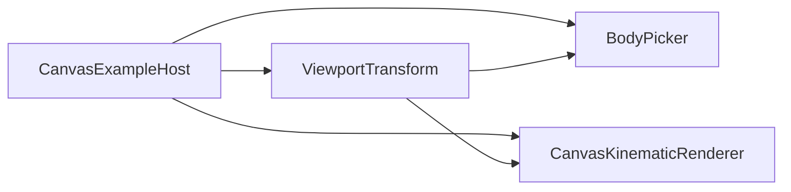
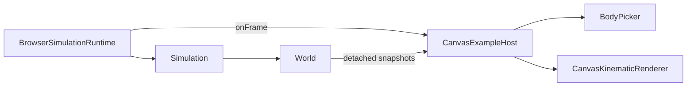

# Visualization

`src/visualization/` contains presentation and visual-interaction components for observed simulation state.

Visualization is intentionally outside the engine boundary. It consumes detached `BodySnapshot` observations and immutable definition data exposed by the engine; it does not advance simulation time, calculate physics, or mutate authoritative World state.

## Current components

The visualization layer currently contains four concrete concepts:

- `ViewportTransform` — rendering-technology-independent viewport geometry and bidirectional world/display coordinate conversion;
- `CanvasKinematicRenderer` — live Canvas 2D drawing;
- `SvgKinematicRenderer` — static SVG document generation;
- `BodyPicker` — Canvas-oriented display-space hit testing against observed body geometry.

They are intentionally concrete. There is no generic renderer hierarchy, picker interface, camera framework, scene graph, or transformation-matrix abstraction yet.

## Observation model

Visualization receives `BodySnapshot` values:

```text
BodySnapshot
├── id
├── definition
└── state
```

The snapshot deliberately carries two different ownership categories:

```text
definition
    shared immutable Body definition
    optional Circle or Rectangle geometry

state
    detached copy of World-owned runtime state
    position
    velocity
    orientation
```

The renderer or picker may inspect the shared immutable definition, but neither receives writable World storage.

This lets Visualization answer questions such as “what geometry should this body display?” without moving geometry ownership into the World or duplicating definition data in every observation.

## Domain geometry versus presentation geometry

The current Body definition may be shapeless or carry one concrete shape:

```text
Body
├── no shape
├── Circle(radius)
└── Rectangle(width, height)
```

Those cases deliberately have different presentation semantics.

| Body definition | Domain spatial extent              | Normal visualization                                 |
| --------------- | ---------------------------------- | ---------------------------------------------------- |
| shapeless       | none                               | fixed display-space circular marker                  |
| Circle          | finite radius in world units       | radius scaled through the viewport                   |
| Rectangle       | finite width/height in world units | centered local rectangle scaled through the viewport |

A shapeless marker is presentation-only. Its radius does not become physical geometry merely because it is visible or pickable.

Likewise, picking against observed geometry is not collision detection. Picking answers an interaction question about what the user is pointing at; collision detection would answer a physical simulation question and belongs to a different responsibility.

## Coordinate systems

The engine uses mathematical world coordinates:

```text
+X → right
+Y → up
positive orientation → counter-clockwise
```

Canvas and SVG display coordinates use positive Y downward.

`ViewportTransform` owns the translation between these coordinate systems. Its current responsibilities include:

- immutable viewport width and height;
- mutable world-space viewport center;
- mutable display scale (`pixelsPerUnit`);
- continuous visible-world bounds;
- world-to-display X/Y conversion;
- display-to-world X/Y conversion;
- display-space panning geometry;
- anchor-preserving zoom geometry.

The transform contains no Canvas, SVG, DOM, World, snapshot, or `Vector2` behavior.

### Orientation convention

Body orientation is stored in world semantics: finite radians, positive counter-clockwise.

Because display Y points downward, both renderers negate the world angle when expressing the equivalent display-space rotation.

For a Rectangle, normal rendering conceptually does this:

```text
world BodyState
    position + orientation
        ↓
move drawing frame to body position
        ↓
apply display-space rotation = -orientation
        ↓
draw Rectangle around local (0, 0)
```

The centered Rectangle geometry remains simple in body-local coordinates:

```text
x ∈ [-width / 2, +width / 2]
y ∈ [-height / 2, +height / 2]
```

Circle geometry also carries orientation through runtime state, even though a plain circular outline is rotationally symmetric and therefore looks unchanged.

## Canvas composition

The interactive Canvas path deliberately uses one explicitly composed `ViewportTransform` instance.

`examples/kinematic-world-canvas/main.ts` creates the transform and shares it with the collaborators that must observe the same mutable viewport state:



The responsibility split is:

```text
CanvasExampleHost
    browser DOM/input policy
    CSS → Canvas coordinate conversion
    pan/zoom policy
    hover identity
    selection identity
    inspection output

ViewportTransform
    viewport geometry
    world ↔ display mapping
    pan/zoom geometry

BodyPicker
    hit testing of detached observations

CanvasKinematicRenderer
    drawing only
```

This is an intentional evolution from the earlier Canvas design where the renderer constructed its transform internally and exposed viewport and picking façade methods.

That earlier design was reasonable while the renderer was the only real viewport consumer. Once `BodyPicker` became a second independent consumer, sharing one explicitly composed transform removed duplicated ownership and prevented drawing and picking from drifting apart.

The architectural lesson is not “injection is always better.” It is:

> A shared collaborator becomes worth composing explicitly when multiple concrete responsibilities must observe the same state.

## Canvas renderer

`CanvasKinematicRenderer` renders detached observations into a Canvas-like 2D drawing context.

It currently draws:

1. a low-opacity integer grid;
2. world X/Y axes;
3. the world-origin marker;
4. shapeless presentation markers;
5. Circle geometry;
6. Rectangle geometry;
7. transient hover feedback;
8. persistent-selection feedback.

The renderer receives the shared `ViewportTransform` through its constructor:

```ts
new CanvasKinematicRenderer(context, viewport, shapelessBodyRadius);
```

It does not expose pan, zoom, inverse-coordinate, or picking methods. Those capabilities belong to the collaborators that own the corresponding responsibilities.

### Rectangle rendering

Rectangle geometry is drawn around the body's local origin and transformed by the body's current pose:

```ts
context.save();
context.translate(displayX, displayY);
context.rotate(-snapshot.state.orientation);
context.fillRect(-width / 2, -height / 2, width, height);
context.restore();
```

This keeps intrinsic geometry independent from world position and orientation.

### Circle rendering

Circle radius is defined in world units and converted through the current viewport scale:

```text
display radius = Circle.radius × pixelsPerUnit
```

A shapeless Body instead uses the renderer's fixed display-space fallback radius, so zoom changes domain geometry on screen while leaving the presentation marker visually fixed.

## Hover and selection presentation

Hover and selection are application/interaction state owned by the Canvas host, not engine state and not persistent renderer state.

The host passes optional body identities into each render call:

```text
render(snapshots, hoveredBodyId, selectedBodyId)
```

The renderer decides only how those identities are presented for the current frame.

For Rectangle bodies, hover and selection outlines are drawn in the same body-local transformed frame as the Rectangle itself. Geometry and interaction feedback therefore rotate together.

For Circle and shapeless markers, the feedback is circular and therefore visually invariant under orientation.

This distinction matters:

```text
interaction state ownership
    CanvasExampleHost

interaction feedback drawing
    CanvasKinematicRenderer
```

The renderer remains stateless about which body is hovered or selected.

## Body picking

`BodyPicker` owns display-space hit testing. It receives the same `ViewportTransform` instance used by the Canvas renderer together with presentation/picking policy values:

```ts
new BodyPicker(viewport, shapelessBodyRadius, pickTolerance);
```

`pickTolerance` is measured in display units. It deliberately belongs to visual interaction rather than Body/shape geometry, so zoom can change the visible size of world geometry without also changing how precisely the user must place the pointer.

Its public query is:

```ts
findBodyAtDisplayPoint(
  snapshots,
  displayX,
  displayY,
): BodyId | undefined
```

The picker measures the pointer's distance to the geometry visible in the observed frame:

```text
shapeless Body
    distance to fixed circular presentation marker

Circle
    distance to world radius × current viewport scale

Rectangle
    distance to world width/height × current viewport scale
    after accounting for current BodyState.orientation
```

A body becomes a candidate when its geometry distance is no greater than `pickTolerance`. Points inside a body's pick geometry have distance zero.

### Oriented Rectangle picking

Rendering makes Rectangle geometry simple by drawing in body-local coordinates. Picking applies the inverse idea: transform the pointer displacement back into the Rectangle's local coordinate frame, then measure distance to ordinary centered Rectangle bounds.

Conceptually:

```text
display-space pointer
    ↓ subtract displayed body center
body-relative display vector
    ↓ inverse body rotation
Rectangle-local vector
    ↓
distance to centered local Rectangle
```

The inverse rotation remains:

```ts
const cos = Math.cos(orientation);
const sin = Math.sin(orientation);

const localX = deltaX * cos - deltaY * sin;
const localY = deltaX * sin + deltaY * cos;
```

The local Rectangle distance is then computed from the amount by which the point lies outside each half-extent:

```ts
const outsideX = Math.max(Math.abs(localX) - halfWidth, 0);
const outsideY = Math.max(Math.abs(localY) - halfHeight, 0);

const distanceSquared = outsideX * outsideX + outsideY * outsideY;
```

Using Euclidean distance here creates a true rounded tolerance around Rectangle corners rather than the larger diagonal reach produced by simply inflating width and height.

### Candidate ranking

When several bodies lie within tolerance, selection is deterministic and geometry-oriented:

```text
1. smallest distance to visible/pick geometry wins
2. if geometry distances tie, nearest displayed center wins
```

The center rule is therefore a tie-breaker rather than the primary metric. This is especially useful when the pointer lies inside overlapping bodies: every containing geometry has distance zero, so center distance resolves the ambiguity without depending on `BodySnapshot[]` ordering.

No collision shape, broad phase, spatial index, or generic picking framework is implied by this interaction query.

## Canvas host interaction

`CanvasExampleHost` remains example-local because there is still one concrete consumer for its combined browser policy.

It owns:

- pointer and wheel event handling;
- pointer capture;
- browser client-coordinate to Canvas drawing-buffer conversion;
- click-versus-drag interpretation;
- wheel-delta normalization;
- zoom sensitivity and min/max limits;
- transient hovered `BodyId`;
- persistent selected `BodyId`;
- read-only DOM inspection output;
- per-frame rendering orchestration.

It directly uses `ViewportTransform` for panning, anchored zoom, and world-coordinate inspection, and directly uses `BodyPicker` for hover/click hit testing.

The host retains the latest detached snapshots used for the visible frame. Hover is recomputed from those observations every animation frame because simulation bodies can move underneath a stationary pointer.

Selection stores only identity. The selected snapshot itself is not retained across frames; current position and velocity are resolved again from each fresh observation set.

## SVG renderer

`SvgKinematicRenderer` remains the secondary static visualization path.

Unlike the Canvas path, SVG currently has no independent second consumer that must share its mutable viewport state. It therefore still creates and owns its `ViewportTransform` internally.

It exposes only the programmatic viewport operations that have real SVG consumers:

```text
setViewportCenter(...)
setViewportScale(...)
```

This difference is intentional:

```text
Canvas
    one transform shared explicitly by renderer + picker + host

SVG
    renderer owns one transform internally
```

The project does not force the two renderers into identical construction or interaction APIs merely for symmetry.

SVG renders the same domain geometry semantics as Canvas:

- fixed marker for shapeless Bodies;
- world-scaled Circle radius;
- centered Rectangle width/height;
- body orientation expressed as a negated display-space rotation.

## Runtime is separate from visualization

`BrowserSimulationRuntime` owns browser scheduling and fixed-timestep accumulation. It does not own Canvas, SVG, picking, hover, selection, snapshots, or DOM interaction state.

The live flow is therefore:



Variable browser frame timing drives Runtime scheduling only. Numerical progression remains fixed-timestep Simulation stepping.

## Normal appearance versus diagnostics

The project distinguishes three visual concerns:

```text
1. Domain representation
   Body / shape / BodyState

2. Normal appearance
   how a body is presented
   future materials / colors / textures / sprites

3. Diagnostic / inspection visualization
   optional information about simulation state
   orientation axes / velocity vectors / bounds / contacts / IDs
```

Current hover and selection rings are interaction feedback, not physics diagnostics.

A future orientation-axis overlay, for example, would reveal the orientation of a Circle whose plain outline is visually symmetric. That overlay would not change the Circle's domain geometry or its normal rendering semantics.

No material system, sprite system, diagnostic-overlay framework, or style/theme abstraction has been introduced yet.

## Abstractions deliberately deferred

Current implementation evidence does **not** yet justify:

- a generic `Renderer` base class or interface;
- a generic `Shape` inheritance hierarchy;
- a generic `Picker` hierarchy;
- `Transform2D` for body pose;
- `Vector2.rotate()` merely for renderer-native transformations;
- a camera object separate from `ViewportTransform`;
- a scene graph;
- a collision system;
- an interaction framework;
- a materials/appearance framework;
- a diagnostic-overlay framework.

Canvas and SVG already provide native rotation transforms for normal rendering. A project-owned `Transform2D` or vector-rotation primitive should be introduced only when our own code repeatedly needs to transform points/vectors between body-local and world coordinate frames.

## Architecture evolution rule

Visualization follows the same project-wide rule:

> Concrete requirements create pressure; repeated pressure earns abstractions.

`ViewportTransform` itself was extracted only after Canvas and SVG independently demonstrated the same viewport geometry. Later, its Canvas ownership evolved again when `BodyPicker` created a real second consumer of the same mutable viewport state.

That evolution is expected. The goal is not to predict the final framework; it is to keep each current responsibility understandable and correctly placed.
