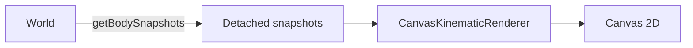
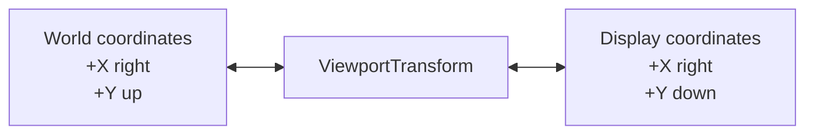
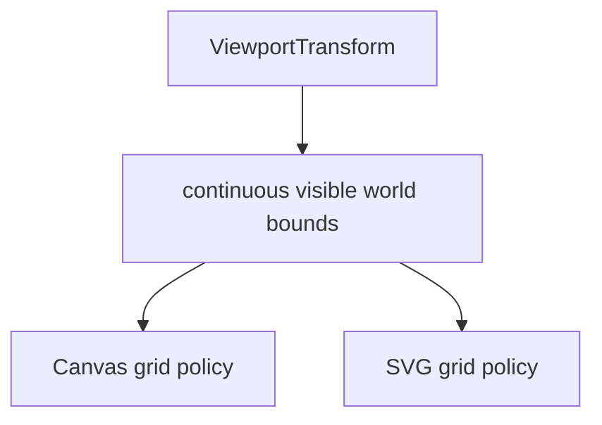
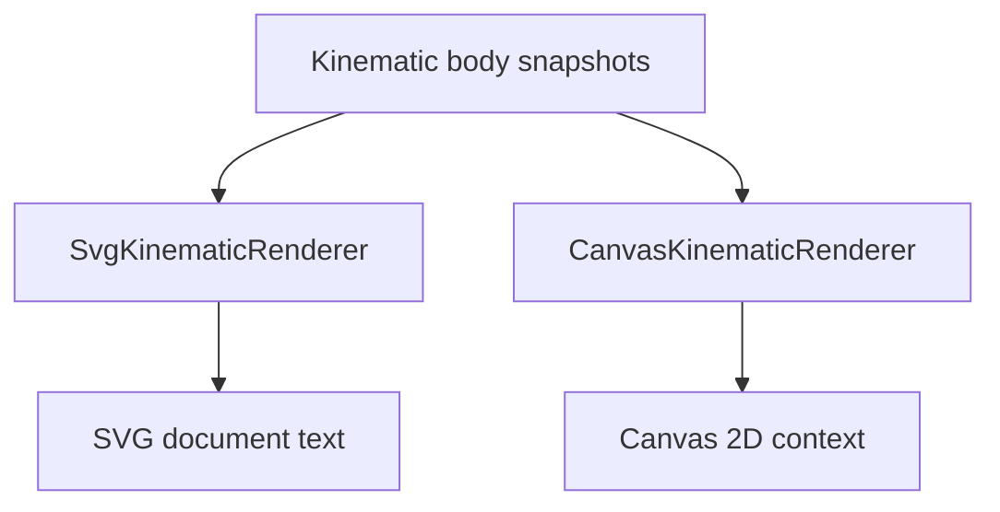

# Visualization

`src/visualization/` contains ways to represent simulation information visually.

Visualization is intentionally outside the engine boundary. Renderers and diagnostic views observe information exposed by the engine's public API rather than reaching into engine internals or mutating authoritative simulation state.

## Current implementations

The project currently has two concrete visualization implementations:

- `CanvasKinematicRenderer` for browser Canvas 2D rendering;
- `SvgKinematicRenderer` for static SVG output.

Both consume detached `BodySnapshot` values exposed by the simulation engine.

`ViewportTransform` provides bidirectional world/display coordinate mapping, continuous visible-world geometry, mutable world-space centering, mutable display scale, and anchor-preserving zoom geometry shared by the visualization layer.

Neither renderer advances simulation time or performs physics calculations.

## Visualization priority

Canvas and canvas-like interactive rendering are the primary visualization target. New interactive capabilities should be shaped around what makes sense for that path.

SVG remains a useful secondary companion because it provides reproducible static snapshots, inspectable output, debugging captures, exports, and documentation images. Keep SVG working where the required adaptation remains natural and reasonably inexpensive.

Do not constrain Canvas to the lowest common denominator merely to preserve SVG parity. If a Canvas feature does not map naturally to SVG, prefer the Canvas design; SVG may adapt, provide a reduced/static equivalent, or omit the feature.

Likewise, a visualization abstraction should be shared only when the underlying concept is genuinely common. `ViewportTransform` is shared because viewport geometry is common to both renderers, not because the renderers are required to expose identical rendering semantics.

## SVG renderer

`SvgKinematicRenderer` produces a complete SVG document.

It currently renders:

1. a low-opacity coordinate grid at visible integer world coordinates;
2. a horizontal world X axis;
3. a vertical world Y axis;
4. a world-origin marker;
5. body markers above the spatial reference elements.

The SVG renderer exposes `setViewportCenter(...)` for shared programmatic world-space centering and `setViewportScale(...)` for shared programmatic scale changes. Although `ViewportTransform` also supports inverse display-to-world mapping and anchor-aware scale changes, the SVG renderer does not expose those Canvas-oriented interaction queries because no concrete SVG consumer currently needs them.

The SVG renderer is useful as a:

- static visual workbench;
- reproducible snapshot;
- debugging capture;
- export format;
- source image for project documentation.

A runnable example is available at:

```text
examples/kinematic-world-svg.ts
```

It writes:

```text
generated/kinematic-world.svg
```

## Canvas renderer

`CanvasKinematicRenderer` provides the live rendering implementation.

It receives a Canvas 2D drawing context and renders detached body snapshots directly into that context.

Each frame is rendered in this order:

1. clear the previous frame;
2. render the integer-coordinate grid;
3. render the world X and Y axes;
4. render the world-origin marker;
5. render the current bodies.



The grid omits zero-coordinate lines because those positions are represented by the world axes.

Spatial references and body positions use the shared `ViewportTransform`. `setViewportCenter(...)` changes which world position occupies the display center, `setViewportScale(...)` changes magnification while preserving that center, and `panViewportBy(...)` accepts finite Canvas display-space deltas and converts them into world-center movement. `displayToWorldX(...)` and `displayToWorldY(...)` expose inverse scalar mapping for interaction without exposing the transform object itself. `viewportScale` exposes the current scale read-only, and `setViewportScaleAroundDisplayPoint(...)` delegates anchor-preserving scale changes for interactive zoom.

The live browser host owns pointer and wheel interaction. It tracks one active pointer for dragging, uses pointer capture, converts browser CSS coordinates into Canvas drawing-buffer coordinates, and forwards display-space deltas to `panViewportBy(...)`. The same drawing-buffer coordinates can be queried through the inverse mapping to report the world coordinate underneath the pointer or used as the anchor for wheel/trackpad zoom.

Wheel normalization, zoom sensitivity, minimum and maximum scale, and suppression of browser page scrolling during Canvas zoom are host policy. The renderer itself does not depend on Pointer Events, Wheel Events, or other DOM input APIs, and presentation formatting remains host/UI responsibility.

Canvas also supports visual body picking through `findBodyAtDisplayPoint(...)`. The query receives detached snapshots and a Canvas drawing-buffer point, maps each body position through the same viewport transform used for rendering, and tests against the renderer's circular body-marker radius. When markers overlap, the nearest rendered center wins rather than relying on snapshot order.

The renderer can also receive optional hovered and selected `BodyId` values during `render(...)`. It draws distinct rings around the corresponding body markers but stores neither interaction identity itself. The same body can display both states simultaneously.

This is intentionally visualization geometry. The engine does not yet model physical body shape or radius, so body picking is not an engine/world query. The browser host reuses detached observations for hit testing and drawing, owns the transient hovered `BodyId` and persistent selected `BodyId`, recomputes hover as bodies move, and changes selection only through click semantics.

The selected-body inspector is also host-owned and read-only. It resolves the persistent selected identity against the latest detached snapshots each frame and displays the matching body's current position and velocity. No selected snapshot is retained as persistent state.

Clearing the previous frame remains deliberate. Trails should become an explicit visualization capability rather than appearing accidentally because old frames were left on the canvas.

The browser host controls repeated execution. The renderer itself has no knowledge of `requestAnimationFrame`.

## Animation timing

The browser host separates rendering cadence from simulation cadence.

`requestAnimationFrame` provides frame timestamps, which are converted into elapsed seconds and accumulated. The host consumes that accumulated time through fixed-size world steps before rendering the latest body snapshots.


The renderer itself remains unaware of this timing mechanism. `CanvasKinematicRenderer` only draws the snapshots it receives.

Variable frame delta is therefore a scheduling input rather than the numerical integration timestep.

## Coordinate systems

The engine uses mathematical world coordinates:

- positive X points right;
- positive Y points up.

SVG and Canvas use display coordinate systems where positive Y points downward.

The shared `ViewportTransform` owns conversion in both directions between those coordinate systems:

```text
displayX = viewportWidth / 2 + (worldX - centerWorldX) × pixelsPerUnit

displayY = viewportHeight / 2 - (worldY - centerWorldY) × pixelsPerUnit

worldX = centerWorldX + (displayX - viewportWidth / 2) / pixelsPerUnit

worldY = centerWorldY - (displayY - viewportHeight / 2) / pixelsPerUnit
```

The configured world-space center maps to the center of the viewport. The world origin occupies that position by default.



`ViewportTransform` contains no rendering behavior.

It stores immutable viewport dimensions together with mutable world-space center and display scale, exposes scalar forward and inverse coordinate-conversion operations, and describes the continuous world-space extent visible through the viewport:

```text
minWorldX
maxWorldX
minWorldY
maxWorldY
```

These bounds move with the world-space center and change with the display scale while remaining viewport geometry rather than grid policy. Each renderer remains responsible for choosing its discrete grid coordinates by applying `ceil` / `floor`, skipping zero where the world axes own that coordinate, and drawing with renderer-specific primitives.



Both `SvgKinematicRenderer` and `CanvasKinematicRenderer` own a transform internally while retaining their existing public constructor shapes.

The shared viewport responsibilities were introduced only after concrete renderer implementations demonstrated the same geometry requirements.

## Rendering roles

The current renderers have intentionally different output models.



This is why the project does not yet define a generic renderer interface.

The two concrete implementations should continue to teach us which concepts are genuinely shared and which belong to particular rendering technologies.

## Direction

Programmatic viewport centering and scale changes are supported by both concrete renderers. The Canvas browser example adds pointer-drag panning, live world-coordinate inspection, bounded pointer-anchored wheel/trackpad zoom, display-space body picking, live hover highlighting, persistent click selection, and read-only live selected-body inspection.

Anchor-preserving zoom is geometry owned by `ViewportTransform`; wheel interpretation, scale limits, sensitivity, browser event cancellation, CSS-to-Canvas coordinate conversion, inspection UI, transient hover identity, persistent selection identity, click-versus-drag tolerance, and inspector formatting remain host policy. Body hit testing stays in Canvas visualization because the current pick radius is the renderer's display-space marker radius rather than engine-owned physical geometry. The renderer accepts per-frame hover and selection identities but owns neither state.

The inspector resolves the selected `BodyId` against fresh detached snapshots and never treats a retained snapshot as authoritative state. Visual feature development is currently paused during Phase 1 architectural refactoring; the selected-body velocity-vector diagnostic remains a later candidate once the structural work is complete. Editable state, drag manipulation, physical engine shapes, cameras, renderer interfaces, generalized inspector systems, diagnostic-overlay frameworks, and generalized rendering abstractions remain deferred until concrete requirements establish their shape.
