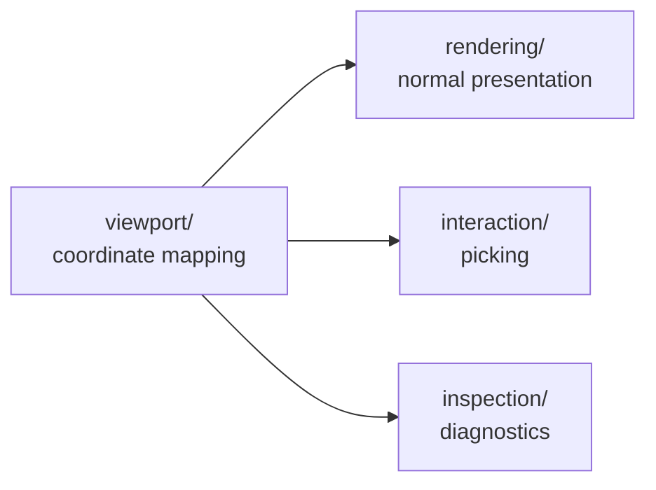
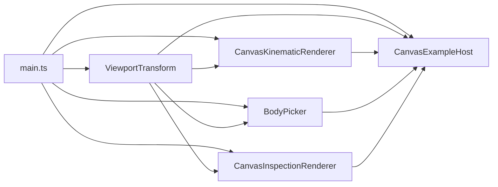

# Visualization

`src/visualization/` contains presentation, interaction, viewport, and diagnostic components for observed simulation state.

Visualization is intentionally outside the engine boundary. It consumes detached `BodySnapshot` observations and immutable definition data; it does not advance simulation time or mutate authoritative `World` state.

## Responsibility-based organization

The directory is organized by responsibility rather than by output technology:

```text
src/visualization/
├── inspection/
│   optional diagnostic overlays and their renderer-neutral options
├── interaction/
│   visual interaction queries such as body picking
├── rendering/
│   normal Canvas/SVG scene rendering
└── viewport/
    world/display viewport geometry and coordinate conversion
```

This split reflects responsibilities that now have concrete independent consumers:



The organization is structural rather than framework-oriented. There is still no generic renderer hierarchy, picker interface, diagnostic plug-in system, scene graph, or camera abstraction.

## Current components

### Viewport

`ViewportTransform` owns rendering-technology-independent viewport geometry:

- immutable viewport width and height;
- mutable world-space center;
- mutable `pixelsPerUnit` scale;
- visible-world bounds;
- world-to-display conversion;
- display-to-world conversion;
- display-space panning geometry;
- anchor-preserving zoom geometry.

It knows nothing about Canvas, SVG, DOM events, bodies, snapshots, or physics.

### Normal rendering

`CanvasKinematicRenderer` is the live Canvas renderer. It draws:

- integer world grid;
- world axes;
- world-origin marker;
- shapeless presentation markers;
- Circle geometry;
- Rectangle geometry;
- hover feedback;
- selection feedback.

`SvgKinematicRenderer` is the secondary static renderer. It represents the same current domain geometry semantics in SVG and remains useful for deterministic snapshots, exports, debugging captures, and documentation images.

Normal rendering answers:

> What should the observed scene normally look like?

It is distinct from both interaction hit testing and optional diagnostic overlays.

### Interaction

`BodyPicker` answers a visual interaction query:

> Which observed Body is close enough to this display-space point to be the user's intended target?

It shares the Canvas `ViewportTransform` and measures display-space distance to current pick geometry:

```text
shapeless Body
    fixed circular presentation marker

Circle
    world radius × pixelsPerUnit

Rectangle
    world width/height × pixelsPerUnit
    with current BodyState.orientation
```

A body is a candidate when its geometry distance is no greater than `pickTolerance`.

Candidate ranking is:

```text
1. smallest distance to pick geometry
2. if tied, smallest distance to displayed body center
```

`pickTolerance` is display-space interaction policy. It does not change physical/domain geometry and is not collision detection.

### Inspection

`InspectionOptions` describes renderer-neutral diagnostic visibility:

```ts
interface InspectionOptions {
  readonly showGeometryContour: boolean;
  readonly showBodyOrigin: boolean;
  readonly showOrientation: boolean;
}
```

These options describe **what diagnostic information should be visible**, not how a particular output technology draws it.

`CanvasInspectionRenderer` is the first concrete consumer. It draws diagnostic overlays after normal Canvas rendering and deliberately does not clear the drawing surface.

Current indicators are:

| Indicator        | Meaning                                                | Units / behavior                          |
| ---------------- | ------------------------------------------------------ | ----------------------------------------- |
| geometry contour | intrinsic Circle/Rectangle boundary                    | follows world geometry and viewport scale |
| body origin      | `BodyState.position`, i.e. local origin in world space | fixed display-space marker                |
| orientation      | local `+X` / `0°` direction from body origin           | fixed display-space line                  |

A shapeless Body has no domain geometry, so it has no geometry contour. Its body origin remains meaningful. Orientation is stored in `BodyState`, but the current inspection renderer suppresses the orientation glyph for shapeless Bodies because no concrete geometry provides a useful local frame to inspect.

The term **body origin** is deliberate. With today's centered Circle and Rectangle definitions it coincides with their geometric center, but it must not be redefined as a future centroid or center of mass.

The orientation indicator is a plain line rather than an arrow. This leaves arrow semantics available for a future velocity-vector indicator, where direction and magnitude have different meaning.

## Observation model

Visualization consumes detached `BodySnapshot` values:

```text
BodySnapshot
├── id
├── definition
└── state
```

Ownership remains:

```text
definition
    shared immutable Body definition
    optional Circle or Rectangle geometry

state
    detached copy of World-owned runtime state
    position
    velocity
    orientation
```

Visualization may inspect the shared immutable definition but never receives writable World storage.

## Domain geometry versus presentation and inspection geometry

The current Body definition may be shapeless or carry one concrete shape:

```text
Body
├── no shape
├── Circle(radius)
└── Rectangle(width, height)
```

The distinction is important:

```text
domain geometry
    intrinsic spatial extent of the Body definition

normal presentation geometry
    how the Body is normally made visible

interaction geometry
    what may be acquired by the pointer

inspection geometry
    optional diagnostic aids about observed state/geometry
```

A shapeless body's visible marker is presentation-only. The marker does not become physical geometry because it can be rendered or picked.

Likewise, the fixed display size of body-origin and orientation diagnostics does not become a domain length.

## Coordinate systems and orientation

The engine uses mathematical world coordinates:

```text
+X → right
+Y → up
positive orientation → counter-clockwise
```

Canvas and SVG display coordinates use positive Y downward.

For Canvas rendering and inspection, body-local drawing therefore follows this pattern:

```ts
context.save();
context.translate(displayX, displayY);
context.rotate(-snapshot.state.orientation);

// draw local geometry / diagnostics around local (0, 0)

context.restore();
```

The negated angle represents positive world-space counter-clockwise orientation in a Y-down display coordinate system.

The inspection orientation line is especially simple inside that local frame:

```ts
context.moveTo(0, 0);
context.lineTo(ORIENTATION_LINE_LENGTH, 0);
```

It literally represents Body-local `+X`, or local `0°`.

## Canvas composition

The Canvas composition root creates one mutable `ViewportTransform` and shares it among the responsibilities that must observe identical viewport state:



The host coordinates frame presentation in this order:

```text
observe fresh World snapshots
    ↓
refresh hover / selected-body readouts
    ↓
normal Canvas rendering
    ↓
inspection overlay rendering
```

This ensures diagnostics appear on top of the normal scene while remaining aligned with exactly the same pan/zoom state.

## Canvas example host

`CanvasExampleHost` remains example-local. It owns concrete browser/application policy:

- pointer and wheel events;
- pointer capture;
- CSS-to-Canvas coordinate conversion;
- click-versus-drag interpretation;
- zoom sensitivity and limits;
- hover identity;
- selection identity;
- selected-body textual readouts;
- per-frame orchestration.

It delegates:

```text
viewport geometry      → ViewportTransform
hit testing            → BodyPicker
normal scene drawing   → CanvasKinematicRenderer
diagnostic overlays    → CanvasInspectionRenderer
```

No generic application or interaction framework has been introduced.

## SVG and renderer-neutral inspection intent

`InspectionOptions` is deliberately not named `CanvasInspectionOptions`: geometry contour, body origin, and orientation are semantic diagnostics that can also be represented by SVG or another future output target.

SVG inspection has not yet been implemented. `SvgKinematicRenderer` currently returns a complete SVG document and owns its `ViewportTransform` internally, so forcing a parallel `SvgInspectionRenderer` before deciding how static-document composition should work would be premature.

Renderer-neutral intent is established now; technology-specific implementation is added only when a concrete consumer needs it.

## Appearance versus diagnostics

The project keeps these concepts separate:

```text
Domain representation
    Body / Shape / BodyState

Normal appearance
    how a body normally looks
    future fill / contour mode / material / texture / sprite concerns

Interaction feedback
    hover / selection / picking tolerance

Inspection diagnostics
    optional contour / body origin / orientation
    future velocity / bounds / contacts / IDs
```

A future “render shapes as contour only” mode is therefore an appearance/rendering choice, not the same thing as the current optional geometry-contour diagnostic overlay.

## Abstractions deliberately deferred

Current implementation evidence still does not justify:

- a generic `Renderer` interface/base class;
- a generic `Picker` hierarchy;
- a diagnostic-overlay plug-in framework;
- a renderer-neutral inspection renderer interface;
- `Transform2D`;
- `Vector2.rotate()` merely to wrap native Canvas/SVG transforms;
- a camera abstraction separate from `ViewportTransform`;
- a scene graph;
- a collision system;
- a materials/appearance framework.

Canvas normal rendering and Canvas inspection both use native local-frame transforms naturally. Rectangle picking remains the main project-owned explicit inverse-rotation calculation, so reusable body-transform mathematics are still not sufficiently repeated to determine the right abstraction.

## Architecture evolution rule

Visualization follows the project-wide rule:

> Concrete requirements create pressure; repeated pressure earns abstractions.

The current folder structure is itself an example. A flat `visualization/` directory was sufficient while the layer was small. Once viewport, normal rendering, picking, and inspection became independent responsibilities, grouping files by responsibility made the architecture easier to see without introducing any new behavioral abstraction.
